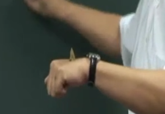

教材 针灸大成
 临床下针是左病右治、右病左治。
 针就是针，炙就是灸，我们要分开使用。
 热症不用灸法
 灸的大原则。痛灸到不痛止，不痛灸到痛止，这是原则，所谓“不痛灸到痛止”

## 针灸的时机
遇到气血大虚、重病、刚刚失过很多血、病患完全没有元气的时候，这时候我们不下针。另外，刚做完爱，行完房事后，也不针。时机不好、运动过后、大汗后也不针。喝酒后，不针。体力不够，不下针

## 为什么用艾草
灸呢？我们叫 JIU，就是“久”下加一个“火”字。用灸时就必须用艾绒，为什么要用这个艾草
艾性向下。艾性纯阳
中医如何去找这个水呢？艾草它的生命力很强，再艰难的环境下都可以找得到它。艾有一个特性，就是向下，艾会自己去找水,找到水以后烟就往上升。如果部队要找水，就叫阿兵哥将艾草摊在土里烧，这时叫人到各处去看看，看到地上有烟冒出来的地方，那个地方下面就有水。为什么要灸？当针力不足的地方，我们就会用到灸，气血大虚时，可用灸的方式处理。

## 不同的灸法

### 1-隔姜灸
我们有几种灸法，最普遍的就是“隔姜灸”。我们隔姜灸就是切一片大概五十元大小的生姜，先戳几个洞，
拿一些艾绒捏成金字塔状，再将它放在生姜上面，这样一个单位叫“一壮”。

在灸的时候，这个生姜片不用换。不要灸五壮，就换五片生姜，烧到温热，不用烧到很烫。感觉温热，不用很烫时就换一壮，在旁边放一个水盆，未烧完的艾就丢到水里熄灭掉。

灸的时候，灸单数不灸双数，艾为纯阳，取阳数。

若灸后起了水泡，就从皮肤旁边用消毒过的针刺一个小洞，把水慢按排出来。不要把皮肤撕掉免得造成疤痕，洒上一些硫磺粉及大黄粉就可以了。

膏肓穴 无所不疗  -- 并入膏肓

### 2-隔盐灸

肚脐 神阙穴
我们在灸的时候，用盐巴填满神阙穴（就是肚脐），再放艾绒上去灸。先将盐炒熟。精盐不能用，要用青盐，要等盐变温一点了，凉了，再倒在神阙穴上，否则会把肚皮烧坏了。古病人下利时不管是寒利或热利（只要是食物没有消化就是寒，热利的话味道会很臭），灸神阙我们寒利用的比较多。

### 3-隔蒜灸
因蒜是白色的，辛辣色白，才能入肺，放在舌上。因为舌为心表，把舌头往外伸，灸后心脏力量加强。心和肺最接近，这时候我们去灸，咳嗽就会好。

### 4-米粒灸
我们还有一个灸法是“米粒灸”。我们把一点点的艾绒，捏成像米粒一样大。用凡士林先涂在欲灸的穴道上，将它放在上面灸。

用在什么地方呢，如鼻窦炎 、鸡眼 
用香来点，灸三个、五个，就看病有多深

## 适用的范围
灸的用途非常广，比如说被毒蛇咬伤、蝎子、蜘蛛咬伤，任何的毒物咬伤、破伤风都可以用灸。什么是破伤风，比如说今天你手上有伤口，又去整理生锈的铁钉，在临床上面怎么做呢？有个病人来找我，手指头红肿，从手指头一路红到手上。

**病之进退**
当病进时，是由四肢末梢往身上走，就像我刚才讲的，如手有伤口被感染或被毒蛇咬到，这时会感到毒往身上走。而病退时，就会由身上往四肢走。譬如，原来是病在肩，第二天醒来，病虽还没好，但我的肩不痛了。但是痛到手臂上了，这就是病在退了。当病在退的时，处方不能改，所针的穴道也不能改，要等它病好了为止。

### 1. 破伤风
当这个病在进时，像病人手指头破伤风红肿，我一看，针都不用下，用隔姜灸。它（病）走到这边的时候，我们在这边的头上面灸，病人手粉红色，很痛，痛到不能动，我就在头尾灸两壮，灸完两壮后才几分钟而已，就在退了，退到手掌心，退到劳宫时，就知道病离开心脏。因为艾草在烧起来的时候，很像大麻的味道。我在美国的诊所，一烧起来的时候，常有人说：有人在抽大麻，所以我没有再帮他灸，而把窗户打开，透透空气，然后隔两天病人回来，那天从诊所走到停车场，他手都不痛了，也可以开车了。

如果说，你觉得打破伤风针很好，打疫苗很好，那就去打吧，实际上没什么大帮助，破伤风时，连药也不用吃针也不用下，用灸就可以好

### 2。疱疹
长这样一圈，看起来红红的一小粒，长疱疹的时候，我们有两种烧它的方式，如病人疱疹是长这样子的，

- 在疱疹的头尾隔姜去灸他，它就不会再蔓延了，过两天，疱疹就变短了。我们还是一样在疱疹的头尾灸，慢慢去灸，反正就是把疱疹包围起来。就是一种方法。

- 还有一种方法，过去古代看到疱疹，就去拿蜘蛛网，把这蜘蛛网平摊在疱疹上面，因为蜘蛛网很粘，用薄薄的粘一层，瞬间一烧就烧掉，烧完后，五天到一个星期，疱疹就治好了。
现在不要去拿蜘蛛网了，可以用干棉花，不要用有酒精的棉花。但棉花粘不住啊，它不像蜘蛛网，没有那个胶质，所以我们放点凡士林在上面，因为目的是烧嘛。

- 全蝎粉 我们平常用全蝎，把它烤干，你不要拿蝎子给他吃，全蝎粉去药房买也可以买到。但过去是把蝎子烧烤成金黄色，但现在药房已有全蝎粉，味道很强，你可以放到胶囊里面去，可以吃八到十颗。所以疱疹很好治。

### 热症不用灸法
当感冒发烧，病人已经很热了，不要灸。流汗多的地方不灸，手掌汗比较多，也不灸。津液很多的地方不要灸，眼睛不要灸，阴部不灸。病人有痔疮时，已经是热了，也不能灸。针灸有些禁忌。有一个歌诀：“针而勿灸灸勿针，针经为此常叮咛。庸医针灸一齐施，徒施患者炮烙刑。”

### 不痛灸到痛止
痛灸到不痛止，不痛灸到痛止，这是原则，所谓“不痛灸到痛止”的意思是，一直灸直到当你碰到患部病根的时候，那儿开始产生了痛，对不对？就表示到了。那怎么知道“痛灸到不痛”
像“肿瘤”就是。在肿瘤痛 的地方一直灸，直到不痛的地方就停住。最高明的医生，就是把病治好了，又不伤病人的元气。