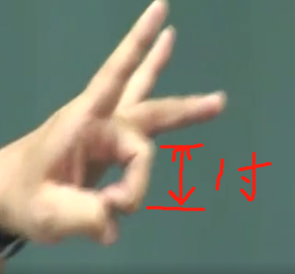
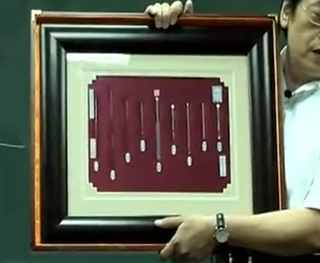

## 丈量穴道的方法
- 同身寸  运用于四肢 经络之间
  把中指头弯起来，这两个横纹头，点跟这个点之间我们定义为一寸，这是同身寸。
  
  三指两寸 四指三寸

- 腹部胸部 独立的丈量
  讲解任督二脉细讲

## 下针的深浅讨论
### 季节
我们下针有深有浅，一般言，我们有受季节的影响，比如说在春天下针就要比较浅，秋冬的时候，针下的比较深，这就好像我们钓鱼一样。冬天的时候，鱼都在比较深的地方，针就要下到骨髓去，春夏的时候，天气比较热，所以针下的比较浅，这是一个观念。

### 病情深浅
还有，就是中医认为，皮毛是肺在管，肌肉是脾脏在管，血脉是心脏在管，骨是肾脏在管。一般下针的时候，如果病在皮毛，我们针就下在皮毛，如果病在肌肉，我们下在肌肉，病如果是在血脉上面，我们就扎在脉的旁边，如果病是在肾脏，我们会从皮肤上面下针下在骨头的旁边去。看这个病情在那里，决定我们下针的深浅。

### 成人与幼儿
成人要留针，幼儿不留针，幼儿我们有一个特别的名称， 我们叫单刺
幼儿的定义以十四岁做为标准，十四岁以下，单 剌不留针，十四岁以上，就留针

我们留针，留二十分钟，留针之后会做补泻，像中风的病人，留二十、三十、四十分钟、 一个小时两个小时都没关系。

单刺 进去捻一捻就出来。哪些穴道可以单刺，经络学再讲

### 针刺手法 补泄手法
奇经八脉 十二经络 细讲

过去我们有一句话，叫做“腹深似井，背薄似饼”。这指的就是针刺的深浅。腹部上扎针的时候，可深针，背上扎针，就不可以深针，否则会扎到内脏。扎到肺会引起肺气肿，但也不能说腹深似井，就扎那么深，不能乱搞。还有，胖子瘦子下针的深浅也不一样。下针有个规矩在那边，不能随便，有的穴道本来就浅，你也不能硬要把它刺过去，也无此需要。

## 针刺入穴方法
《针灸大成》提到入针的方式，下针的时候，要病人咳嗽一下，针就同时下去了。为什么以前是这样子，因为那时没有针管，同时，以前针的（制造）技术很差，过去的针像火柴棒那么粗，我们看黄帝的九针，《针灸大成》的九针画的图，那九种针根根都像火柴那么粗，所以扎针比较痛。用咳嗽，一咳，针就下去了，比较不痛。

一般穴道绝对不会在肌肉上面，你摸两个肌肉中间穴位永远在肌肉、筋旁，穴道都在两条肌肉中，或者是肌肉和骨之间
血管旁边或在筋和筋之间、筋和肌之间、筋与骨中间。绝不会在骨上面。

当你们穴道位置找到以后，就用摸的，就知道哪个是正确的，针下进去就对了，这是我们基本上找穴，下针位置的取舍。
### 晕针

下针时，叫病人采用卧姿。针灸下针后有一种现象就是晕针 。为什么？因为中医有一句话“药不眩瞑厥疾弗瘳”。这 句话，出自《后汉书》，所谓“药不瞑眩疾弗瘳”，就是说一种治疗方式，没有产生瞑眩的话， 这个病不会好。我们每次扎针，若病人产生晕针的现象，起完针，病人会感觉效果很好。

当姿势不对会产生晕针。 出现晕针，先下人中。

将胸腔的扣子打开。让他能呼吸，空气流通就会醒过来。晕针不会死的，到现 在还没有因晕针而死的。如果你是很性急的人，不醒就十宣放血，脚趾头再放血，回家叫病 人怎么走回去，太过也不好。

## 起针
起针的时候很重要。这个指头放在那，慢慢的拔出来， 出毛孔的时候，稍停一下，停个三四秒，再慢慢出来，这样一滴血都没有。

## 针号
现在我们常用的针，比如说 3215，32 是针号，数目字越大，越细，一号，二号，三号 四号，很粗就像螺丝刀一样，32 号已经很细了，15 是一寸半，号码小，粗一点，有 2815， 平常多用 32。

- 一寸半用的最多 肌肉四肢身体
- 一寸针 手指旁
- 三寸针 透穴 3230,32 号三寸针用来透穴。有些地方会用到透 穴，当场透就好了。

针灸做得好是立竿见影, 做不好也没有感觉
身上有非常多的穴道，都可以用透针，透的时候不但不伤筋，不 伤骨，不伤血脉，连一滴血都看不到，脚伤、腕骨痛，针一下去当场痛就去掉了。中医如果 以后发展起来，全世界医疗费用可减少非常多。

### 黄帝内经九针

毫针 长针 火针 

我们现在用的针就不会断了。只有针身跟针柄接合处容易折断，所以我们下针都会留一点针身在外面，不会整只插下去。若一段断在里面，两指同时一下压旁边的肉，针就出来了。

------------------------------------
github笔记同步 欢迎fork
https://github.com/wdsheng999/hantang_medicine
