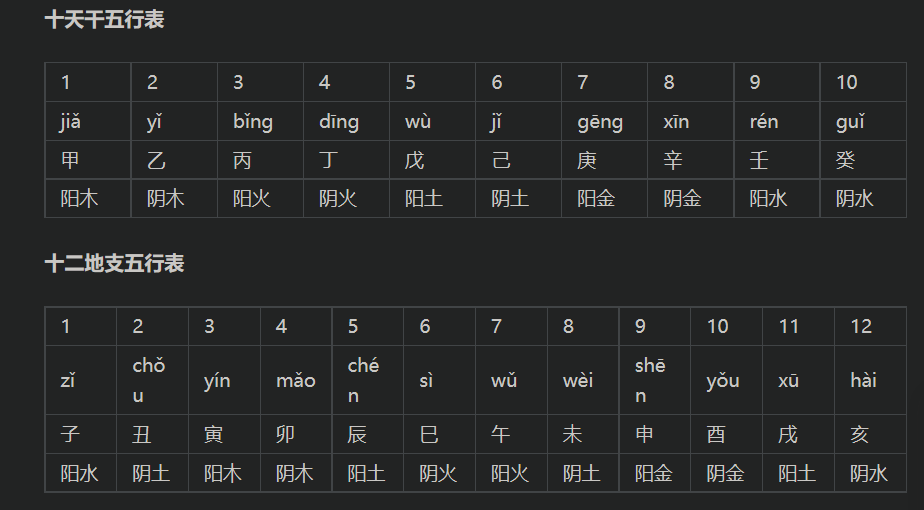
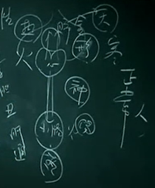
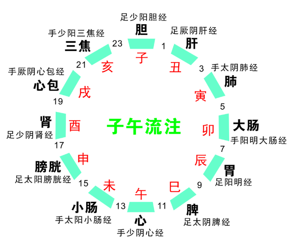
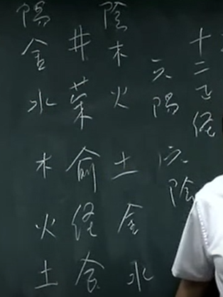
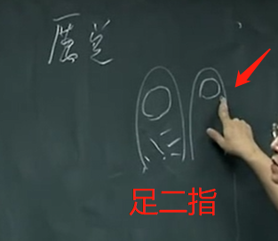

## 十二经纳天干--阴阳五行

甲胆乙肝丙小肠,
丁心戊胃己脾乡,
庚属大肠辛属肺,
壬属膀胱癸肾脏,
三焦亦向壬中寄,
心包同归入癸水

甲乙丙丁午己庚辛壬癸，总共十个，称为：“十天干”。也用于十二生肖
“甲丙戊庚壬”的五行属“阳”，“乙丁己辛癸”的五行属“阴”。
最主要是它的属性，就是木火土金水，五行的属性。

吸气--热向下--心火到小肠 丹田就是小肠的募穴

大肠中的水是气化状态（小肠气化） 回到肺
水生木 膀胱 膀胱是由于热量像气球 第一次气化在肾脏 膀胱第二次气化得到干净的水 交给肝 肝排完毒交给胆产生胆汁

中医是物理医学
中医就是按照时间、速度、温度还有压力，你的身体就是一个小宇宙。这就是中医，就是站在外面可以看到里面。

## 十二经纳地支--时间时机
肺寅大卯胃辰宫。脾巳心午小未中，申胱酉肾心包戌，亥焦子胆丑肝通。

子丑寅卯辰巳午未申酉戌亥，总共十二个，称为：“十二地支”“子寅辰午申戌”的五行属“阳”，“丑卯巳未酉亥”的五行属“阴”

地支歌，简单讲，就是寅时开肺，寅时大家都知道是三点到五点，是凌晨三点到五点。大肠开卯时，卯时，是五点到七点。胃开辰时，七点到九点。脾脏开巳时，九点到十一点早 上，心开午时，十一点到下午的一点，小肠，是一点到三点。再来是膀胱，是三点到五点。再来是肾脏，五点到七点。心包经呢，七点到九点。晚上九点到十一点是三焦经。九点到十 一点再回到胆，胆经是凌晨，晚上十一点到凌晨一点，最后再回到肝经，一点到三点。

从诊断
举个例子给你听，病人来看你，这个人脸色黄黄的，再看手掌暗红色，问一个问题，晚 上好不好睡?答：每天晚上一点多就醒过来，从头到尾没问第二句。第一次问诊，睡觉好不 好就结束了--> 肝

肺比心脏大很多，很多的白加一点红，就是手掌的颜色粉红色，手掌表示是肚脐以上的颜色。

晚上1-3肝经流注 应该是最好的睡觉时间 睡不着告诉你身体有问题

中医上人不是机器 病--症状--正常
当你是正常的人，一得到症状的时候，身体马上就知道了。西医却还不知 道。等到病了，经过太阳、少阳、阳明、太阴、少阴、厥阴六个阶段，进入病西医才查到了， 这就太慢!中医在一开始，一有动作就知道了。中医的高手在一动就晓得。西医到这阶段才查到，查到病时就已经太慢了。所以我常常握手，以后诸位被我训练到， 举手投足之间，就可以知道，因为你一摸就知道了嘛，如果知道病，知道后就心痒难耐、不 去治又很难过，不知道就好，还要救他回来，真的很麻烦。

举例，这是正常人，大肠是开早 上五点到七点，所以起床要上大号，这是正常的身体。

所谓时机 下时针

TODO:有个问题 白天的脏腑出问题怎么诊断

## 十二正经
我们介绍经络之前，先介绍基本的观念。
正经有十二条，奇经有八条，这个十二 正经，每一条经络，不管是阴经还是阳经。有六阳经、六阴经，加起来共十二条。
奇经八脉 有任脉、督脉、冲脉、带脉、阳蹻（乔），阴蹻、阳维、阴维。

十二正经中，所有的阳经及所有的阴经，都会介绍到井荣俞（输 运输）经合
**井荣俞经合**都是手不过肘，足不过膝。我们下针的时候，在手肘以下， 膝盖以下下针，

### 络穴
每条经上面有一条络穴 经之间平行 由络链接
每一条经都一定要有它的络穴。

阳经比阴经多一个东西，就是 原穴。

## 取穴

### 病在脏取井穴
这个井呢?病在脏取井，所谓病在脏取井就是病在越深的地方，我们要在**指头末稍**，井 穴通通在手指头或脚趾头的末稍，非常的敏感。

比如说，足阳明胃经的井穴，**我们叫厉兑**， 位在第二个脚趾头。我们下针的时候，“井主心下满”，临床上，在动脉血管堵塞，针一下去， 病人会感到有个人在里面扫地，有人在清洗，速度就那么快

用一寸针嘛!刺一点点即可。身上虽有其它穴道可用，但没有井穴好。所谓堵塞，西医讲的动脉血管堵塞，中医是讲**心剧烈的疼痛**，这个针一下去的时候，痛马上去掉，就是所谓的实症。

### 病在色取荣穴
当有颜色的病出现了，一看见到发黄是脾病，发红是心脏病，这个人脸色发黑是肾脏病。遇有颜色出现，我们选取穴道的时候用荣穴。 

### 病在时间者取俞穴
治时间的病。每一条经都有他的俞穴所在。凡按照时间发病的，如每天晚上十二点起来，病是发在胆经上，取胆经的俞穴。按地支歌去判断。

### 病变于音者取经穴
至于经穴，病变于音者。
相法中，女人面大声沙骨粗，这是孤单到老，声沙就是象，骨头很大，肉看不到，脸又很大，这个女生一辈子孤单到老。

如果是感冒，声音变了，就用经穴来治疗，每一条经都有它的经穴，声音是从那器官发出来。

### 病起于饮食取合穴
那再来讲合穴，当饮食不节，暴饮暴食就用合穴。
讲到饮食，跟各位讲一个观念，什么叫饱，什么叫饿，这没有一个定义。真正对身体最好的，是吃完还要有一点饿的感觉，一年四季保持有一点饿，只要七、八分饱就好，因为这样不断训练你的胃气。
只要有饿，就救得回来。任何的重病到后来都是没有胃口。饮食不节，暴饮暴食的，还有胀满的病，我们大部分选用合穴来治疗。

### 五脏不平衡用原穴
原穴是安五脏的，五脏不平衡时用的。
对不平衡的定义，不安的定义是什么?到讲脏腑时再告诉你们。诸位要先对原穴有个基本的观念，阳经都有原穴。

### 取穴与四季
井穴主冬天，脏主冬，冬天的时候刺井穴。井荣俞经合五穴，都在手肘以下或膝盖以下。如果今天扎针，你又怕出事，在手脚上扎针就不会有事。

时间
现在介绍的时间，若出问题时是夏天，我们一样取他的俞穴。
冬-春-夏-长夏-秋
井 荣 俞 经 合

味道有问题 包括嗅觉
味主秋 治在合穴

中医的观念，春夏养阳、秋冬这个季节是养阴
要随着节气定，春夏要多运动，不是秋冬不用运动，而是要收敛，包括房事要节制。

------------------------------------
github笔记同步 欢迎fork
https://github.com/wdsheng999/hantang_medicine