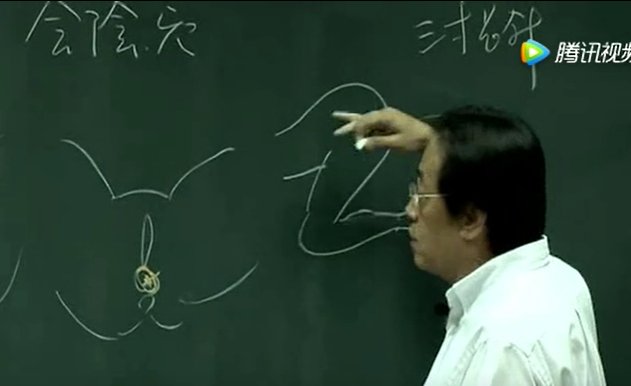
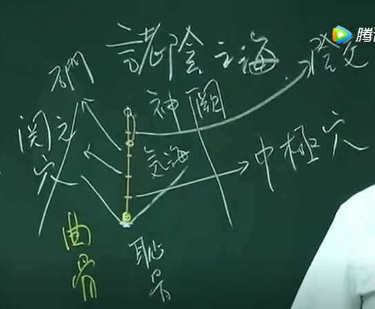

## 任脉 督脉
任，女子妊也，女人会怀孕是靠任脉。十二经络开始介绍之前，要从任脉开始介绍。
找穴道要从任、督二脉为基准，找到标准，就可以很快速的找到穴道。

任脉是所有阴汇积的地方。而督脉是诸阳之会!全身的动能，能量，都在督脉上面。无论如何不要让别人碰你的脊椎骨，督脉不能碰

任督二脉交会在鼻子人中这边。刚好嘴巴讲话，讲话时任督二脉是开的，你在听课的时候，舌头是顶着上颚。这是你的牙龈，这牙齿，侧面看哦，然后这是下牙，这是嘴唇。简单的概念，舌头顶到上颚的时候，任督二脉是通的。

任脉有三八二十四个穴道，任脉三八起会阴

急救的时候也用会阴，怎么用呢?在溺水 时，病人胸腔里面，肺里面全是水，呼吸都停掉了，气脉都没了，你用口对口呼吸也救不回来时，那怎么办呢?下针!下针的时候，让病人采用趴着的姿式，小腿跪着。肚子在这边，腿在这边，小腿，针下会阴的时候，用三寸长针。针进入会阴时要对着心脏的方向下针。采这个姿式，一下针病人水会喷出去。在急救的时候用。

平常 不灸 也不下针

会阴很少会痛，遇到怎么处理，如果不是鬼附身，我会教你们十三鬼针，我会教，但我不扎，有过一次经验够了。

**对称治疗** 百会和会阴对称 下百会

中间那个发光的地方就是病原的所在，下针时，针要从这到那个角度进去，针从这边进去可以到中心，进入那边以后也会碰到中心。假如要下针在手上的少商、鱼际，病人偏偏手指断了没有少商穴，就从别的角度进去。不能说你这个人没有这个穴道，我不能治。我们要从很多角度进去，经方为何叫经方，处方要治那个地方就会到那个地方，百发百中。所以切入的角度很多，要**因时因地因人而制宜。**

### 任脉
我们今天开始正式进入任脉。任呢，妊也。中医有所谓八纲，这个八纲观念，是阴阳、 表里、虚实、寒热。我们用这八纲，除了可帮我们了解脏腑之间的关系，协助诊断，也可以治疗，也可看日后病人好了没，也可看病情是转好转坏以及预测这个病现在不治的话将会发生什么事。这些都可以用八纲来做。

经络直走的通通为经，经与经之间的联系称为络，所有的阴经像河流一样，总有一天会流入大海，阴经总有一天会回到任脉。任脉是阴经的汇合的地方。本身没有井荣俞经合

以任督为标杆，这样选穴会非常准。如果我们按照“同身寸”来找任脉的穴道就会错掉，因为它有个独立的寸法。

- 会阴
- 神阙 肚脐
- 曲骨 耻骨的上方

神阙和曲骨分成四段 此为寸

- 中极
- 关元
- 石门
- 阴交

石门 阴交中间 肚脐下一寸半

- 气海

《针灸大成》作者杨继洲有个很特殊的本领，把各派名家的专论合成一本书。每家有每家的好处将之合起来。我们以正经十二经为主，其它的是锦上添花。各位看到七十二页，这里面说的很多，其实重点在气血的流注。气脉的流注叫后升前降。

从会阴向上
1. 曲骨 由于体毛多 不灸 可针 古代粗针不可
    曲骨治白带等妇科 膀胱 小便 尿道发炎  **近取穴** 不管虚实寒热都可以治

2. 中极 膀胱的募穴 募就是开口的地方 任何膀胱的问题 可针可灸
    我们以后有治疗法则，其中有一个法则叫**俞募治疗法**。我们比较喜欢念“俞”，不爱念“输”。因为输输把钱都输掉了。
    我们有会郄、原络等治疗法，以后都会慢慢学到。
    中极治疗 小便少 多等统统可以.

    那小便频数 、失精绝子 ，月经痛 、产后胎盘没有下来都可以用。还有呢中间有个很重要的转脬不得尿 ，是指膀胱扭曲了以后，小便排不出来，所以我们都可以用中极穴，因为他是膀胱的募穴。

3. 关元 小肠之募穴
    中医非常注重小肠，因为小肠是第二个心脏
    近取穴，所有腹部的病，像小便不好啊、妇人妊娠时不下。一般来说妇人怀孕时不针下腹部，因为怕伤到胎儿。

    男女都可以灸关元 女灸可去痛经 痛经因为寒 有热痛和寒痛
    灸了几次后，双脚一热，血块就去掉了。为什么双脚一热，病就去掉了。
    当这个热呢，因为受到肺的影响，热力往下走，余热才往手掌走。小肠的热往脚上面，所以热气是往下，所以气要往下沉到脚。所以心脏按照简单讲，心脏就是管动脉。小肠管静脉。西医是说心脏管全身的血液循环。中医说，等一下!心脏其实只管一半。全身的动静脉一样长，全身的大小血管加起来可以绕地球一圈半，那么大的系统，动脉静脉一样长，基本常识，不需要去证明，有动脉就有静脉，讲完了。这个血液回流到心脏，就要靠小肠。没有小肠的热，没有小肠的火，没有办法下达到脚。

    所以你脚是冰的，表示你一天二十四小时不断在制造血块。西医没有寒热的观念，吃西药会不断的产生血块，就给你吃古靡登，这是厂牌的名字，化学成分就是老鼠药，杀老鼠的。比较轻微就是阿司匹林，让血变稀

    所以，我常说脚热的没有心脏病、没有中风。

    当我们遇到里寒的情形，我们用针把血管堵塞去掉，用灸把里寒去掉，关元上通通可以做，关元是大穴。

    临床上面呢，因为心和小肠是表里，所以心脏病 ，急救在关元上面。临床上，心律不整 、心脏快停了，针一下去，心脏“碰”的一声就跳起来了，一摸脉，脉就起来了。这是我在治疗西医讲动脉血管堵塞的时候，先下的大穴，病人一来就先下关元，关元非常好用。那心律不整，下关元穴。那平常没事灸灸关元，灸要小心，不要太斜不然会烧到。最好是隔姜灸。

    只有在孕妇怀孕的时候不要动它。下针可以堕胎

    脐下血水 ，妇女界最多，男人比较少。男人除非阴部被踢伤，绝大多数是妇女，她的子宫在这个地方，子宫里面有血块、或腹部有血块，而月经不顺，我们一定会发现到**肌肤甲错** 。肌肤甲错的位置是在小腿这段，这段皮肤会像蛇皮一样，一开始还有东西掉下来：白白的灰掉下来。一般多半是内有瘀血，而且瘀血一般多半是少腹的地方。为什么，介绍脚的经络就知道

4. 石门 三焦之募穴
    什么叫三焦，中医三焦的观念，古体字“膲”，身上脏腑之间的油网，这个油网就是三焦。
    夫人禁针灸，绝子。其实效果还不是很强，石门关元之间有个穴道，绝孕穴，针灸绝子
    平常石门穴是禁针禁灸的。

5. 气海穴 
   气海 关元针灸很好

6. 阴交 三焦之募穴
    “脐下一寸，当膀胱上际，又是三焦之募，任脉少阴冲脉之会”

    那怎么有两个三焦之募呢？因为三焦是油网遍部全身，你在石门下针，阴交下针通通可以。不一定要限制在哪里，募是开口的地方。

    像“阴汗湿痒”，阴汗真的是在阴部有很多汗，很多津液在那边就会痒，原因呢，可能里面有寄生虫，可能湿热很多，都没关系，我们灸阴交穴就可以了

7. 神阙 
   不必记住针灸大成上面的治症 观念最重要
   

**手法**
平补平泻 左转右转 
酸、麻、胀”，这三种感觉就是气至。针下去了以后，气会到，气到以后，病人会产生酸麻胀的感觉。你可以在下针的周围，看到一圈粉红色，这个粉红色就是气。扎到瘀血是青黑色而不是粉红色。那红的大小看病人的部位跟身体状况。有人扎下去没有红色，因为气很虚。扎下去红圈一大圈，这身体很好。

下针不要太深，肚子很大的，当然可以深一点。肚子比较平的，针就比较浅。你要按照他的体格，不是死板板按书上针下几分留几呼。针下去的时候，不是说要下的很深，差不多一寸的地方，不要太深。肚子比较大深一点没关系。一捻针病人就感觉得到，气到了的时候，病人会有酸麻胀的感觉。平常我们留针会留二十分钟，小孩不留针。

灸介绍被虫蛇咬伤外，主要治疗寒症 
色深 痛为热 脉为洪大 / 色浅 隐痛为寒 脉为沉细 

---

1、任脉位于正前胸，心脏脾胃行不通；上连乳腺下子宫，万一不通变老翁。

2、督脉立于脊椎中，监督气血来运行；五脏六腑督脉宫，对应区域弯曲痛。

3、胆经裤线重叠行，分泌紊乱变神经；嗜睡液汗疲倦态，腋窝肿胀后脑痛； 淋巴发炎局部胖，眼花。

4、肝经对应胆经行，循环分泌掌控中；肤色发青腰疼痛，眼圈发黑有痛经；眼球发干眼屎多，肝火旺盛有罪行。

5、肝经后面是肾经，距离不远两指空；分泌系统掌控中，尿量稀少还尿频；眼袋眼皱足下冷，下肢肿胀善惊恐；经前腰酸背又痛，脸上出斑心发惊；记忆下降无睡梦，症状不通慢慢通。

6、肾经对应膀胱经，泌尿骨骼掌控中；小便发黄膀胱痛，尿路发炎讲卫生； 四肢无力后背痛，痔疮难坐肩颈痛。

7、胃经位于胆经前，三指距离到经中；口腔糜乱牙肿痛，口干口臭腹胀痛；体热打嗝喜食冷，大便干燥且不通。

8、胃经对应是脾经，免疫神经掌控中；胃胀打嗝排气空，呕吐难耐肋下痛； 曲张平血低血压，风湿还有关节痛。

9、食指腋窝大肠经，手臂外侧属阳经；消化神经掌控中，它要不痛腹胀痛；便秘口干肩颈痛，体热痔疮加头痛。

10、胸到拇指为肺经，手臂内侧属阴经；呼吸免疫掌控中，缺水敏感鼻不通； 体热出汗背有痘，干燥痰多下咽痛;感冒发冷体内空。

11、心到小指为心经，手臂内侧属阴经；循环系统掌控中，胸口沉闷与头痛；心烦失眠也多梦，肩与前胸多疼痛；目赤颧红口干燥，血液不良喜安静；心事过多压力重。

12、小指肩窝小肠经，手臂外侧属阳经；消化神经掌控中，太阳耳部会疼痛；经前腹胀后脑痛，后背肩胛至背痛。

13、胸到中指心胞经，手臂内侧属阴经；分泌循环掌控中，循环差异血管病；心跳过快还便秘，心烦目赤上肢痛。

14、无名至肩三焦经，手臂外侧属阳经；分泌循环掌控中，免疫下降忧郁症；疲倦易得慢性病。

------------------------------------
github笔记同步 欢迎fork
https://github.com/wdsheng999/hantang_medicine