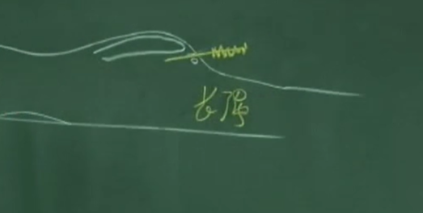

## 督脉
诸阳之海
督脉跟任脉一样，没有井荣俞经合。
要知任督二脉之功， 先将四门关闭，耳、目、口、鼻先闭起来。

1. 长强
    督脉第一个穴道是长强穴，是足少阴、少阳之会，这个穴是痔疮 的根本。

    在尾椎骨的下方，肛门与尾椎骨的中间

    

    痔分两种， 一种是内痔、一种是外痔。内痔时，中医定义它，是先血后便。大便的时候，血排出来后， 再出大便，不会痛。外痔呢，是先便后血，上完厕所，一擦屁股，看到流血，这是外痔，先 便后血，外痔会很痛。长强穴，不管内、外痔都可以治疗。像痔疮就是个非常好的治症，不管是针、灸或中药.

    下针时内痔看不到，外痔时，肿得很大，用三棱针来刺它放血，放血时， 可以用小一点的火罐把痔疮吸住，把脓血抽出来，把痛去掉，痛就是瘀血累积才会有痛。很多穴道都可以治痔疮，长强是个大穴，内痔效果也是很好。
2. 腰俞
   