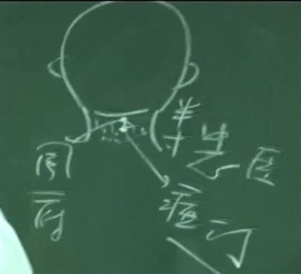
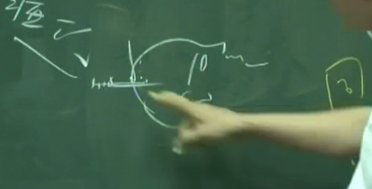
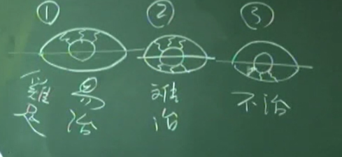

## 督脉
诸阳之海
督脉跟任脉一样，没有井荣俞经合。
要知任督二脉之功， 先将四门关闭，耳、目、口、鼻先闭起来。

督脉一般下针较少，做诊断，下在旁边膀胱经上

---

十四椎 肚脐对面 命门

肩胛下横线相交 第七椎下 至阳。
找第九椎   筋缩 这个在筋缩可以治疗，任何的抽筋，吐白沫

至阳筋缩中间 经外奇穴 消渴穴 糖尿病 可以判断好了没有 可以治疗。 治到压着不痛好了

第四椎 没有穴道
第三椎 身柱

如何区分胸椎和颈椎 手按着那个骨头，头椎是会转动的，但胸椎不动。所以在动骨和不动骨之间的就是大椎穴

哑门跟风府。要先找到风府穴。
要用度骨法来找穴道。度骨法是用骨头来丈量。在我们的后脑，可以摸到脑骨，在脑骨下方半寸，是我们的风府穴。
风府下半寸，只有一点点，就是哑门穴。

下针的手法是这样子。平常我们有特别设计的枕头（中间是空的），病人面朝下，但病人头可以靠着。我们下针的时候，这个针下去是这样子，对着舌根的方向。

下到已经到脊椎骨旁，已经碰到头椎。到位的时候，病人舌头会吐出来。哑门专治声音都发不出来。

前顶 先找神庭

你弧度转上去的第一个凹点就是神庭。

所以找穴道最好是触感，触感不好没关系，你从百会回头找。百会很好找，百会往前走一寸半就是前顶，前顶再往前一寸半就是顖(聪)会，顖会再往前一寸半就是上星，上星跟神庭只差五分，

素髎（疗） 鼻头正中间 和女人的会阴穴相对

---

1. 长强
    督脉第一个穴道是长强穴，是足少阴、少阳之会，这个穴是痔疮 的根本。

    在尾椎骨的下方，肛门与尾椎骨的中间

    

    痔分两种， 一种是内痔、一种是外痔。内痔时，中医定义它，是先血后便。大便的时候，血排出来后， 再出大便，不会痛。外痔呢，是先便后血，上完厕所，一擦屁股，看到流血，这是外痔，先 便后血，外痔会很痛。长强穴，不管内、外痔都可以治疗。像痔疮就是个非常好的治症，不管是针、灸或中药.

    下针时内痔看不到，外痔时，肿得很大，用三棱针来刺它放血，放血时， 可以用小一点的火罐把痔疮吸住，把脓血抽出来，把痛去掉，痛就是瘀血累积才会有痛。很多穴道都可以治痔疮，长强是个大穴，内痔效果也是很好。
2. 腰俞
   督脉第二个穴道叫腰俞，这脊椎骨在尾椎上是成三角形的，在尾椎骨上，在脊椎交接的地方，第二十一椎，我们叫腰俞。
   腰俞可治月经不来，其实我们有非常多的穴道可以治月经不顺，不一定要在腰俞治，很少用。
   诸位知道这个穴道就好了，我到现在没有用过。
   长强就很常用了，那个痔疮痛起来时，很难过。当然我们痔疮放血时，要带橡皮手套放血。放血时，当然用火罐小一点的，这是基本常识。
3. 命门 第十四椎 肚脐对面
   命门穴针和灸都可以，剧烈的头痛，中医讲的角弓反张就是脑膜炎，在命门上都可以治疗。
   命门穴顾名思义是生命之门。练功夫的人在肚脐下三寸的关元和命门，先观想成一条线。吸气时，这条线往下沉，这条线沉到会阴的地方。吐气时这条气往上升，升到顶的时候，再吐后一口气，再提肛门。

   平常小便，男女都可以用，从小就要教你的小孩子，不要随时跑去小便，你要等到饱满 时，扣不住了才去。在小便时，要大力地排出来，成为反射动作，大力地尽量排，要让力量很大，养成习惯时，每天都在运动下焦，就会长命百岁。把气逼出去发一点声音都没有关系。
4. 阳关 命门下两椎
   阳关穴很少用到。阳关穴针灸都可以，像治腰痛时。
5. 悬枢 第十三椎下
   悬枢呢，治症跟阳关差不多，治腰痛等等。三焦经会经过。 
6. 脊中 第十一椎下 脾的正后方
   脊中这个穴道只能下针，不可以灸。第十一椎下周围是脾脏，这穴道主要是治黄疸 、便血 。因为它在脾的正后方。以后会学到膀胱经第十一椎下外开一寸半，是脾俞。
   督脉的穴道除了治病以外，还可帮助诊断。介绍膀胱经时，会回来介绍这些。筋缩用针和灸都可以，像治癫痫狂。-->眼诊法
7. 中枢
8. 筋缩 第九椎下 肝脏后方
   第九椎是筋缩。全身上下，肝主筋，全身的筋是肝脏在管。这个穴道正在肝的后方。
   
9. 至阳 肩胛横线 第七椎下 血会
    至阳穴也是近取穴，治我们的腰脊痛 。
    
    实际上腰脊痛分很多种，如果是上部。
    以十四椎分，脐下痛都是带脉。脐上横的痛，是阳维脉的地方。
    
    在督脉上面，上面就是至阳，下面就是阳关。那你就要看那个穴道是近取穴

   TODO: 至阳是心脏背面？看情况像是胃

10. 灵台 第六椎下 古代禁针
    灵台穴这个穴道是帮我们诊断用的，第七椎这个穴道也是可以帮我们做诊断，这些都非常好用。一般呢，第七椎是血会的地方。
    而第六椎灵台穴进入脊椎骨，是现在标准血癌可以看到的地方。

    灵台的旁边是督俞，诸阳之会。灵台有压痛点，代表得到过多的营养，实际就是西医讲的白血球增加。在灵台这边就会有过实的现象。灵台穴有压痛，就是标准的血癌。

    一般疗程四周，没有人动过的情况下。小朋友两周。
11. 神道 第五椎下 一般下针 因为汗水比较多，所以下针。
    神道穴，在任何的心脏病都会有压痛点。在初诊时压它，在治疗后再压它，就发现痛没那么多了。如何知道病好 了，压的时候不痛了，就是好了。
    主要用来诊断，下针很少下，我都下旁边膀胱经的穴道。
12. 身柱 第三椎 
    这个身柱骨很有名。假如脊椎骨受伤产生的瘫痪，如果是第三椎裂掉，就完全没办法治。只要第三椎骨还在，第二、第四、五坏，都还有办法救回来。

    实务上，身柱骨很好用，小孩子没事就灸身柱。灸灸身柱可以让人家长的高大，而且身体非常壮，不容易感冒。

    所以，灸身柱是很有名的。临床上，平时常感冒的小孩子，灸身柱后，五壮七壮九壮都可以。小孩就没感冒了。书上写身柱后第二行写，不喜欢看到人、火，这就是阴症，可以灸灸第三椎跟第九椎，都是志阳的穴道，第三椎非常好。 
13. 陶道 第一椎下
    手按着那个骨头，头椎是会转动的，但胸椎不动。所以在动骨和不动骨之间的就是大椎穴
14. 大椎 第一椎上
    大椎穴是真正的大穴。我们在发烧感冒时，用三棱针放血，挤一点血出来烧就退。因为它是手三阳、足三阳、督脉之会，我们在退烧时可以用大椎穴。

    太阳少阳并病，头项强痛，或眩冒，时如结胸，当刺大椎……
    医圣张仲景，他很了不起， 写完《伤寒》《金匮》，他的针灸不强。太阳少阳并病就是小柴胡汤症。
    
    大椎的主力就是用在高烧放血。
15. 风府 足太阳督脉阳维之会
    风府就是风之府，风很容易进去的地方。所以，是中风的穴道、头项强痛的穴道，都是近取穴。你看这个风府，旁边有风池，下面风门，所以冬天时，你缩脖子就不会冷。因为脖子它根本就是一个冷却系统。

    风府是中风的大穴。
16. 哑门 督脉阳维之会
    病人中风舌强，正面的时候下廉泉，趴过来就下哑门。哑门跟风府下针手法都一样，对着舌尖下。哑门是督脉阳维之会。
    在脑部那边下针，你只要方向对，都不会有问题，对着舌根。
    一般来说，哑门跟风府都不灸，灸哑门的话，一灸就哑了。

17. 脑户
    脑户、一个是强间。这个脑户、强间，一般都不灸的，都会让喉咙失掉声音，都是用下针的。

18. 强间

19. 后顶
    从百会往下一寸半，就是后顶。后顶跟前顶都是百会的辅助穴，
20. 百会 所有的阳经都会在这个地方。
    耳朵耳尖的地方往下到头顶中心点，再往后五分的地方有一个凹洞，凹洞可以摸到，这就是百会。

    一般来说，都是治疗头痛 

    百会穴百病皆治，也就是当你完全想不到怎么办时，就治百会。
    因为百会是诸阳之会。我们有六条阳经，手有三阳足有三阳。而阴经只到脖子，不到头。所以“头”部，人称六阳之首，头上没有阴经，头部是阳经。

    百会是六条阳经过的地方，所以百病皆治，癫痫也可以治。中风时，百会是大穴，必取的穴道。

21. 前顶 百会前一寸半
    那平常下针的时候，百会前一寸半，后一寸半，左一寸半、右一寸半，都是加强百会的效果。

    

    往这凹洞的前五分，在这个地方斜刺，刺到百会穴。我们扎头针，是在头皮和头骨之间，没有人直扎进去的。

22. 顖会 
    顖会再往前一寸半就是上星，上星跟神庭只差五分，平常这些穴道我们很少用。

23. 上星
    我们大概会用到上星。上星呢?我们在治鼻窦炎 、治鼻子发炎时，在上星灸。上星是用米粒灸，把头发分开来，头发用夹子夹住，找到上星穴的时候，一般督脉的穴道都有个凹洞，在上星这个凹洞上放一点凡士林，艾绒用细细小小的放上去，香一点，一下就烧完，做七壮，九壮，十一壮。

    灸的时候，会麻麻的一条直接到鼻子，效果不错。那灸到头上有个疤也没关系，和尚有九个疤，你才一个。搽一点外用伤口的药膏就可以。
24. 神庭
    神庭穴一般来说不针，你大概知道位置就好了。灸比较多，一般很少用针的，脑部或头部的穴道，大部分都是治精神病，你想近取穴就对了。
25. 素髎(疗)
    女人如果是处女之身，素髎这会有一片骨头，鼻子一摸，就感觉得出来，如果不是就变成两片骨头。
    通常用点刺放血治酒糟鼻
26. 水沟 水沟就是我们的人中
    书上：“主消渴饮水无度”，因为在嘴巴旁边嘛，你喝一杯就小一杯出来。癫痫、不识尊卑、胡说八道、面肿 。

    有的人人中是一个缝,像个水沟。有人没有水沟，平的代表没有小孩，没有儿子，有水沟代表有儿子。
27. 兑端 上唇上面正中间。
    平时很少用
28. 龈交 在门牙肉正中间
    一般来说是近取穴，治牙痛，牙周病。
    这个针你扎上去，捻捻针就出针，一出针血就出来，不留针。
    不要去灸，怎么可能在嘴巴里灸?这是督脉最后一个穴道，治疗牙龈肿 、腐烂，牙周病 ，用放血的就好了。
    

### 癫、痫、狂之眼诊法
癫、痫、狂，这三个是不一样的东西，在诊断上要看眼睛。这是眼睛，这是眼珠，左眼右眼都一样。

我们把眼角切开来分一半看，第一种呢，可以看到血丝在眼珠的上面，如鸡的脚。 易治

第二种呢，这是眼睛，这是黑珠，上下都有血丝。 难治

第三种是血丝在下面，不治，就是无法治。

怎么知道治好了，看鸡脚，鸡脚就是血丝，没有了鸡脚，就好了。那这个癫症、痫症、狂症，一般来说，只要精神上有问题，百分之九十九都有便秘。把燥粪去掉之后，再来会有很多种治疗方法。
