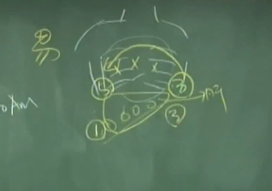
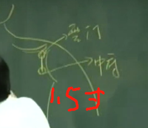

## 肺 传导之官
为什么讲官位？就是黄帝问岐伯，把内脏对到官位，把身体当成国家时，内脏的官位各是什么。就是岐黄之术的由来。

**“传导之官，治节出焉”**

### 肺藏魄。
这个魄，中医这专有名词害了很多人，我解释给诸位听，这个魄是什么东西，什么意思?就是白天见鬼嘛，讲完了。这个人看到不应该看到的东西，奇怪，大家都看不到，我却看到了，就是魄不守。
看这个人在大白天，他不喜欢出来，怕见到阳光，躲在衣柜里面，看到你很惧怕，就是魄已失。
有这个魄在肺上，我们才知道治节，才知道进退，才知道客气、态度。

### 肺是气之本。
我们中医很喜欢用气、血这两个字。真正气的定义，就是热气、蒸气。好像吐气吐出来，吐到玻璃上面，看到那个热气。
气可以表现在很多地方，像头发出油，就是有气才会出油。快死掉的人，头发干的都蓬起来。
有的人油太多了，有个女黑人，风吹来头发都不动的，一天要洗两次头，她气太旺了也不好，要把气用掉，多运动。所以头发出油也是气的表现。

### 肺主皮毛，也就是皮肤毛孔是肺在管。
所以中医治皮肤病，在肺上面治疗。这个人皮肤好不好，也可以看肺好不好。

### 肺开窍在鼻。
所谓开窍在鼻，鼻在呼吸，毛孔也在呼吸，通通是肺在管。
脸上的眉毛也是肺脏在管，所以眉毛跟头发、胡子不一样。把眉毛剃掉，不容易长，但头发很好长。

肺管治节，治节之官，一个人年纪大了，非常有规律。治节嘛，就是非常有规律，每天按步就班的这种人长寿。所以到了年纪大了，眉毛开始长，所以长眉等于长寿。
那有的人眉毛掉了，就是魄不守，这个人一天到晚在忧虑。

### 肺主忧，因为有肺脏，所以我们人会忧.
忧太过，就伤到肺。
所以有个人咳嗽，不断咳，在咳的时候发生一件事情让他很担心，比如说担心小朋友考试考不好，在这个时候，咳嗽就不会好，会一直咳下去。

### 肺在五音，主的是商声。
肺是金，在五行里面呢肺属金。因为肺是阴经，所以是阴金。

肺在干支里面是辛寅.金会生水，肺是燥金

### 肺在声为哭在变动为咳。
当肺有问题时，
在变动上面为咳，在志为忧，忧能伤肺，喜能胜忧。

那这个寒胜热、辛伤皮毛、苦胜辛。这个苦味一样是属于火。任何东西经过烧过就是苦味的，辛辣的东西，放苦的东西就不辣了。

## 五脏逼毒法
这个商声呢，叫呬，这个呬怎么发声，我画给你看。
/木火土金水排第四

那你这样子时，要有动作配合。

肺脏在骨头里 如何练？

这就是要技巧啊! 我们有个动作，把肋骨上下一挤压，肺里面的浊气就只能往外走。人直立在那边，手往上抬，脚尖着地，手往上升时，肋骨会往上升，一上升就压到肺脏，然后那个呬的声音发出来，发到没有气了才是开始!不是结束!没气时，要把肛门提起来，最后发一个无声的气

在做的时候，可以做五次、六次，我们在做逼毒的时候，会咳、吐，眼泪都出来，这都是好的。练功之前，就要把毒逼掉，身体会很干净，这样练功才能把大气的精华吸收进来，这是“呬”的动作。

### 肺发象天幕
正常人要头面身体冷，手脚是热的，这是正常。
肺脏法象天。整个天幕像肺脏，皮肤像天幕把人体所有的器官包起来。不管身体里面是大便、病毒、宿便，好的坏的全包在里面。
肺主皮毛，天是冷的，所以皮肤、毛孔、头上通通是冷的，这是正常的，但手脚要是热的。

## 脉诊
正常的肺脉!什么叫肺主皮毛，你如果摸到脉，在秋天的季节，你摸它的脉气，这脉气会在皮毛上面，这样是正常的。

脉气怎么摸呢?不能乱摸，当指头摸到脉的时候，这是病人的皮肤，你摸的时候正好轻轻摸上去，像刀子正好到皮上面，人可以感觉到刀子，但是不会把皮割破。
轻轻的你就可以摸到脉，这种脉叫浮脉。正常的肺脉是浮脉，轻轻就能摸到脉就是正脉。这就是正常。

。。。人参非大剂不补，少则凝滞。大剂的人参，像独参汤，大剂的时候一两，二两这样用，补气时要大剂的人参才行，为什么呢，我们到《神农本草经》再讲。

瓜果吃不是不好，吃得多会伤到肺，
以薤xie4白粥加羊肾空心补之。加羊肾来炖，没有羊肾时用猪腰来代，比独参汤还补！穷人买不起人参，羊肾也买不起，那就用猪肾代替。

## 阴经之井荣俞经合
肺经有十一个穴道，我们会一个一个介绍，起于中府，终于少商。
这条经是多气少血，流注的时间是寅时，就是早上的三点到五点在这里。三点在这，五点在这，肺气是从左向右走。

第一堂课就谈过了，只要是阴经，从手肘以下、膝盖以下，是从井穴开始，就属木（井）火（荣）土（俞）金（经）水（合），这是相对的。
手肘以上没有。

肺气是从左向右走。

有个病人来找你，我每天四点半起来咳嗽。这就讲完了，就是在肺脏的中间偏右出问题。所以中医不须要 X 光，用听的就知道了。

---

肺经第一个穴道叫中府，歌诀是：“中府云门天府诀，侠白尺泽孔最存，列缺经渠太渊涉，鱼际少商如韭叶。”

天府 手靠过来 素髎穴的位置  大臂正中

尺泽穴 大臂大筋外 合穴
孔最 尺泽下三寸 

列缺 列缺找法是把手叉起来，这两个指头，食指尖到处是穴
首先有个高骨在这，你摸，这有个高骨出来，高骨之下方，我们叫经渠。经渠后五分叫列缺，经渠前靠近手横纹的地方，我们叫太渊。

太渊 经渠 列缺 寸关尺

---

1. 中府 肺之募、手足太阴二脉之会
   我们平常下针，中府如果直刺，容易扎到肺。云门是肺的募穴，这两个穴道靠肺很近，我们扁鹊针灸手法是**一针透两穴。**
   编者注：也有种说法是肺的募穴是中府。
   一般这个穴是治疗久咳 、气喘 。

   那我们针灸书上讲的瘿瘤 ，包含我们的甲状腺肿瘤 、淋巴腺肿瘤 、腋下的肿瘤。千万不要只局限在甲状腺肿瘤。
2. 云门 穴性接近
3. 天府
   穴道要找两个肌肉中间，包括下针的时候，也要把肌肉分开，直针进去。
   这个穴道专治流鼻血 ，左鼻右治，右鼻左治，采对称治疗。
   扎的穴道很正确，差不多五分钟就完全停掉了。
4. 侠白
   侠白在天府下一寸。扎天府就不用扎侠白。但我们有一种针法叫随寸针。比如说天府下去血没有止，再针侠白，因为差一寸像加强效果，变成两倍效果，增强它的效果。
   这两个主 治都是流鼻血，我不管你是一般的流鼻血，还是鼻咽癌。不管里面的病，只要是流鼻血都可以下。
5. 尺泽 合穴 肺经子穴
   下面一句话，肺实泻之。肺家的实症，在这个穴道上治。
   直刺就没有所谓的补泻。最简单泻的手法，肺的经气是向下，病人躺平，逆向下就是泻，同向下就是补，顺为补逆为泻。
   把昨天的手法加进来，我们针进去就已经是逆了，引到气病人会酸麻胀，再往下推一点， 就是泻上加泻，那这是老师傅的手法，把两种手法合并在一起用。

   初病为实证 可
   久病 几个月 虚证 不可扎尺泽。因为尺泽是合穴，属性是水。

    这个肺经除了内科病以外，还包括神经痛。比如，病人手痛来找你，痛在肺经，痛多久啦，五天，是实症，就结束了
    。经络上的痛是新病的话，一样是实症，症状判断的准，才会选择穴道。久病，一个星期以后，就是虚症，用母穴。
6. 孔最 肺经的郄穴
   郄穴一般是发炎的时候用的。孔最在两个肌肉中间，可针可灸。
   一般在身体凹下去的地方（尺 泽），因为多汗，针比灸好。

    孔最有一个特别的治症，专治痔疮。
7. 列缺 手太阴肺经络穴手阳明大肠经
   我们在针列缺经渠时， 用指甲拨开动脉。下针到穴道后，会变点头针，针下的很好，针会点头，这不难。
   **列缺主任脉，任脉有问题下列缺。**
   喉咙痛时针列缺。书上面说，列缺过来第三行，最上面那边，“阴茎痛 ”。什么地方不痛，痛在阴茎上面，你只要记得，列缺管任脉，喉咙到阴部都可以在列缺上治。
    《素问》说，直行的是经，旁出者谓之络。列缺是手太阴肺经的络穴。经和经之间有络，这个络从手太阴肺经络穴络到手阳明大肠经。

    人会有寸关尺的脉不见，从列缺到阳溪见者，这是反关脉。从食指按到列缺，一摸，怎么脉没有了。这个脉很大，太渊脉没了，这是经，这是络。经脉气不够，络脉气很强，这叫反关脉。
    有反关脉，非富即贵，这是象。那最近呢，病人尿毒洗肾的时候，为了洗肾方便。把动脉跟静脉接在一起，变成人人有 反关脉，硬接上来的就不是象了。 
8. 经渠 金穴
   手太阴肺经就是阴金，碰到一个穴道刚刚好也是金，就是本穴。
   在本穴上可补也可泻。
    尺泽，必须要实症才下，虚症不下。假设补泻没做好，针下在尺泽，也是泻，因为穴性就是泻。

9.  太渊 脉之会 俞穴 属土 母穴
    太渊下针角度是斜下进针，用一寸针。用 3210，三十二号一寸针。
     

## 补泄
俞募治疗，取俞穴以及募穴。下针的方式，是顺着经走，在补泻的手法里面呢，慢慢我会一点一点教你。
### 顺为补，逆为泻。
那何时用补，何时用泻。有这两句话，“虚则补之，实则泻之”。
所以我们要分虚实。简单讲虚实，就是实有东西虚没东西。虚症跟实症，虚症小便多，实症会手掌过热。
顺着经气走，中府，云门， 顺气扎针，叫补，如果逆气扎就是泻。

### 子穴泄 母穴补
每个经络都有子穴母穴，阴经就是木火土金水，阳经就是金水木火土。 

### 实拒按，虚喜按。
