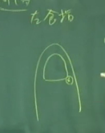
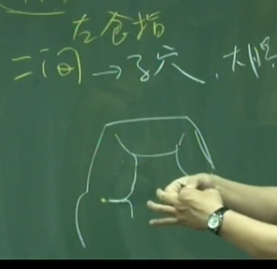

## 大肠
《内经》曰“大肠者，传导之官，变化出焉，又云白肠”。

养生的时候，大肠是属于腑，是属于阳，所以在揉丹田的时候，是顺时钟的方向揉，这是我们揉的方向，顺着大肠的方向 推，可帮助排便。

因为肺有肋骨，所以按不到。但别忘掉了，肺主皮毛，所以手掌轻轻碰，气就开始动了。

阳金 与肺互为表里
我们人吸气的时候，中医认为吸气是肾脏在管，吐气是肺脏在管。所以有病人气喘时，问病人你是呼气困难还是吸气困难？如果是吐气困难，我们知道病在肺。如病人说“我是吸气困难”，那我们知道肺没有问题，病在肾。

表里是指呼吸时，肺横隔挤压肝 气直达大肠。

---

## 位置

手阳明大肠经，我们遇到阳经的时候，我们的五腧穴属性就改变了，变成金（井）水（荣） 木（俞）火（经）土（合）。五腧穴的阴阳五行的性改变了，叫做金水木火土。

商阳 

二间
二间穴怎么找，指头弯起来这个地方，在这横纹头这里。你可以看到纹头在这边，看到了没有?在纹头上面一点点下针，

三间
从二间穴跳过来，进入手掌有个关节缝，这个缝就叫做三间。

合谷 握起来最高点 虎口高起来的地方，最高点就是合谷。

---

#### 1. 商阳 井穴 本穴 金穴
   我们点刺放血，少商商阳放血，大椎也放血，几乎所有的烧都可以去掉。扁桃腺也可以治，但主症是在退烧方面。
#### 2. 二间 荣穴 子穴
   也就是说治大肠经实症。大肠有实症时，在这泻它。
   如果直接下在纹头上， 因为那里有痛神经，所以会很痛。在指头旁已经很痛了，你不能又在痛神经上下针。二间穴怎么下，将病人手弯起来，不能直的下，要弯曲指头，然后一压，一压肉会比较 多，比较不痛。这是我们下针的手法。

   所谓实症，大肠经的经穴走向是由手走头。
   我们手上面有三条阳经，手三阳控制三个动作。例如，我们抬手有三个动作，第一个是手没办法前抬，就是大肠经。手不能梳头了，是三焦经。手不能往后摆是小肠经。
   而虚实要看病多久，在该经的子穴、母穴上下针即可。
#### 3. 三间 俞穴
   很有名的三间透劳宫，手掌的中心是劳宫，讲到心经时会再介绍，三间穴下到劳宫穴主治风湿关节炎的肿痛。当手不能握拳，针下去， 二十分钟，起针，就可以握了，隔天会更好。三间也可以透到后面的穴道，也就是合谷穴。
#### 4. 合谷 原穴
合谷是非常大的穴道。阳经有原穴。阴经没有原穴。合谷穴就是阳经的原穴，原穴没有井荣俞经合属性。
治疗法则就是原络治疗法。就是取它当病经的原穴。我们合谷穴就是大肠经的原穴，那所谓的原络治疗，这个“原” 就是病经，“络”就是指表经或里经的络穴

## 细分虚实症
那有的时候，刚好痛一个星期，到底是实症还是虚症。
实症呢，就是痛，差不多一周之内。
实中带虚，就是痛多酸少。再久一点变虚中带实，酸多痛少。
虚中带实 酸多痛少
虚 纯酸 不痛
>实症很简单，用子穴去泻它。实中带虚就先泻后补，因为痛比较多嘛，后补，后面补它。虚中带实，先去补它，再去泻它。纯虚症，用补的手法
法二 原络治疗 分不清虚实的多少
>第二种呢，扎原穴，扎病经。大肠经又痛又酸，就用原穴，对面的原穴下针，针原穴就像你跟身体讲话，我知道你的病在大肠上面，这时候扎肺经的络穴，表经跟里经的络穴，肺经的络是列缺。你今天下原穴，再下表经或里经的络穴，病就去掉。这样就是原络治疗了。

