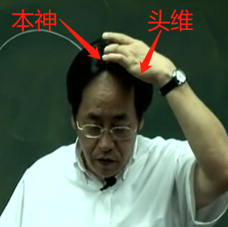
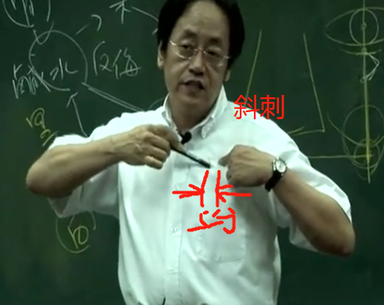

上午7-9 
大肠经走完了以后，进入了足阳明，足阳明是胃经。阳经又重复了，任何的阳经从四肢末梢，井荣俞经合，就是金水木火土，膝盖以下。
胃经从头上，一路下去，到脚趾头，是相当大的经络。
手上的阳经由四肢往身上走，脚上的阳经是身上往四肢末梢走。

大肠完了以后，气血就进入头维，阳明胃经的第一个大穴。

胃经，是多血多气的。

胃脉，实则实脉，脉按着越重，就越弹得越高，这就是实脉，虚脉看着很大，按下去就没有了。

### “胃者仓廪之官，五味出焉”，
仓廪之官管仓库，东西进来不好就把你排掉。当胃一吃到是不好的东西，就开始反胃、恶心想吐。

我们所谓常人，正常人他的脉息是一息四至。
比如说吸气，一吸胃就动两下，吐气，一吐胃跟着动两下。这就是四至到五至的观念。

土克水的意思是，今天水有问题了，水是肾脏，肾脏有问题时把土淹没掉了，所以水会反土。

所以我们有一句话，胃是肾之关，肾关门的地方。所以严重的肾脏病、尿毒症，除了极度的晕眩以外，就是恶心，不断的吐，是因为水太重，害到胃，并不是有胃病。
### 胃为黄肠。
胃的本身是黄色的，叫黄土。

## 位置
足阳明胃经一共四十五个穴道，它还不是最大的经络，最大的是膀胱经。

厉兑、内庭、陷谷、冲阳、解溪、足三里，为井荣俞原经合

头维呢?头发拉起来，发际这边，正好在转角的地方。头型是这样子，这个在转角的地方，有一个凹洞，这个穴道，跟本神在同一条线。

发际这边，正好在转角的地方。头型是这样子，这个在转角的地方，有一个凹洞，这个穴道，跟本神在同一条线。这个位置看你头的大小来决定。不能说三寸，有人三寸还没有到发际。

用指感来找，正好在凹角的地方进去，你用摸就可以摸到一个凹洞

下关 开口那个洞 颊车 咬肌跳动

承泣、四白与巨髎
在眼睛下方、眼框骨头上面一点，我讲过穴道不会在骨头的正上方，而是在骨头上面凹的地方，这就是承泣。

四白 眼眶骨头下一寸
巨髎是在颧骨下方这边，这里有动脉，可以下针，但不要太深。

地仓在嘴角旁边，我们有天仓跟地仓，你看眉毛这边，我们这叫天仓。
天仓没有的话，一种是没有祖业，或身体很差的时候，天仓也是会凹下来的。没有地仓表示是小偷或身体的胃气不够。

大迎在我们下颔这个地方，地仓颊车中间是大迎。大迎穴在骨头上方，再往下是人迎。
这些穴道你知道就好了，很少用，人迎有人迎脉，这条大筋最上方就是人迎、中间就是水突，再下来就是气舍。这几个穴道在用的时候，水突比较常用，治疗瘰疬 ，治甲状腺肿大 ，下针的时候把大筋捉住，不要碰到血管，顺着指甲进去，扎五分进去，在治甲状腺肿很好用。

缺盆穴在琵琶骨、锁骨正中间。
由缺盆穴再下来是气户，我们叫“气户库房屋翳屯，膺窗乳中庭乳根”。气户跟缺盆隔了一个骨头，跳一个骨头下来就是气户，再来就是库房。

这个足阳明胃经，顺着大筋的内侧下来以后，再转到这边来。与任脉相距四寸的距离，到了乳根进来，后面是两寸。

---

#### 1. 头维 足阳明跟足少阳之会，一般来说也是禁灸的。
穴很少下针，你也可以下针，但要知道这个位置是头维。你仔细摸，讲话时会有脉在动。
你就去摸骨缝，这个穴道很大。全身最小的穴道是八髎，其它穴道都蛮大的，血海更大。
#### 2. 下关
让病人躺到，侧卧
主要治症包括，中耳炎 ，牙科脱臼的时候以下关穴为主，两手将下巴的骨头往上打上去，它就会合起来。
下关不灸，有头发的穴道都不灸。可治牙科、下巴脱臼 、耳流脓 。

还有一个症状西医叫tmJ,就是牙关这边很痛，不能咬，我们下针都可以。下脸针的时候，先下合谷，这个tmJ效果非常好，牙医也来找我治tmJ,牙医痛的没办法啊!tmJ 治法是痛在下关，先下对侧合谷，再针下关。
#### 3. 颊车
颊车穴可治疗中风 、口歪眼斜。用地仓透颊车。下针的时候，地仓透颊车，面部中风用的，病人口歪眼斜。
我们先针健侧，当然要先下合谷再透针。过去面部中风的时候，是用鳝鱼血，当场杀一条鳝鱼，把鳝鱼血一涂上去，血一干，拉的力量很强，就把脸拉回来。用鳝鱼血拉脸很有名的，万一歪左边的时候，就涂右边。没鳝鱼血时，就下针，用地仓透颊车。
所以，治口张不开，口噤不语、失音，面部中风、口歪眼斜，都可以。
#### 4. 承泣 足阳明、阳蹻、任脉会穴
一般来说，不下针，因扎了眼睛会黑眼圈瘀血嘛!知道穴道位置就好，但不下针。
现在我们技术好的话下针可以，因为以前针很粗，现在针很细。
我们知道这穴道要干什么?因为要用来诊断。这眼珠子，下眼袋拉开一看，这个人眼翳从下往上升，就知道是足阳明胃经的问题，升到瞳孔边把眼睛遮住就看不到了。
#### 5. 四白
那这些眼睛附近的穴道，都是治疗眼睛、内翳的问题，还有更好的穴道可用。
#### 6. 巨髎
有人拔牙完很痛，我们就在这下针，效果会很好。我用最多的是治牙痛 ，还有这边局部的肌肉麻痹。
#### 7. 地仓 手阳明、足阳明、阳蹻脉的会穴
所以很多年轻男女有青春痘，青春痘都在胃经上面。胃很热，又吃很凶，吃了半天，痘痘就会比较多，又再通宵熬夜，痘子就长出来，
#### 8. 大迎
#### 9. 人迎
这人迎很少下针，但用来摸脉，人迎脉有的话，胃气就有，病人就不会死。那这几个穴道呢，即使不会用也没关系，但位置要知道。
#### 10。水突
水突比较常用，治疗瘰疬 ，治甲状腺肿大 ，下针的时候把大筋捉住，不要碰到血管，顺着指甲进去，扎五分进去，在治甲状腺肿很好用
#### 11.缺盆
穴道不会下针的，若深针会扎到肺脏，引起肺气肿。
#### 12.气户库房屋翳膺窗乳中乳根
近取穴一定是乳房的问题嘛，平常不会下这边，通常是像这个乳水排不出来，有硬块，男生很简单一个肋一个肋这样去找。我们下针的时候不是直下，要斜剌。

下针是在前五分的地方从里面斜刺进去，而不是直刺。
膺窗，屋翳、乳根，是治乳房硬块的地方。
这里面我们要了解几个东西，书上指膺窗，乳痈寒热。那乳中穴，看书上的中间。乳中禁针也禁灸。
乳房是足阳明胃经所经过，那乳头后面的地方是肝经经过。这是乳头的下方，乳头这络到肝经上面。乳房有足阳明胃经经过它，足厥阴肝经也经过它。
这也是为什么女人乳癌，若切了乳癌又会变转到肝癌、肺癌的原因。因为有络会到它，里面身体都是相通的。
就是乳癌发病的过程。妈妈喂母乳给小孩，在喂母乳的中间跟先生吵架、婆媳吵架，就造成奶水在里面，那奶水一积住，奶水不出来，就变成硬块在里面。只能活十年。书上提到已成岩就不可治，这是针灸不可治，但我们还有药，《伤寒》《金匮》里面。乳中穴呢，初次喂母乳，奶水很胀，但奶水 出不来。过去大陆的中医，用葱头，用葱白，先用葱白的地方，把乳头涂一下，这葱白会辛辣发散，然后把葱反过来，用葱背后的毛一扎一下，奶水就出来了，效果很好。

像石头一样那么硬，乳癌就是这样子的，很硬。然后到了十三年、十四年，中间会破个洞，流很臭的脓出来，肿很大，但病人不痛。到后期时，按书上记载，深可见骨，可以看到肋骨，还是流黑的脓血，也很臭，我被臭过很多次了。这个怎么形容呢，像烂的尸体，就是那个味道。这个是最早中医的癌症。
从宋朝开始有记载。再来是乳根，一般来说，膺窗，乳中、乳根，乳中不下针，膺窗、乳根都可以下针。如果说我们下针在膺窗跟乳根。

#### 19. 