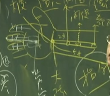

要先有个观念，三焦是行阳的，是无所不治的。当心包经的气血，走到指头边，关冲穴的时候，就会顺着指头再绕回来到笫二个指头，也就是无名指的外侧。 9-11点

三焦经由于贯通全身，它是行阳，所以比如说往来寒热、忽冷忽热。因为它连贯脏和腑中间，脏有肝、心、脾、肺、肾、心包，腑有大小肠、胃、胆、膀胱。它连接腑和脏还有沟通协调，这些都靠三焦。所以，三焦当阴阳在相抗争的时候，或内脏在抗争时候，因病想进到内脏，而内脏不让病进来，所以身体就忽冷忽热。这些症状你都可以在三焦经上面找到很好的穴道。

肚脐以下我们称下焦， 胸蔽骨到肚脐称中焦。胸蔽骨以上称上焦，合为三焦。上焦如雾，雾是很轻的，非常干净，中焦如沤，下焦如渎.

所谓上焦如雾，就是因为小肠在这边，膀胱在小肠前面，大肠在小肠上方，肾脏在小肠的后方。当水经过小肠的加热，水气就因蒸发而到上面来了，所以上焦如雾。

三焦就是网络、网膜，它横跨肝胆脾胃，完全是消化的地方，当中焦气快没有了的时候，病人呈现的是“嗝”，就是打嗝。打嗝古人称“哕”。虽然此时东西还是可以吃，但表示中焦气快没了，三焦是阳嘛，是阳气。这是很危险的时候。

下焦如渎，这是指下焦比较脏，是有很多食物的残渣的地方。三焦看起来都是黄色的， 古字上面这个“焦”，就是“膲”。

## “决渎之官，水道出焉”。
水道是三焦在管。膀胱经是“州都之官，津液出焉”。那肚子腹水胀满满的，这就是在三焦，水道不通，阳气不通。我们常用行阳的手法，不管是下针或用药，只要阳气 顺，水就不会累积。
## 位置
在无名指指甲外侧的穴道就是关冲穴。四五指掌骨中间，靠近这骨边，这个穴道我们叫液门。液门往后一寸叫中渚穴。

阳池 手背腕中凹洞

阳池穴往上二寸叫外关。外关的对面就是内关。外关是管阳维脉，内关管阴维脉。

外关上一寸就是支沟。支沟向身体内侧骨边，会宗。支沟上一寸，三阳络。

四渎穴在手肘骨尖，往下五寸，在这个骨头的阳侧。

---

#### 1.关冲 井穴 阳属金
#### 2.液门 荣穴 阳属水
#### 3.中渚 俞穴 阳属木
阳使为母 治疗虚证。
包括我们的眼科很多穴道，液门、中渚都可以治眼科，我们可以在四肢上取穴，像眼生白内障。这都是油网、焦膜的问题。
#### 4.阳池
我们从阳池穴可以透到大陵穴。这是治疗糖尿病消渴很有名的穴道。

比如说，他左脚胃经的解溪穴痛。你可以扎右手阳池穴。用对称治疗。同样的，病人伤到阳池，你就下对侧的解溪，采用对称治疗。
#### 5.外关 管阳维 络穴
大穴。像实则肘挛，手挛急，虚则手张开不能握拳。都可以用外关来治。
在针刺的手法上面，所谓**通生死桥，**讲的就是这里外关。什么叫通生死桥，病人在壮热、大热、高烧的时候，你在外关下针，左捻右捻，不需要补泻，引到气病人说酸痛以后，你把针慢慢推到内关。
治疗高热。
从外关引到气以后，因为它是行阳的，就好像这个热水停在那边，针直接下去就好比现在打个洞，阳就往下走。所以，针一通到内关，这热当场就去了。小孩子你可以用单刺。小baby 不要下针，十四岁以下单刺，从外关左捻右捻，烧就退了，速度很快，这是通生死桥的地方。
#### 6.支沟
支沟穴在临床上，治疗便秘很好。支沟穴下针以后再配合照海穴。照海管的是阴蹻脉。

我们便秘有分寒、热。寒症的便秘就是肠子没有蠕动了，病人没有感觉，一个礼拜不大便也不难过，这是寒症。热症的便秘，病人只有一天不大便就会很难过，肚子很胀，绞痛得很难过。
在针支沟、照海时，并无谓寒热，下针后，二十四小时就排便了。支沟照海下去，可以再帮他下关元，大肠经的募穴天枢，中脘再来四花灸。中脘、天枢和神阙用隔盐灸，然后再下关元、支沟、照海，那肯定会好的嘛。

支沟穴呢?我们所谓的**开沟渠**，如人中、支沟，女人的阴道就是沟。有了这个观念，所以妇人难产、胎衣不出，或者是漏下不止、任脉不通、不容易怀孕，都可以在支沟上做。
#### 7. 三阳络
天河水不够用了！这时候我们会用到经筋，我们在三阳络开始揉一下，让气血往下走，力量会非常强。过去的三阳络我们不扎针的，因为里面有动脉，因为古代针很粗，现在可以扎针，因为针很细。
三阳络的气脉很强，所以你声音哑掉，耳聋，都可以用。
## 手指手掌问题
像书上写手指不能屈伸。其实我们通常不扎这个穴。通常遇到严重的中风患者，我们从合谷透到后溪。若是一般关节不能动的话，如扭曲不行的话，我们用三间透到劳宫穴去了。

## 儿科 推三关 （指针法）
男左女右。
小孩高烧壮热时，将手指头按到小孩子的外关穴揉一揉，揉个二、三下，然后往下推到四肢末梢，然后你手这样，因为小baby 的手很小嘛，你指头就是这样摸，从阳经这样推下来，那天河水就会从这出来，然后进入手掌内部。你就把天河水散了。再找心包经的间使穴，你只有按到它，一揉，天河水就散掉了。

在散之前，我们要先做的手法，你不要开完又散，散完又开，这样病还在那，没有去掉。我们开天河水的目地，这是用指针。

让小孩子的手握拳，中指头往前推，你这指头往前推的时候，它的指头就会弓，你不要让他变这样子。让他指头弯起来，弓过来，其它指头还在后面。这是小baby 弓过来以后，再把手指头放上去，轻轻揉它。小孩子很好玩，你不动它，它手就是捏着的，所以你把它往前推。揉几下，烧就退了，这刚好是劳宫穴，心主五液，汗流出来就开始退。

第二种手法是用在比较重的症状，例如说烧没有退。你开了天河水以后要走这边，男孩子我们有寒跟热。若这个小孩子来时，一看嘴唇是青的、脸色白的就是寒症。一看脸那么红，不是好可爱而捏他脸，这是热症嘛。一看小孩子桃子脸就是热症。

如果病在寒，我们有退寒的手法。从三关开始。三关有三个地方，食指、中指、无名指，所谓三关刚好是指头的三个关。男孩子是寒症时往上推，然后你顺着身体的方向推。这可去寒。反过来是热症，就往回推，这热就去掉了。

这推三关是去寒去热。女孩子正好反过来。

那推完以后呢，要把天河水散掉，不然它气就一直在那边，你按按间使穴，从掌的内侧到间使的地方，按到揉一下，天河水就散了。

## 耳轮：治小儿惊吓
耳朵外面一圈，我们有个名称，称之为耳轮。中医的观念里面，认为肾主耳，小孩子受到惊吓的时候，眉宇会有一条青筋，小孩子胃里面比较寒冷，眉宇间也会有青筋。

那我们怎么知道小孩子是不是受到惊吓？小孩子常常会哭闹不停。小孩子晚上在惊叫叫很大声，就是受到惊吓。受到惊吓很严重时，眼珠会动。

那我们怎么做呢？一般，我们会用两个手指头，在小孩子的耳朵耳轮外侧这边，轻轻的揉它，重量一样，当你揉耳朵的时候，小孩子就很安静了。你揉得很久，揉到小孩子睡过去，或这小孩子开始笑，就可以停下了。

如果小孩子是眼睛是往上吊，黑珠子是往上吊的，那你揉耳朵的时候，将耳垂往下拉一点重一点，它就会慢慢回来。如果眼球吊在下面，就耳朵上面的耳轮揉一揉。你如果看到小孩子眼珠是这样子，这眼睛斜那边的，或斜这个地方。你就把他对侧的耳朵，揉一揉、拉一拉，让它回来。反之，如果在这边的话，拉这个耳朵，就是拉对侧。拉的时候，比较用力一点的揉这个耳朵，眼珠子会回来。当你眼珠子朝这的时候，你在这边比较用力，他的眼珠子会自己回来。

## 三关望诊
一般来说，我们从手看三关，这是内侧的手，这三个指头有三关。三关正常是这样，如果有黑线青筋在上面两个指头(食指中指)都是很好治的，那如果青筋或黑线在下面的指头无名指的话，就非常难治，这是一种辨证法。

还有一种单指法，靠近身体的叫风关，第二个关叫气关。第三个到手指头是命关。初症，刚开始出现有问题时是在风关，没有治好才会到气关，再没治好会到命关。

## 三种背痛
痛在中间是督脉，就扎后溪。如果痛在两条经上面是膀胱经，虚证我们扎委中，实证我们扎束骨。痛是横的背痛，督脉第十四椎是命门，从这以下，病人有痛的时候，是带脉痛。上面痛是阳维脉，胸肋痛是阳维脉，就针外关。我们讲外关的治症上，常常会配合临泣这个穴道。

## 寒热进一步 癫痫、抽搐
当我们遇到经筋的病。我们开天河水，退天河水。这只是一般的寒热、高烧。严重的时候，如癫痫、抽搐，痉挛、角弓反张、脑膜炎啊，天河水不够用了！这时候我们会用到经筋，我们在三阳络开始揉一下，让气血往下走，力量会非常强。

平常我们用指针，遇到小孩子发高烧、痉挛了，你在推三关或天河水时力量若不够，这时我们用经筋。我们从三阳络把气导回来。

我们从内侧六个经筋下手。这边三关不够，就要到经筋上面。这个时候，男女不一样，往上推去寒，筋经会松掉，抽筋的现象就会去掉，那女孩子反过来，男的往上，女的往下。寒一定是往上抽，这个绷得很紧。