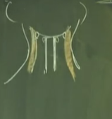
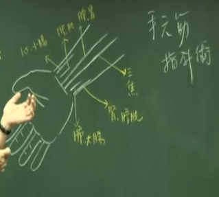

要先有个观念，三焦是行阳的，是无所不治的。当心包经的气血，走到指头边，关冲穴的时候，就会顺着指头再绕回来到笫二个指头，也就是无名指的外侧。 9-11点

三焦经由于贯通全身，它是行阳，所以比如说往来寒热、忽冷忽热。因为它连贯脏和腑中间，脏有肝、心、脾、肺、肾、心包，腑有大小肠、胃、胆、膀胱。它连接腑和脏还有沟通协调，这些都靠三焦。所以，三焦当阴阳在相抗争的时候，或内脏在抗争时候，因病想进到内脏，而内脏不让病进来，所以身体就忽冷忽热。这些症状你都可以在三焦经上面找到很好的穴道。

肚脐以下我们称下焦， 胸蔽骨到肚脐称中焦。胸蔽骨以上称上焦，合为三焦。上焦如雾，雾是很轻的，非常干净，中焦如沤，下焦如渎.

所谓上焦如雾，就是因为小肠在这边，膀胱在小肠前面，大肠在小肠上方，肾脏在小肠的后方。当水经过小肠的加热，水气就因蒸发而到上面来了，所以上焦如雾。

三焦就是网络、网膜，它横跨肝胆脾胃，完全是消化的地方，当中焦气快没有了的时候，病人呈现的是“嗝”，就是打嗝。打嗝古人称“哕”。虽然此时东西还是可以吃，但表示中焦气快没了，三焦是阳嘛，是阳气。这是很危险的时候。

下焦如渎，这是指下焦比较脏，是有很多食物的残渣的地方。三焦看起来都是黄色的， 古字上面这个“焦”，就是“膲”。

## “决渎之官，水道出焉”。
水道是三焦在管。膀胱经是“州都之官，津液出焉”。那肚子腹水胀满满的，这就是在三焦，水道不通，阳气不通。我们常用行阳的手法，不管是下针或用药，只要阳气 顺，水就不会累积。
## 位置

所以耳朵后面只有一条经经过，就是三焦经。

在无名指指甲外侧的穴道就是关冲穴。四五指掌骨中间，靠近这骨边，这个穴道我们叫液门。液门往后一寸叫中渚穴。

阳池 手背腕中凹洞

阳池穴往上二寸叫外关。外关的对面就是内关。外关是管阳维脉，内关管阴维脉。

外关上一寸就是支沟。支沟向身体内侧骨边，会宗。支沟上一寸，三阳络。

四渎穴在手肘骨尖，往下五寸，在这个骨头的阳侧。

手弯起来，手伸直时没有天井穴，要手弯起来，这个手慢慢爬过来到关节后面，你一摸，在两个筋的中间，那个凹洞就是天井穴。

你找到正位的天井穴后，从天井直上一寸，就是清冷渊。

清冷渊再往上五寸，就是消泺，这个穴道我们很少用。消泺再上三寸，就是臑（挠）会。

肩髎在手臂上方，手背一弯起来有一个凹洞，这是肩俞穴。肩俞是在手阳明大肠经。从肩俞穴跨一个大筋到后面的凹洞，这就是三焦经的肩髎。

再来天牖（泳）穴，在颈后中间两个大筋，这两个大筋外侧是天柱。这边还有一条大筋。大筋和骨头交接的地方是天牖，三焦经的地方，我们很少下针，也不能让人家灸，头后面的地方都不灸的。

扎这些后脑的针时，我们下得很浅，直针进去。

由侧面看，在耳朵下方，这个骨头后面差不多一寸的地方，这是翳风穴。

把耳朵翻起来，耳朵盖着没有经络，要搬开看。我们把耳朵翻过来，这后面有个骨头，这个骨头叫智慧骨。你摸小朋友，这智慧骨很高很凸，越凸越高越聪明，越平的越笨。

那问那里痛，我这儿痛沿着耳朵一圈。只要是沿着耳朵一圈，你马上就要想到是三焦经。

从翳风上来一寸半就是瘈脉，可以刺出血。
跳过这个大骨头上去，骨头上方凹洞的地方，就是颅息。

耳朵最上方到发际这边，中间这个地方，是我们的角孙穴。在越靠眼睛的穴道，都是用在眼科的治症。

丝竹空在眉毛的后方。在眉毛尾端是丝竹空，眼睛旁边五分的地方是太阳。后面有个凹洞是太阳。

在耳前有一个骨缝，你手按在这，嘴一张开来，就出现一条骨缝对不对?骨缝有三个穴道。最上面这个穴道是耳门，中间是听宫，下面是听会。现在讲耳门，耳门是属于三焦经，听宫是小肠经，听会是胆经。

在靠近耳门前，这斜的半寸到一寸的中间，你摸有个动脉在跳，这就和髎穴。和髎穴在脉的下方，一般来说下针的时候，手摸上去，先用指甲把脉推开来，针就下去了。你们千万不要按着脉下，按着脉下就直接扎到动脉上面，会造成淤青一块。

---

#### 1.关冲 井穴 阳属金
#### 2.液门 荣穴 阳属水
#### 3.中渚 俞穴 阳属木 母
阳使为母 治疗虚证。
包括我们的眼科很多穴道，液门、中渚都可以治眼科，我们可以在四肢上取穴，像眼生白内障。这都是油网、焦膜的问题。
#### 4.阳池
我们从阳池穴可以透到大陵穴。这是治疗糖尿病消渴很有名的穴道。

比如说，他左脚胃经的解溪穴痛。你可以扎右手阳池穴。用对称治疗。同样的，病人伤到阳池，你就下对侧的解溪，采用对称治疗。
#### 5.外关 管阳维 络穴
大穴。像实则肘挛，手挛急，虚则手张开不能握拳。都可以用外关来治。
在针刺的手法上面，所谓**通生死桥，**讲的就是这里外关。什么叫通生死桥，病人在壮热、大热、高烧的时候，你在外关下针，左捻右捻，不需要补泻，引到气病人说酸痛以后，你把针慢慢推到内关。
治疗高热。
从外关引到气以后，因为它是行阳的，就好像这个热水停在那边，针直接下去就好比现在打个洞，阳就往下走。所以，针一通到内关，这热当场就去了。小孩子你可以用单刺。小baby 不要下针，十四岁以下单刺，从外关左捻右捻，烧就退了，速度很快，这是通生死桥的地方。
#### 6.支沟 经穴 火
支沟穴在临床上，治疗便秘很好。支沟穴下针以后再配合照海穴。照海管的是阴蹻脉。

我们便秘有分寒、热。寒症的便秘就是肠子没有蠕动了，病人没有感觉，一个礼拜不大便也不难过，这是寒症。热症的便秘，病人只有一天不大便就会很难过，肚子很胀，绞痛得很难过。
在针支沟、照海时，并无谓寒热，下针后，二十四小时就排便了。支沟照海下去，可以再帮他下关元，大肠经的募穴天枢，中脘再来四花灸。中脘、天枢和神阙用隔盐灸，然后再下关元、支沟、照海，那肯定会好的嘛。

支沟穴呢?我们所谓的**开沟渠**，如人中、支沟，女人的阴道就是沟。有了这个观念，所以妇人难产、胎衣不出，或者是漏下不止、任脉不通、不容易怀孕，都可以在支沟上做。
#### 7. 三阳络
天河水不够用了！这时候我们会用到经筋，我们在三阳络开始揉一下，让气血往下走，力量会非常强。过去的三阳络我们不扎针的，因为里面有动脉，因为古代针很粗，现在可以扎针，因为针很细。
三阳络的气脉很强，所以你声音哑掉，耳聋，都可以用。
#### 8.会宗
#### 9.四渎
#### 10. 天井 合 土 夏至至冬至为子穴
对称治疗时，如果一个病人来是因左边的膝盖头痛，那你可以下右边的天井
子穴为泄
#### 11.清冷渊
清冷渊呢?顾名思义，三焦是行阳的，我们在清冷渊上下针也可以治发烧
#### 12.消泺
这个穴道我们很少用。消泺再上三寸，就是
#### 13.臑会。
臑会可治疗甲状腺功能亢进 ，脖子肿，脖子强硬，淋巴有肿瘤，我们都可在臑会上下针。

我们有非常多的穴道可以治疗这个淋巴结、甲状腺的肿，一般来说是找天应。比如说，我们知道三焦经散布全身，所有的淋巴系统、内分泌系统，通通是三焦在管。淋巴结通通属于三焦。我们在三焦经上找，在三焦经上按，若找到压痛点，那个穴道就是最好下针的地方。所以你知道经络这样走，你不一定要对着穴道上下针。而是找到天应，最痛的那一点下针。

所以你只要知道一般腺体的问题，内分泌啊，通通是属于三焦。
#### 14.肩髎
肩膀问题
#### 15.翳风穴。
一般西医来说，眼科麻醉时是在翳风穴下针。所以白内障他们都在这治疗。你下针的时候，可以看到骨头，我们的下颚骨，顺着中间扎，扎这些后脑的针时，我们下得很浅，直针进去。这个穴道大部分是用在治耳鸣、耳聋 ，还有下巴脱臼 ，还有牙关很痛。

有的人牙关这里痛，不能咬合食物。你下针的时候下下关、颊车。先下对侧的合谷，再下下关、颊车、翳风，下完针起来就好。
#### 16.瘈（切）脉
这耳后，临床上治症很多，中风在急救的时候，耳朵翻开来看，有很多青的鸡爪，这因血脉都在耳朵后面，你拿三棱针，在血脉头放穴，这也放，针刺过去，手推一推，把血放出来，有的是在耳朵后面，可以找到。放完血，人就会醒过来，这也是一个急救的大穴。癫痫也在这放，小孩子脑膜炎、角弓反张、高烧不退，人整个这样弯折过去，也在这个地方治疗。从翳风这个穴道开始，沿着耳朵旁边，在耳朵跟发际中间后面是耳沟，耳朵中间这一条就是三焦经经过的地方。
瘈脉，可以刺出血。在这里不下针也不灸，大部分是放血，还有是摸愚笨、聪明。
#### 17.颅息
一般只要是耳朵后面的问题，你只要耳朵翻过来，看一下，看到有青筋冒出来，或是有血脉在，你就在上面点刺放血。因为你一把血放掉，压力一去掉，人就醒过来了。筋挛的现象也就退掉了，尤其是脑膜炎。
#### 18.角孙
在越靠眼睛的穴道，都是用在眼科的治症。里面像白内障、青内障。
#### 19.丝竹空
在眼科，我们最常在这些地方放血，比如说角膜炎，眼红肿 。在攒竹、丝竹空、瞳子髎，还有耳尖放血。你把耳朵拉起来，用三棱针刺破，再挤两滴血，你不要上火罐，不要太过了。刺破，挤压几滴血出来就好了。你常常放血对眼睛视力非常好，尤其是眼睛红肿。湿热的时候，你一放血，它就很轻松，清凉的感觉就下来了。这很正常嘛，因为里面有血堵着，有很多湿热，湿热的时候有很多病毒，你放了很多瘀血，新的血就补过来并带来很多白血球，抗体一来，病就去了。把炎去掉，这很有道理，这是中医采放血的方式。
#### 20.和髎穴
和髎像书上写的，牙科病如牙痛、头痛、耳朵流脓。一般来说我们治疗儿科耳朵里面化脓出来是用麝香矾石散的喷剂。
#### 21.耳门
像和髎、耳门、听宫、听会都是所谓的近取穴。遇到耳朵流脓、耳朵发炎 、耳鸣 ，耳聋 ，到底要扎哪一个。临床上我在做的时候，我是今天扎耳门，明天扎听宫，后天扎听会。要轮刺，不要老是扎一个穴道，不要那么死脑筋，我偏要扎耳门不可，扎了皮肤都硬成一块，扎太多针皮肤会硬成一块。我是采轮刺的方法，这是第一个。第二个，在耳朵旁边，三焦经有很多穴道，到底那个穴道是最好的穴道，我是用指头去按它，指头按它的时候，那点特别痛，就是阿是穴，就在那个痛点下针。因为很多穴道都很靠近，它的功能又很雷同。你
## 奇穴 眉棱点
那我们有一种叫眉棱骨痛。病人说“我头痛!”，问：“痛那里?”，在两眉中间，最常见的就是胃痛，我们下针下中脘，一针下去，印堂痛就去了。

有人痛在眉棱骨上，在眉毛下方的骨头上。我在这一条骨头上痛，就扎阴陵泉下一寸，阴陵泉在脚的内侧，介绍脾经的时候有讲过阴陵泉。阴陵泉下一寸有个奇穴，叫眉棱点。

找到眉棱点时在附近按，按到有痛，就在痛点上下针。左边的眉棱痛，我们下右边的眉棱点。右边的眉棱骨痛，我们下左边的眉棱点。若正面痛是胃经，我们扎中脘穴。旁边沿耳的头痛是三焦经。
## 手指手掌问题
像书上写手指不能屈伸。其实我们通常不扎这个穴。通常遇到严重的中风患者，我们从合谷透到后溪。若是一般关节不能动的话，如扭曲不行的话，我们用三间透到劳宫穴去了。

病人告诉你，他怎么不能梳头了，就是三焦经的问题。还有一种症状很好玩，病人用筷子夹菜，夹到嘴巴、这个筷子一闪，食物就掉了，这也是三焦经。

你问多久了?三天，是子穴。好几天、一个星期，母穴。但一般是子穴。
## 儿科 推三关 （指针法）
男左女右。
小孩高烧壮热时，将手指头按到小孩子的外关穴揉一揉，揉个二、三下，然后往下推到四肢末梢，然后你手这样，因为小baby 的手很小嘛，你指头就是这样摸，从阳经这样推下来，那天河水就会从这出来，然后进入手掌内部。你就把天河水散了。再找心包经的间使穴，你只有按到它，一揉，天河水就散掉了。

在散之前，我们要先做的手法，你不要开完又散，散完又开，这样病还在那，没有去掉。我们开天河水的目地，这是用指针。

让小孩子的手握拳，中指头往前推，你这指头往前推的时候，它的指头就会弓，你不要让他变这样子。让他指头弯起来，弓过来，其它指头还在后面。这是小baby 弓过来以后，再把手指头放上去，轻轻揉它。小孩子很好玩，你不动它，它手就是捏着的，所以你把它往前推。揉几下，烧就退了，这刚好是劳宫穴，心主五液，汗流出来就开始退。

第二种手法是用在比较重的症状，例如说烧没有退。你开了天河水以后要走这边，男孩子我们有寒跟热。若这个小孩子来时，一看嘴唇是青的、脸色白的就是寒症。一看脸那么红，不是好可爱而捏他脸，这是热症嘛。一看小孩子桃子脸就是热症。

如果病在寒，我们有退寒的手法。从三关开始。三关有三个地方，食指、中指、无名指，所谓三关刚好是指头的三个关。男孩子是寒症时往上推，然后你顺着身体的方向推。这可去寒。反过来是热症，就往回推，这热就去掉了。

这推三关是去寒去热。女孩子正好反过来。

那推完以后呢，要把天河水散掉，不然它气就一直在那边，你按按间使穴，从掌的内侧到间使的地方，按到揉一下，天河水就散了。

## 耳轮：治小儿惊吓
耳朵外面一圈，我们有个名称，称之为耳轮。中医的观念里面，认为肾主耳，小孩子受到惊吓的时候，眉宇会有一条青筋，小孩子胃里面比较寒冷，眉宇间也会有青筋。

那我们怎么知道小孩子是不是受到惊吓？小孩子常常会哭闹不停。小孩子晚上在惊叫叫很大声，就是受到惊吓。受到惊吓很严重时，眼珠会动。

那我们怎么做呢？一般，我们会用两个手指头，在小孩子的耳朵耳轮外侧这边，轻轻的揉它，重量一样，当你揉耳朵的时候，小孩子就很安静了。你揉得很久，揉到小孩子睡过去，或这小孩子开始笑，就可以停下了。

如果小孩子是眼睛是往上吊，黑珠子是往上吊的，那你揉耳朵的时候，将耳垂往下拉一点重一点，它就会慢慢回来。如果眼球吊在下面，就耳朵上面的耳轮揉一揉。你如果看到小孩子眼珠是这样子，这眼睛斜那边的，或斜这个地方。你就把他对侧的耳朵，揉一揉、拉一拉，让它回来。反之，如果在这边的话，拉这个耳朵，就是拉对侧。拉的时候，比较用力一点的揉这个耳朵，眼珠子会回来。当你眼珠子朝这的时候，你在这边比较用力，他的眼珠子会自己回来。

## 三关望诊
一般来说，我们从手看三关，这是内侧的手，这三个指头有三关。三关正常是这样，如果有黑线青筋在上面两个指头(食指中指)都是很好治的，那如果青筋或黑线在下面的指头无名指的话，就非常难治，这是一种辨证法。

还有一种单指法，靠近身体的叫风关，第二个关叫气关。第三个到手指头是命关。初症，刚开始出现有问题时是在风关，没有治好才会到气关，再没治好会到命关。

## 三种背痛
痛在中间是督脉，就扎后溪。如果痛在两条经上面是膀胱经，虚证我们扎委中，实证我们扎束骨。痛是横的背痛，督脉第十四椎是命门，从这以下，病人有痛的时候，是带脉痛。上面痛是阳维脉，胸肋痛是阳维脉，就针外关。我们讲外关的治症上，常常会配合临泣这个穴道。
## 多种头痛
若正面痛是胃经，我们扎中脘穴。旁边沿耳的头痛是三焦经。我们下次会介绍胆经。所以你们现在知道，头痛在督脉两边是膀胱经的实症下束骨，虚症下委中。如果在正中间头痛是督脉下后溪。近取穴下百会。整个头痛，头是六阳之会，管他的，就下百会。还痛的话就下涌泉，下到他不敢再痛。
## 寒热进一步 癫痫、抽搐
当我们遇到经筋的病。我们开天河水，退天河水。这只是一般的寒热、高烧。严重的时候，如癫痫、抽搐，痉挛、角弓反张、脑膜炎啊，天河水不够用了！这时候我们会用到经筋，我们在三阳络开始揉一下，让气血往下走，力量会非常强。

平常我们用指针，遇到小孩子发高烧、痉挛了，你在推三关或天河水时力量若不够，这时我们用经筋。我们从三阳络把气导回来。

我们从内侧六个经筋下手。这边三关不够，就要到经筋上面。这个时候，男女不一样，往上推去寒，筋经会松掉，抽筋的现象就会去掉，那女孩子反过来，男的往上，女的往下。寒一定是往上抽，这个绷得很紧。

## 手六筋

比如说，小孩子一生下来有黄疸 ，中医会在肝胆下手，轻轻的推它。小孩子手很嫩，轻轻的推，在皮肤上面推都有效，因为气在皮肤表面，你不要把他推到骨头断掉，因为小孩子骨头软，不要下手太重，推到淤青都是太重了。你手上轻轻的沿着皮，不要去按它，要沿着皮往上推，因为气在皮肤表面上，非常敏感。当小孩子吐奶，你就在脾胃这一条筋上面，轻轻推。
### 中医指针分寒热.
推的时候，大家知道由下往身体推的时候是去寒，由身体往四肢末梢去推的时候是去热。
### 做完以后，一定要把天河水放掉，在间使穴揉一揉，气就散了。
