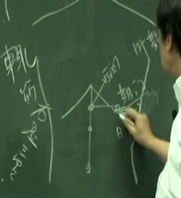
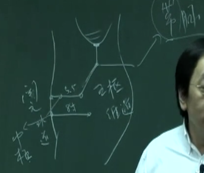

中医认为肝脏是木。

所以，你如果说肝脏本身的性像树木一样，即使再脏的水，如人体的大便、排泄物丢到稻田里面或果树旁边，这些植物都会吸收转化，长得很好。这什么意思，就是它可以把浊物排掉，可以吸收转化。因为肝是木，所以它可以转化让人体受用。

心和木的关系，当火（小肠）在下面，胆只是一个袋子而已，它不会那么聪明，给你定时定量的排出胆汁。我们的肝把好的营养吸收以后，变成血，浊物会进入胆，进入胆以后，会进入肠里，这个浊物进入胆时就是进入木，然后加上小肠开始生火，消化力就会更强。

心包膜直接络到胆上面，所以心脏不断的博动，这动作不断的打到胆，所以胆受到压力时，胆汁出来就绝对不是一直线。胆汁喷出来是一阵阵的。胆汁喷出来的速度，就是心脏的速度，这就是我讲的速度的观念。那你就知道治胆很简单，只要加强心脏，让心脏搏动的力量加强，同时用一些药把浊物清出来，同时增加肝的代谢，让它从后面去推它，就结束啦，这就是治疗胆的方法。
## 胆为清净之腑、正之官
怎么查都没有毛病，其实就是胆囊倒过来了。但中医很早就知道。视物会看反的原因，因小时候每天都吐，吐到不行了，胆囊都翻过来了。胆为清净之腑、正之官，视物倒之，道理就是这样。没有临床经验的人，倒过来就倒过来。我看过好几个。我一讲妈妈就吓一跳，说一你怎么知道是这样（意指小BABy 吐）

临床上，胆病呕吐，口苦，嘴巴苦。因为在阳木在生火，烧完以后，烧焦以后都是苦味。口苦呕吐都是胆。

## 位置
瞳子髎。在眼珠的后方，从太阳这边下来。又称为太阳穴，就是眼角后方有个骨头，骨头复方有个凹洞就是太阳穴。太阳穴下针，如果是只扎太阳的话，扎很浅的，用一寸扎半寸就到了。差不多五分就到了，不要扎很深，扎到脑里面去了。可以下针。

瞳子髎以后，到耳朵骨缝最下端的听会。耳门、听宫、听会都是张口取穴。这三个穴道下针，方向是直直的进去，都不捻针，而是用上下插提法。

上关和下关正好差一个骨头。记不记得在讲胃经的时候，头维、下关、颊车，在这前面有一个高骨，这高骨下的凹洞，就是下关，跨过这个骨头的凹谷就是上关。

头顶的穴道用的不多，多用来放血

从上关上来一直到颔厌。那颔厌怎么找呢，就是在足阳明胃经的第一个穴道头维，再往下一寸就是颔厌。这是颔厌，这个穴道就是曲鬓。曲鬓跟耳朵很接近，在这上面有个动脉，在发际这边有个动脉，这两个穴道找到以后，把它分成三等份，上面是悬颅，第二个是悬厘，那治症的时候，都是治疗头痛。越靠近耳朵，就越能治疗耳朵。越靠近上方，就越能治疗偏头痛。

在耳朵旁边一圈的，靠近耳朵后边的是三焦经，再外面这一圈，这一整侧都属于胆经。所以正面看的时侯，头正中央是督脉，旁开一寸半是膀胱经，再开一寸半，这一侧通通是胆经。要连到三焦经的时候，就在耳朵后面，这观念要有。

从耳尖，耳朵最高的尖端往上一寸，如果说我们是从耳尖上去是一寸半。如果耳朵不算，从耳朵旁边跟头连到的这个交接的点这边，再往上就是两寸。那如果是耳朵尖端往上是一寸半。这个穴道是率谷。

完骨穴在天柱穴与天容穴的中央，在大筋的后方。绕着骨头，大概离这骨头五分还没有到一寸的地方，就是胆经下来到结尾的地方，然后再往回走一路上去。一路倒过来就是阳白穴。阳白穴在眉毛跟发际的中间，正在眼睛眉毛的上方。

头临泣。
我看他眼珠一条线，在心里画一条线，从这到发际一寸半的地方，一摸就有一个骨缝。那就是头临泣。从攒竹上来到骨头，攒竹穴在这边，头在这边，眉毛从这上来。往右边转到神庭穴的时候，这一段前面是膀胱经，到这边的时候就分开来。这边是一寸，再过来约五分的距离是胆经的头临泣。

从头临泣直直往后一寸半就是目窗，目窗再往后一寸半，沿着下来就是正营，再过来是承灵，再过来是脑空，再过来就是风池。

肩井穴非常好找，就正在肩膀上方，正好在肌肉最高的地方，你按下去，在两片肌肉的中间。过去武术家重击肩井穴会把人打昏

在极泉正下方三寸的渊液。辄（扎）筋 渊液前一寸

从心蔽骨下来到肚脐正中点是中脘，心蔽骨到中脘的正中间叫巨阙。巨阙是心脏的募穴，心募巨阙，对不对？从巨阙旁开四寸，到两个肋骨中间，这个穴道叫期门穴。期门穴是肝的募暮穴。跟着期门往下一寸，跳过一个肋间，在骨头上没有穴道的，一定在两个骨头中间。所以期门穴往下走到了肋间，这个穴道叫日月。日月穴是胆的募穴。

再来是京门穴。京门穴是肾的募穴。肾的募穴是京门穴。京门穴怎么找？你手肘靠着肋骨，胸肋骨最下面的那个点。也正好是平我们的手肘尖，这个穴道叫章门穴。我们还没介绍章门，在肝经上面。从章门穴，也就是肋骨最下端，往后摸，刚好有一个肋骨从后面凸出。正在这肋骨头上面，就是京门穴。

就是带脉、五枢、维道三个连续的穴道。
手肘弯到肋骨底边，这是章门穴。从章门穴往下走一寸八分的地方，找两个肌肉中间，找到肌肉缝。这个穴道就称之为带脉。、

五枢穴要从水道穴找。这是任脉的关元，关元外开二寸就是水道，水道在足阳明胃经上。从水道再走五寸半，从这横过来，这个穴道就是五枢穴。

关元下一寸是任脉的中极穴。从中极穴外开八寸的距离就是维道穴。

再来是居髎穴。居髎穴从章门穴直下八点三寸或八点五寸，很难找。没关系，你直下下来以后，摸到了肌肉中间。不然就是在肌肉跟骨头中间。

---

#### 1.瞳子髎
临床最多是放血，像眼睛发炎、红肿、角膜炎。我们会在太阳穴放血。那下针的时候，最常用的就是偏头痛。很多人偏头痛就是在这部位痛，所以你要知道穴道的位置，你才知道是什么病。病人说头痛，但头痛有分很多地方痛啊，痛这个你要知道是胆经。我们有个很有名治疗偏头痛的治法就是从太阳透率谷。
#### 2.听会
#### 3.上关 手足少阳阳明的会穴
近取穴治耳朵耳鸣的。你说“旁边那么多穴道，我到底要选哪个？”没有关系，拿手指头去按，这个最痛，就是阿是的精神在这里。而不是像现在的人乱搞，肩膀痛扎肩膀，就在阿是那边扎。我们也有阿是穴，但我们取穴是当穴性雷同的时候，你以最痛的点来治疗，这是选择下针的原则。
#### 4.曲鬓
中间份三个。
那治症的时候，都是治疗头痛。越靠近耳朵，就越能治疗耳朵。越靠近上方，就越能治疗偏头痛。
#### 5.颔厌

#### 6.率谷。
我们针灸治偏头痛是立竿见影的。头痛的时候，我们很有名的针法是太阳透率谷。就是从瞳子髎一针透到率谷去。怎么透呢？针先扎到瞳子髎，捻捻针，用三寸针，扎到瞳子髎捻一捻，再把针提起来，不要拔出来，提到皮层，然后手摸到率谷，率谷在耳朵的正上方，非常好找，这有个骨缝。你把针倒过来以后，把皮拉起来，一点一点的透过去。如果你透对了，透到瞳子髎时，头痛就都没了。

你如果觉得这透法很痛，我告诉你，那个人在头痛的时候，根本感觉不到你透的痛。你不会在这个人没有头痛时，也透过去啊。当这个头痛已经很痛时，病人根本没感觉，透完后，每次病人都是这样子，叹一口气，就睡着了。

从1996 年11 月到现在，没有再痛过，就透两次而已。他很后悔吃了二十五年的止痛药。你用得好的话，效果非常的好，这就是中医。如果说，没有针在旁边，你用手按，沿着太阳透率谷，那也聊胜于无嘛。
#### 7.完骨
#### 8.阳白
阳白常常下针。阳白穴的下法是把皮肤拉起来，从阳白刺进去，刺到眉毛的中间，这我们叫做阳白透鱼腰。治疗眼睛近视，视物不明，或是眼睛痛，或有内障都可以在这治。
#### 9.本神
#### 10.头临泣
头临泣和目窗，尤其是治风泪，风一吹就流泪，这种症状很多。这两个都是眼科的大穴及近取穴，在近取穴的时候是不分虚实的，通通可以用。
#### 11.目窗-风池
从这头中间，后面大部分是治疗头痛、头昏、眩的穴道。前面是治眼科的穴，因为胆经有络到上面，络到眼睛的上方。

那临床的治症呢？你可以看一下书。我们用到最多的穴道是风池穴。我们以度骨法为准，骨头在这，这是大筋，有一条大筋在这。在两条大筋的中间是风府。一般风池穴，就下在这凹下去的地方。

风池穴这个地方，下针手法很重要。就在颈边，扎到动脉里面很危险。实际上，我们下针时，先让病人趴倒，头摆正,我们再下风池。我们风池下针的时候，先用一只手按到颧髎，另一个手按风池，假想一条线。下右边风池，针是对着左边的颧髎，下左风池的时候，是对右边的颧髎。顺这个方向下过去，血管就不会踫到，这是前人的经验。

风池、风府、膀胱经的风门穴，第一椎陶道外开一寸半是风门穴。这些穴道都是风、风、风，就是我们受风的地方。所以一受到风寒，就项强，就会后面颈子强硬，因为这是风进入的地方。我们治疗鼻窦炎、鼻子不通时，风池穴很好用。你下得很好的话，针一下去，鼻子就通了。而且下的时候很好玩，你下左边的风池，右边的鼻孔就通了，你下右边，左边的鼻孔就通了。

风池穴和风府、风门，除了下针以外，我们可拔火罐。项强的时候在这拔火罐，过去还有刮痧，先用米酒在膀胱经上面洒上去，再用汤匙在上面刮，刮红的一条，这都是过去一些祖传的手法，来解除脖子强硬的病痛。可以用没有关系，但不要太用力，不要刮到皮肤都破掉了。太过就不好了。
#### 12.肩井 解血瘀胸中
针肩井穴时，不能深针，深针的结果非常凶，下针要下得很浅。平常是用一寸的针，针下去五分，因为肩井穴这个穴道很浅，但力量非常的强。你针肩井穴，引到气以后，一般都在对侧的足三里再下一针。比如说，扎左肩井再配合右边的足三里下针。因为扎到肩井，胸部的气会很强，如果没有扎足三里的话，气会闷在胸腔里面，病人会晕倒。

临床上，这样做是干嘛？就是你骑马掉下来或被马踢到，造成血胸，胸腔里面有瘀血，可活血化瘀。针下去以后，病人大便是黑便。所以，治疗胸腔里面有受到重击、撞伤，跌打损伤的时候，肩井是非常有名的大穴。

当病人肩项强硬、脖子酸，有很多人后脑、后项这边酸，我们最常用的穴道是后溪，后溪主督脉嘛！申脉是在膀胱经上面，同时也主阳蹻。所以后溪跟申脉两个穴道同时用的时候，所有肩项病的症通通可以治疗。在外踝裸下五分是申脉穴。我们平常用在治疗昼发癫痫，白天发癫痫，这时候是用灸的。后溪管督脉、申脉管阳蹻脉，针了后溪、申脉以后，痛就去了一大半。若还有一点，这时候我们就下肩井。下了肩井以后，再下足三里、几乎没有什么肩膀痛去不掉的。这是非常好的穴道可治疗肩项强痛。

会喘不过气来。就在肩井下针，再下足三里，气就回来了。但绝对不要深针，因为扎太深会扎到肺，会把肺刺穿。本来呼吸短促已经有内出血了，你不要再雪上加霜。孕妇不可以下肩井穴，下肩井会落胎，因为肩井穴气非常的强，对胎儿不好。
#### 渊液
#### 辄筋
辄筋是在渊液往前一寸，一般来说是近取穴，治吐酸、呕吐。实际在临床上很少下针，也很少灸。 主要用来诊断
#### 日月 胆募穴
如果胆汁不通、胆结石，我们可以扎背后的胆俞，扎正面的日月。正面的日月、背后胆俞。俞就是输通，那这个募是开门嘛，门打开，开门以后让它输通，就是俞募治疗了。

下针是胸针
#### 京门 肾经的募穴
京门穴是肾经的募穴，所以治肾脏虚症或实症的时候，用俞募治疗并无所谓虚实。肾结石、肾脏癌、肾阳虚、阴虚，耳鸣，都没有关系。我们扎肾俞以后，再扎京门，这就是俞募治疗。

针直接下进去，因为你扎进去会扎到骨头，不要太深差不多一寸就到了，这是京门穴。京门穴常常配合在肚脐正后方第十四椎骨的命门，在第十四椎外开一寸半就是肾俞。

用得很多，像耳鸣、腰酸、肾脏等问题或水肿，我们都可以用。最常用在腰酸及耳鸣。
#### 带脉、五枢与维道穴
治症就是女子带下、白带、赤白带，还有包括带脉的痛。带脉它像皮带一样，环腰一圈。
这三个穴道，带脉、五枢、维道，是属于人的带脉。带脉的症状，病人会陈述，下半身好像泡在水里面。你今天可以洗澡放冷水，让屁股坐下去，坐到腰部，这种感覚就是带脉的症状。
#### 居髎穴与环跳穴（骨之始）
## 眼内翳
所以，当你看到有内翳从睛明穴快通到瞳孔那边，这是太阳经的经热，如果从眼角这过来是胆经的问题。如果是从眼下方，白翳往上生，你就知道这是阳明胃经的湿热，是胃热造成的。

从上面下来的呢？一般来说还是胆，因为胆经从上面到阳白穴.像足太阳膀胱经、足阳明胃经、足少阳胆经，上面都有很多的穴道可以治疗内翳。那到底是什么经络，就看它从哪过来的。这样你就会分清楚了。
## 耳鸣
耳鸣是外来的，比如说他去潜水，结果他浮上来比较快，因压力不适应，就造成耳鸣。那你就再叫他再带着同样的泳装，同样的装备，再回来到原来的地方，再潜下去。这次上来的时候，你慢慢、慢慢的上来，就不会了。在美国很多玩热门音乐的，尤其是鼓手，因乐器很大声，而造成耳鸣。就跟他说，你这样子，回到原来的地方，把声音开很大声，开到同样的音量，你一边打，一边叫一个人帮你，慢慢慢慢把声音调小，然后慢慢、慢慢离开这个原位，结果一次就好了，我针还没下，所以人体很精妙。如果你太太是河东狮吼，一叫，结果你的耳朵聋掉了，这就很难治了。因为要叫她把叫的声音慢慢慢慢放低，但她是因生气才叫很大声，现在一时叫不出来啦。

那身体里虚的耳鸣，我们同时在经络上取穴，辅助它，让它慢慢的回复。

## 伤科
脑部受到伤害的时候，我们在然谷放血对不对？胸腔受到铁打损伤、踢伤、家暴打伤，就用肩井穴。

## 带脉
带脉、五枢与维道穴

## 腰痛
如果有个人说“我腰痛!”，因病人不知道经络啊，只说“我腰痛”，就问“怎么痛的？”说，我是背两边上下痛，你就知道在膀胱经上。如果是中间，就知道是督脉痛。如果他说在腰上，环腰一圈，就是带脉痛。你知道是带脉病，我们就治带脉，在膀胱经我们就治膀胱经。所以腰痛没有不能治的。

这个椎间盘凸出是长骨头啊，这是西医说的。而我管你什么椎间盘凸出，膀胱经虚证只要下针膀胱经的委中，他的痛就去掉了。所以即使它凸出，你都不要动它，他不会痛的。西医他们找不到原因，就说椎间盘突出造成坐骨神经痛。很多人开完刀了以后。有的下半身麻痹。有人瘫痪掉了。最重要的是脊椎不要给人家动手术。就算刚好穿过第十四椎，经过带脉，是横的，那痛是横的。也不会往下痛。所以如果坐骨神经痛，你按经络来取穴就好。不要相信西医椎间盘凸出的说法，你下拿次个X 光片，去试试看那外科。

所以，他们的椎间盘凸出造成坐骨神经痛的说法，在中医的经络学来说是不成立的。

## 华陀夹脊（足三里十临泣穴）
我们有一条经是在督脉旁开五分的地方，这有个特别的名称，叫华陀夹脊。

那华陀夹脊也是治腰痛的一种。那古书上，没有写怎么治这个痛。只有两个穴道可以治疗它，足三里加上临泣。胆经的本穴临泣加足三里同时一起用的时候，专治华陀夹脊。这怎么来的呢？过去我师兄在打坐，他气功很强，我就拿他当实验品啊，每次针一下去，他会告诉我说这气是怎么走的。有一天呢，正好扎到这个穴道，他不懂经络。他说：“今天很奇怪，这个气会沿着督脉旁边走”。这种我也碰到了。