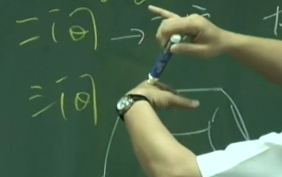
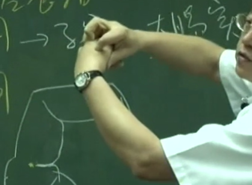
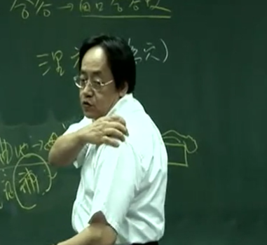
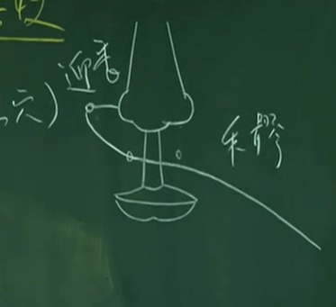

## 大肠
《内经》曰“大肠者，传导之官，变化出焉，又云白肠”。

养生的时候，大肠是属于腑，是属于阳，所以在揉丹田的时候，是顺时钟的方向揉，这是我们揉的方向，顺着大肠的方向 推，可帮助排便。

因为肺有肋骨，所以按不到。但别忘掉了，肺主皮毛，所以手掌轻轻碰，气就开始动了。

阳金 与肺互为表里
我们人吸气的时候，中医认为吸气是肾脏在管，吐气是肺脏在管。所以有病人气喘时，问病人你是呼气困难还是吸气困难？如果是吐气困难，我们知道病在肺。如病人说“我是吸气困难”，那我们知道肺没有问题，病在肾。

表里是指呼吸时，肺横隔挤压肝 气直达大肠。

---

## 位置

手阳明大肠经，我们遇到阳经的时候，我们的五腧穴属性就改变了，变成金（井）水（荣） 木（俞）火（经）土（合）。五腧穴的阴阳五行的性改变了，叫做金水木火土。

商阳 

二间
二间穴怎么找，指头弯起来这个地方，在这横纹头这里。你可以看到纹头在这边，看到了没有?在纹头上面一点点下针，

三间
从二间穴跳过来，进入手掌有个关节缝，这个缝就叫做三间。

合谷 握起来最高点 虎口高起来的地方，最高点就是合谷。

阳溪。阳溪穴很好找，手握起来，这边有个一个凹洞，

偏历 反关脉找法

温溜 偏历上两寸， 下针

我们讲下廉、上廉、手三里、曲池。都从曲池往回头找。曲池是人身上的大穴。

手三里 曲池下两寸

曲池直下连至阳溪穴，往下两寸是手三里。手三里往下一寸上廉，再往下一寸，就是下廉。

肘髎 这个曲池穴，在拱手的地方，往后有个大骨，过这个骨头就是肘髎。

手五里 肘髎穴往上三寸，就是五里穴。

臂臑（nao2）
肩髃找，从肩髃最好找，我们手臂上有个凹洞，那个凹洞就是肩髃穴。从肩髃穴下两寸，就是臂臑，

这两个骨缝中间，这压一下去，病人会很酸，这是巨骨。

脖子上有一条大筋，有没有看到?大筋的外侧，就是大肠经，内侧是胃经，所以大肠经跟胃经隔着一条大筋。
天鼎 扶突

禾髎 迎香

---

#### 1. 商阳 井穴 本穴 金穴
   我们点刺放血，少商商阳放血，大椎也放血，几乎所有的烧都可以去掉。扁桃腺也可以治，但主症是在退烧方面。
#### 2. 二间 荣穴 子穴
   也就是说治大肠经实症。大肠有实症时，在这泻它。
   如果直接下在纹头上， 因为那里有痛神经，所以会很痛。在指头旁已经很痛了，你不能又在痛神经上下针。二间穴怎么下，将病人手弯起来，不能直的下，要弯曲指头，然后一压，一压肉会比较 多，比较不痛。这是我们下针的手法。

   所谓实症，大肠经的经穴走向是由手走头。
   我们手上面有三条阳经，手三阳控制三个动作。例如，我们抬手有三个动作，第一个是手没办法前抬，就是大肠经。手不能梳头了，是三焦经。手不能往后摆是小肠经。
   而虚实要看病多久，在该经的子穴、母穴上下针即可。
#### 3. 三间 俞穴
   很有名的三间透劳宫，手掌的中心是劳宫，讲到心经时会再介绍，三间穴下到劳宫穴主治风湿关节炎的肿痛。当手不能握拳，针下去， 二十分钟，起针，就可以握了，隔天会更好。三间也可以透到后面的穴道，也就是合谷穴。
#### 4. 合谷 原穴
合谷是非常大的穴道。阳经有原穴。阴经没有原穴。合谷穴就是阳经的原穴，原穴没有井荣俞经合属性。
治疗法则就是原络治疗法。就是取它当病经的原穴。我们合谷穴就是大肠经的原穴，那所谓的原络治疗，这个“原” 就是病经，“络”就是指表经或里经的络穴
“虚实皆拔之”
第一个如果你灸合谷，没事用生姜灸，用在脸上青春痘很多，效果最好。灸了以后脸会很干，就不会再出油，用在油性皮肤上，气很旺，灸合谷。那女人美白呢，灸合谷，皮肤会变很好。
这是合谷穴哦，在这两个骨头快到交叉点的这边还有个穴道，这个穴道特别有个名称，叫牙痛合谷。大肠的脉是走到上面的牙齿，所以上牙痛在大肠经治，我们下合谷穴。右边上牙痛。

合谷穴妇人怀孕时不可以下。你们就记得合谷穴，怀孕不可下针，可泻不可补。孕妇在合谷上可泻不可补（因补了会落胎）。
有个合谷脉动，中医在接生小孩的时候，摸产妇的脉，中医是看孕妇肚子在阵痛，如果合谷有脉在跳，一路跳到食指这边，表示要生了。如果只有阵痛而脉没有浮跳起来，就是假性的阵痛。马上可以知道是不是要生了，因为合谷是气脉之所在。

我们用在小儿科，我们叫风关、气关、命关。我们看小孩子的病的时候，把小孩子的手拿起来一看，这边有一个黑的青筋，风关这边。病在浅，在表，很好治。到了气关的时候，病就比较重。到了命关，小孩子就走人.

我们有个歌诀叫面口合谷收，所谓面口合谷收的意思是，面部的病，口部的病，都可以在合谷下针。比如说面部中风的时候，下合谷。我们常常下面针的时候，会先下合谷，因为有麻醉作用。

#### 5. 阳溪穴 经穴 火
书上里面的内症“目风赤烂，寒热疟疾，往来寒热”，你们可以参考看看。我们真正在治这些症的时候这些穴道很少用。这就是针灸不好学的原因，因为临近的穴道治症都很像，穴道全都可以使用，所以穴道很难取舍。
在临床，阳溪很少用过，除非对方有对称的痛点，我才会用。以后我会讲到对称治疗。否则往来寒热怎么用阳溪？我们有更多好的穴道。

#### 6. 偏历穴 络穴
与肺经的络穴列缺是通的。这也是反关脉的地方，大肠经络穴。
由于有络穴存在，所以阴阳是互相平衡的。这是正常人，如果是不正常的人，要想办法让他平衡。
如果大肠经遇到实症的时候，我们可以用偏历穴，像牙齿痛、耳鸣。
虚则齿寒，怕冰冷、怕风吹，我们补之。
。所以络穴和原穴可以做补泻，一个穴道就可以做补泻。

#### 7. 温溜  大肠经的郄穴
因为大肠经的郄穴，所以大肠经的炎症，我们都可以用它。

#### 8. 曲池 大肠经的合穴 土 母穴
曲池一定是拱手取，在这个纹头与肘骨中间，不能下太靠近手骨，要过来一点，不然会很痛。直针进去。

是大肠经的母穴。所以大肠经的虚症在这补之。什么是大肠经的虚症，我肩膀痛，痛半年了、痛三四个月了，就是虚症。在曲池下针，本身就有补的效果。

曲池穴除了是大肠经的母穴以外，曲池也是上半身，肚脐以上的消炎穴。所以皮肤痒，因大肠与肺表里，我们可以下曲池，而合谷是气穴，皮肤管气，所以上半身的皮肤痒最好的治疗是合谷和曲池同时下针。

曲池用的机会非常多，可治肩膀痛、皮肤痒等等。

#### 9. 手三里
另外一个名称叫扭伤穴。有人腰扭伤，扭伤穴针下去，左右捻捻，叫病人慢慢活动，扭伤就开了。比如说，落枕或脖子突然不能动了，赶快针手三里。
自治：让头自然下垂（在床沿外），手自然下垂，躺平，三分钟、四分钟，慢慢呼吸，让身体慢慢扭回来，让头慢慢扭回来，当场就好。这个不要教人家，不然生意就跑了，这是自然疗法。

#### 10. 上廉
#### 11. 下廉
在阳明经上都可以治疗乳痈、硬块，或手臂的问题、手臂的病。治症看书上就可以了，不用花时间讲它。
#### 12. 肘髎
肘髎也可以下针，打网球受伤，就是这受伤，也可以放血，用火罐吸一点血。这是肘髎。

#### 13. 手五里
这个穴道呢，禁针，因为有大动脉在，所以知道就好了，很少用。
#### 14. 臂臑(挠) 臂臑是手阳明络手足太阳阳维之会
臂臑是手阳明络手足太阳阳维之会，是几个经络会到的地方，主瘰疬、臂痛不得举等等。

#### 15. 肩髃 手阳明、阳蹻脉之会。
中风的大穴。我们中风有八大穴，百会，肩髃穴，曲池穴，这都是大穴。
中风筋挛起来的时候，搬它都很硬。针下合谷，一路透到后溪，用三寸针，这针从这边透过去，合谷透后溪，不要透出来。针一下去，自然就张开来了，很听话。
主中风，风病、半身不遂，不能张弓射箭。
肩膀的问题，肩髃穴非常好.

所以要记得肩髃穴是中风的大穴。我们有一针很有名，叫肩髃透极泉。极泉就是手胳肢窝下方的这个地方。肩髃可以透到极泉这个地方，只有一个角度透过去，这是治疗狐臭的方法。 平补平泄

#### 16. 巨骨  手阳明阳蹻之会，跟肩髃一样
一般来说禁针，因为下面就是肺，所以知道位置就好了，为什么要知道位置，因为帮助辨证，像知道是大肠经的问题，不是要去下针，而是知道痛在那个经络，其实我们用很少，但还是要知道。
胸中有瘀血，肩臂不得屈伸，我们有更好的穴道，比巨骨还好，将来会介绍到。

#### 17. 天鼎

#### 18. 扶突
这个穴道很少下，但你要知道这个位置属大肠经。
脖子上下针时，用手指头先把筋捉住，然后顺指头推进去，有动脉在这边，要把脉移开来，下五分，要下很浅。
这穴道用的不多，除非是很严重的喉咙肿胀，没有声音的，讲话讲不出来。书上说，喉中如水鸡（青蛙）声

#### 19. 禾髎
禾髎穴可治鼻子的问题，如鼻窦炎、鼻子不通。迎香，就是治鼻不闻香臭，就是迎着香嘛!你针下去，香味就闻得到。禾髎要下很浅，下约五分，

#### 20. 迎香
下约五分，迎香穴这样下去就一点效都没有。这不是老师傅的手法，老师傅的手法是这样子的，这是眼睛，这是迎香，针扎进去后，不要扎太深，透过皮层后然后倒下来，把肉拉起来，一路往这边透。将针倒下来刺，透到这个地方，旁边就差不多是山根。不要扎太深而扎到眼骨。这个穴位我们叫内迎香。
外迎香透内迎香
外迎香透内迎香就厉害了，两个鼻孔不通，两边都透，一下就通了，鼻窦炎时效果非常好。

你在透迎香时，麻烦对侧合谷先下一针。一个鼻孔不通，同侧透一边就好了，要先扎对侧的合谷穴。

脸上都是下针，不用灸

## 细分虚实症
那有的时候，刚好痛一个星期，到底是实症还是虚症。
实症呢，就是痛，差不多一周之内。
实中带虚，就是痛多酸少。再久一点变虚中带实，酸多痛少。
虚中带实 酸多痛少
虚 纯酸 不痛
>实症很简单，用子穴去泻它。实中带虚就先泻后补，因为痛比较多嘛，后补，后面补它。虚中带实，先去补它，再去泻它。纯虚症，用补的手法
法二 原络治疗 分不清虚实的多少

>第二种呢，扎原穴，扎病经。大肠经又痛又酸，就用原穴，对面的原穴下针，针原穴就像你跟身体讲话，我知道你的病在大肠上面，这时候扎肺经的络穴，表经跟里经的络穴，肺经的络是列缺。你今天下原穴，再下表经或里经的络穴，病就去掉。这样就是原络治疗了。

## 四关穴
我们身上有四个关很重要。有四个关，合谷是两个关。脚上还有两个穴道，就是太冲穴。太冲就是脚的合谷，在脚大指跟二指中间。那开四关目的是什么？
有病人来找你，你问病人“你哪里痛？”，病人回答，“我到处都痛”。我们有十二经络，病人不说那个经络痛，要怎么下针呢？这时，就下合谷、太冲、下四关。下完以后，病人就会说，现在我知道了，我的痛在什么地方。然后我们再看经络取穴道。这是我们的合谷还可以做诊断用，因合谷是气穴，所以合谷穴越大越高，气愈足。病人久病的时候，合谷肉都没了，凹进去了。中风的人一堆都是这样子，肉都没了，所以合谷很重要，可以看到气的兴衰。

## 捻转针手法
那你针下去，感到酸就是气到了。气到了开始做补泻，我们可以用捻转法。方向是这样子过去，很快的过去，很慢回来，很快的过去，很慢回来。不要一直过去，一直过去也不好，针会卡在那边。
针卡住怎么办，上下一寸各下一针，这样就可以出来。如果硬扯肌肉都会一起缠出来。

既然要补，补是采阳数，泻是采阴数，所以我们常用补五下，泻六下。

捻转法一般用在不方便使用迎随的地方。迎就是逆着它、迎就是气血这样来，逆着扎就是泻。随就是顺着它。

补 面对病人 逆时针快速 慢回 反之为泄

像二间迎随很痛，那曲池穴迎随也很痛，那就用插提法、捻转法。