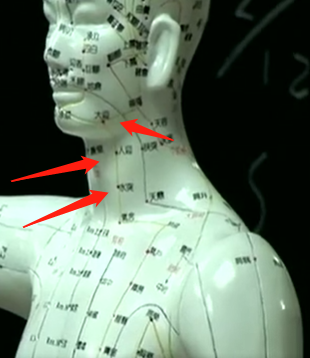
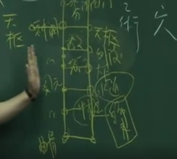
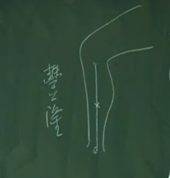
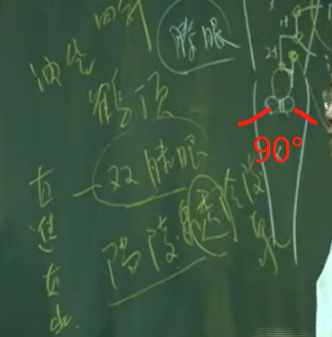

上午7-9 
大肠经走完了以后，进入了足阳明，足阳明是胃经。阳经又重复了，任何的阳经从四肢末梢，井荣俞经合，就是金水木火土，膝盖以下。
胃经从头上，一路下去，到脚趾头，是相当大的经络。
手上的阳经由四肢往身上走，脚上的阳经是身上往四肢末梢走。

大肠完了以后，气血就进入头维，阳明胃经的第一个大穴。

胃经，是多血多气的。

胃脉，实则实脉，脉按着越重，就越弹得越高，这就是实脉，虚脉看着很大，按下去就没有了。

### “胃者仓廪之官，五味出焉”，
仓廪之官管仓库，东西进来不好就把你排掉。当胃一吃到是不好的东西，就开始反胃、恶心想吐。

我们所谓常人，正常人他的脉息是一息四至。
比如说吸气，一吸胃就动两下，吐气，一吐胃跟着动两下。这就是四至到五至的观念。

土克水的意思是，今天水有问题了，水是肾脏，肾脏有问题时把土淹没掉了，所以水会反土。

所以我们有一句话，胃是肾之关，肾关门的地方。所以严重的肾脏病、尿毒症，除了极度的晕眩以外，就是恶心，不断的吐，是因为水太重，害到胃，并不是有胃病。
### 胃为黄肠。
胃的本身是黄色的，叫黄土。

## 位置
足阳明胃经一共四十五个穴道，它还不是最大的经络，最大的是膀胱经。

厉兑、内庭、陷谷、冲阳、解溪、足三里，为井荣俞原经合

头维呢?头发拉起来，发际这边，正好在转角的地方。头型是这样子，这个在转角的地方，有一个凹洞，这个穴道，跟本神在同一条线。

发际这边，正好在转角的地方。头型是这样子，这个在转角的地方，有一个凹洞，这个穴道，跟本神在同一条线。这个位置看你头的大小来决定。不能说三寸，有人三寸还没有到发际。

用指感来找，正好在凹角的地方进去，你用摸就可以摸到一个凹洞

下关 开口那个洞 颊车 咬肌跳动

承泣、四白与巨髎
在眼睛下方、眼框骨头上面一点，我讲过穴道不会在骨头的正上方，而是在骨头上面凹的地方，这就是承泣。

四白 眼眶骨头下一寸
巨髎是在颧骨下方这边，这里有动脉，可以下针，但不要太深。

地仓在嘴角旁边，我们有天仓跟地仓，你看眉毛这边，我们这叫天仓。
天仓没有的话，一种是没有祖业，或身体很差的时候，天仓也是会凹下来的。没有地仓表示是小偷或身体的胃气不够。

大迎在我们下颔这个地方，地仓颊车中间是大迎。大迎穴在骨头上方，再往下是人迎。
这些穴道你知道就好了，很少用，人迎有人迎脉，这条大筋最上方就是人迎、中间就是水突，再下来就是气舍。这几个穴道在用的时候，水突比较常用，治疗瘰疬 ，治甲状腺肿大 ，下针的时候把大筋捉住，不要碰到血管，顺着指甲进去，扎五分进去，在治甲状腺肿很好用。

缺盆穴在琵琶骨、锁骨正中间。
由缺盆穴再下来是气户，我们叫“气户库房屋翳屯，膺窗乳中庭乳根”。气户跟缺盆隔了一个骨头，跳一个骨头下来就是气户，再来就是库房。

这个足阳明胃经，顺着大筋的内侧下来以后，再转到这边来。与任脉相距四寸的距离，到了乳根进来，后面是两寸。

不容 巨阙旁边 承满 上满旁边

对任脉的辅助

天枢 神阙外开两寸

外陵穴至气冲穴

髀关穴至梁丘穴
我们找伏兔，这个穴道过去跪着时，肌肉隆起就像兔子趴下来一样，所以叫伏兔穴。
从膝盖头往上六寸，叫伏兔穴。从伏兔穴再往上六寸，就是髀关穴。
找的时候，记得腿上的阳经，从中间分阴阳，内侧是阴，外侧是阳，翻过来找第六寸

这个犊鼻穴在那里，膝盖的盖子跟胫骨中间有个韧带，中间这个叫做犊鼻。
韧带的正中间是犊鼻，旁边有两个凹洞，我们称膝眼，膝眼属经外奇穴，像个眼睛。 

井荣俞经合 金火木水土
足三里是很大的穴道，这是用书上的寸来找的。我教诸位一个方法，永远不会搞错。用手指头顺着这个胫骨，从下往上推过来，推到这边开始高起来的地方，就是准备高的起点，外开一个指头，就叫足三里。
有个穴道叫冲阳脉，找到足三里，按住足三里，冲阳脉就没了，这代表你找到穴道了。我们叫度骨法，就是按照骨头来找。

足三里下约一寸 奇穴 阑尾

足三里下三寸 上巨虚 再下三寸 下巨虚 上巨虚下一寸 条口

丰隆 中点

解溪 脚正中大筋处
在解溪穴下二寸，找的时候不要硬找二寸、三寸，你用摸的。摸到动脉，动脉下就是冲阳，大约在解溪穴下二寸，冲阳穴是胃经的原穴。

内庭 脚趾23 中间 上五分
内廷上两寸 陷谷 2指远离大拇指侧脚趾甲旁 历兑

---

#### 1. 头维 足阳明跟足少阳之会，一般来说也是禁灸的。
穴很少下针，你也可以下针，但要知道这个位置是头维。你仔细摸，讲话时会有脉在动。
你就去摸骨缝，这个穴道很大。全身最小的穴道是八髎，其它穴道都蛮大的，血海更大。
#### 2. 下关
让病人躺到，侧卧
主要治症包括，中耳炎 ，牙科脱臼的时候以下关穴为主，两手将下巴的骨头往上打上去，它就会合起来。
下关不灸，有头发的穴道都不灸。可治牙科、下巴脱臼 、耳流脓 。

还有一个症状西医叫tmJ,就是牙关这边很痛，不能咬，我们下针都可以。下脸针的时候，先下合谷，这个tmJ效果非常好，牙医也来找我治tmJ,牙医痛的没办法啊!tmJ 治法是痛在下关，先下对侧合谷，再针下关。
#### 3. 颊车
颊车穴可治疗中风 、口歪眼斜。用地仓透颊车。下针的时候，地仓透颊车，面部中风用的，病人口歪眼斜。
我们先针健侧，当然要先下合谷再透针。过去面部中风的时候，是用鳝鱼血，当场杀一条鳝鱼，把鳝鱼血一涂上去，血一干，拉的力量很强，就把脸拉回来。用鳝鱼血拉脸很有名的，万一歪左边的时候，就涂右边。没鳝鱼血时，就下针，用地仓透颊车。
所以，治口张不开，口噤不语、失音，面部中风、口歪眼斜，都可以。
#### 4. 承泣 足阳明、阳蹻、任脉会穴
一般来说，不下针，因扎了眼睛会黑眼圈瘀血嘛!知道穴道位置就好，但不下针。
现在我们技术好的话下针可以，因为以前针很粗，现在针很细。
我们知道这穴道要干什么?因为要用来诊断。这眼珠子，下眼袋拉开一看，这个人眼翳从下往上升，就知道是足阳明胃经的问题，升到瞳孔边把眼睛遮住就看不到了。
#### 5. 四白
那这些眼睛附近的穴道，都是治疗眼睛、内翳的问题，还有更好的穴道可用。
#### 6. 巨髎
有人拔牙完很痛，我们就在这下针，效果会很好。我用最多的是治牙痛 ，还有这边局部的肌肉麻痹。
#### 7. 地仓 手阳明、足阳明、阳蹻脉的会穴
所以很多年轻男女有青春痘，青春痘都在胃经上面。胃很热，又吃很凶，吃了半天，痘痘就会比较多，又再通宵熬夜，痘子就长出来，
#### 8. 大迎
#### 9. 人迎
这人迎很少下针，但用来摸脉，人迎脉有的话，胃气就有，病人就不会死。那这几个穴道呢，即使不会用也没关系，但位置要知道。
#### 10。水突
水突比较常用，治疗瘰疬 ，治甲状腺肿大 ，下针的时候把大筋捉住，不要碰到血管，顺着指甲进去，扎五分进去，在治甲状腺肿很好用
#### 11.缺盆
穴道不会下针的，若深针会扎到肺脏，引起肺气肿。
#### 12.气户库房屋翳膺窗乳中乳根
近取穴一定是乳房的问题嘛，平常不会下这边，通常是像这个乳水排不出来，有硬块，男生很简单一个肋一个肋这样去找。我们下针的时候不是直下，要斜剌。

下针是在前五分的地方从里面斜刺进去，而不是直刺。
膺窗，屋翳、乳根，是治乳房硬块的地方。
这里面我们要了解几个东西，书上指膺窗，乳痈寒热。那乳中穴，看书上的中间。乳中禁针也禁灸。
乳房是足阳明胃经所经过，那乳头后面的地方是肝经经过。这是乳头的下方，乳头这络到肝经上面。乳房有足阳明胃经经过它，足厥阴肝经也经过它。
这也是为什么女人乳癌，若切了乳癌又会变转到肝癌、肺癌的原因。因为有络会到它，里面身体都是相通的。
就是乳癌发病的过程。妈妈喂母乳给小孩，在喂母乳的中间跟先生吵架、婆媳吵架，就造成奶水在里面，那奶水一积住，奶水不出来，就变成硬块在里面。只能活十年。书上提到已成岩就不可治，这是针灸不可治，但我们还有药，《伤寒》《金匮》里面。乳中穴呢，初次喂母乳，奶水很胀，但奶水 出不来。过去大陆的中医，用葱头，用葱白，先用葱白的地方，把乳头涂一下，这葱白会辛辣发散，然后把葱反过来，用葱背后的毛一扎一下，奶水就出来了，效果很好。

像石头一样那么硬，乳癌就是这样子的，很硬。然后到了十三年、十四年，中间会破个洞，流很臭的脓出来，肿很大，但病人不痛。到后期时，按书上记载，深可见骨，可以看到肋骨，还是流黑的脓血，也很臭，我被臭过很多次了。这个怎么形容呢，像烂的尸体，就是那个味道。这个是最早中医的癌症。
从宋朝开始有记载。再来是乳根，一般来说，膺窗，乳中、乳根，乳中不下针，膺窗、乳根都可以下针。如果说我们下针在膺窗跟乳根。

如果说我们下针在膺窗跟乳根，可以帮女人丰胸，到时还有丰隆穴，也可以丰胸，所以，如果不会看病，就做针灸美容嘛。
#### 19. 不容
不容就是食物不容纳嘛!吃东西很胀，不能容纳，就在不容上治疗，这是所谓的近取穴。不分虚实寒热，只有在手脚上面，才有子母补泻。
#### 20. 承满
承满的意思是你吃一点就饱了，胃口不开，吃不多，一下就饱了，这是近取穴。
#### 21.关门太乙滑肉门
比如胃痛扎中脘，如果扎完还有痛，可以在旁开两寸的穴道再扎。我们隔盐灸神阙，灸完后，肠鸣腹泻还有就可以配合天枢穴。

太乙和滑肉门都可以用在长高 ，下针、灸都可以。小孩想长高，你可以帮他灸。现在诸位学到三个穴道：身柱，脊椎第三椎，可以长得高大，再来是太乙跟滑肉门，这是我们可增高的穴道。灸完胃口大开，再灸身柱，小孩子就会长得人高马大。千万要记得，头脑也要好，不能只有四肢发达。
#### 22.天枢 大肠的募穴
我们讲募穴的时候，以后会讲到俞募治疗法，大肠的俞穴加大肠的募穴就是俞募治疗法。
大肠的募穴还有一个意思，当病人便秘时，不是讲完便秘就结束了，这才刚开始。我们要确定便秘是堵在大肠、小肠或十二指肠里面，还是在胃里面等等，后面会慢慢讲到。
我们要怎么知道它是堵塞在大肠里面呢?就看大肠的募穴天枢，手放肚脐旁，一按天枢，病人大叫一声、惨叫，这是燥矢，就是病人有宿便，就是干的大便嘛。这种燥矢若不出来，会让人发精神病，
病人每天都有大便，他是假的精神病，结束了。所以说中医很好，懂医学或生理学，一看就知道。穴道可以帮我们诊断，那怎么知道病人大便排出来了没有，一压又惨叫，那就再治疗，若压了软掉了，那就是宿便排掉了。我们宿便有两种，一种是寒，一种是热。寒的定义是大肠没有蠕动了，没有蠕动了就累积很多了啊，但病人不会感到难过。一种是热,热就是肠子还在蠕动， 但大便排不出来，所以肚子会痛，小朋友半夜肚子痛，就是热，这就讲完了。有东西在里面， 不管寒热，就叫实。

如果是寒症，在天枢上面灸比针好。如果是热实，下针会比灸好。若热实你又用灸的话是火上加油，会更干。寒实我们灸天枢，当然是隔姜灸。 

#### 23. 外陵
#### 24. 大巨

#### 25. 水道
关元穴外开两寸是水道，这都是近取穴，肠鸣 、腹泻都可以治。在这特别提出水道穴，我们在神阙上一寸叫水分，水分跟水道常合并在使用。 可通利水肿 、腹水啊，两个穴道同时用。病人如果说，胀的很厉害，不能躺下去，下针嘛， 灸比较不好灸。
#### 26. 归来 睾丸的位置
看这两个字，睾丸不见啦，睾丸上缩到腹部，下针归来就好了。因为男人的睾丸缩到里面去了。还有一种症很特殊，睾丸会一直转，那西医会把睾丸拿掉，不然一转，血管会转在一起，血液会坏死，归来。我们穴道很多，以后介绍到肝经会更多，肝经直接络到阴器的地方。
#### 27. 气冲
怀孕的孕妇，在针腹针时，肚脐以下的腹针， 最好不要针。怀孕不要针。
这些穴道，中极、气冲、关元都围绕在妇人子宫、卵巢这边，所以可以助孕，不需要用人工受精。
#### 28. 髀关
伏兔有时用到，髀关几乎没有用到， 这些穴道多半是治抽筋、脚没有力。
#### 29. 伏兔
伏兔穴管的像脚膝冷 。临床上，有比伏兔穴更好的穴道，我也很少用它。
#### 30.阴市
阴市是近取穴，平常是治膝盖冰冷 ，好像有水在里面一样，近取穴嘛。 夜市里面买东西。
我们在膝盖以下才有井荣俞经合，膝盖以上没有，在这无所谓补泻，只是一个穴性而己， 后面还有一个风市，风市在胆经上面，我们常用。
#### 31.梁丘 郄穴
消炎用的
膝盖头每天在那弯来弯去，不好收口。我们曾经有个护士，膝盖摔破了，但膝盖也没办法不动啊，变得通通是脓。西医就把盖子拿掉，把脓清出来，但再长一次又化脓。药都还没用，梁丘一下去，病人就觉得好痒，二十分钟针起来，整个膝盖伤口就结在一起，
梁丘是消炎穴，而青春痘老是生在足阳明胃经上面，这都是下梁丘很好的时候。 
#### 32.解穴
解穴有几种功能，第一种，下完针以后，比如说下太渊、经渠时，不小心扎到动脉，胀起来了。这个时候，肿在这边，下对面的解穴，解穴就是当你下针后的针感、很痛、很难过，包括下针肿起来，一下解穴，病人会感到有个东西跑，就那么快，压力马上就去掉了。 过去武功高强的点穴，点穴后解不掉，解穴一点就解掉了。

有两个，一个在脚上，一个在手上是少府穴。这是一个经外奇穴的地方，我在介绍经络遇到奇穴就直接讲了，这样就不用再外开一堂经外奇穴的课
#### 33. 犊鼻
犊鼻穴，很少下。下针如果下得很深，会伤到膝盖的油囊。

#### 34.足三里 胃经合穴 本穴
足三里是非常常用的一个大穴，主治所有胃病都可以治（但吐血除外）

有人脚不能走远，扎足三里。脚没有力扎足三里。灸和针都可以用，灸百壮都没有关系。它可以把燥热的气导下来，比如灸中脘、关元，灸得太过了。想要超过那个老将军，就灸五百壮，灸得很黑，灸到口干舌燥怎么办？再灸足三里，它会把热往下导。后面还会介绍到灸膏肓穴。灸的时候，感觉很燥热，我们就灸足三里，把火气往下导。

如果乳癌硬块正好在乳中的下方，足三里就很好用。问硬块多久啦，答：“二年！”就在足三里用补。如果硬块压好痛，就在足三里用泻的方法。 
顺为补 逆为泄 但是要分左右腿 这里以右手-左腿
 补是单数，像三五七九，比如说，把针提一点起来，一个绿豆大，气就到了，很快。

足三里用的很多，我们在治疗病人有血压上升的时候。中医说是**阳亢**，脸充血，西医说是**血压很高**，我们可在足三里下五分，斜刺到足三里穴，阳明热就慢慢泻下来了，这是临床实务在用。

因为中医观念，有胃气则生，无胃气则死。我们临床上有很多看法。在治病的时候，不管是肝癌、肺癌，或感冒。处方下去，病人如果胃口恢复，就代表救回来了。所谓胃口没有恢复就是，病人不感到饿，不会想要吃，代表胃气还没有回来，就是没有胃气。
这个案例上可以学到，即使病人还是有癌、肿瘤，但病人被你治后疗后，从没有胃口治成有胃口，这个癌你可以忽略它，因为它一百年也不会害你。既然它不会害你，你为什么要去动它，他等于在睡眠中。
你只要知道，本来没有胃气治成有胃气的，本来失眠治成能睡，睡得很好，本来全身黄疸，黄疸也退了，本来小便排不出来，后来排出来；本来水肿，后来水肿没了。一个人能吃能喝能拉能睡，没有病，这样就可以了，即使病还在那，也是在睡眠的状态，不要再用 X 光来刺激它，它就不会醒来，也不会造成危害。所以，健康的定义不是没有癌细胞，而是它无害。怎么知道它无害，就看有没有胃气。所以常灸足三里，会让胃气很好。但常常保持太饿也不好，常常保持太饱也不好。不饱不饿 这是好的养生之道，饮食要定时定量。
#### 35.阑尾
病人肚子痛。一看是个女的，你要查到底是月事痛，还是盲肠炎，还是其它腹痛? 西医是捉病人去验血，看有没有发炎，有时候验血下去开下去还不是盲肠炎!中医不是， 中医是叫腿伸出来，男左女右，男的看左边，女的取右边。足三里找到后，在它下一寸的上、下都找压痛点。如果有压痛，就是盲肠炎 。这是很肯定的，它是 100%

下针下去的时候，引到气就好了。痛人的痛会当场去掉，一般盲肠炎病人会像虾子弯起来，因为弯起来比较舒服一点。痛去掉以后，为确保从大便清出来，可以下大肠募穴天枢， 小肠募关元。

盲肠炎破掉时，病人会变成腹膜炎，这中间症状不太一样。
，看肚子是凉的，但这边是烫的，知道里面是破裂，好不好治?很好治!不难的!在教各位《金 匮》时会讲到，在这不讲处方。如果痛，都可以下针，天枢、中脘，关元、足三里、阑尾， 都可以下针。 

#### 36.上巨虚
乳房硬块
#### 37. 下巨虚
肚脐以下硬块，比如女人子宫卵巢有肿瘤在这边，可以在下巨虚治疗。
遇到实症是用泻的手法，泻时逆向行针，补泻做完再往前扎一点，就是泻。 
这硬块局限在足阳明胃经上面，你一看硬块在阳明胃经上面，对西医来说可能是子宫肿瘤，都没关系。马上采对侧治疗为主。 

#### 38.条口
治脚麻
所以糖尿病人会口渴啊!他不看这个，他看报告，你的血太甜了，所以发明人工酵素，或是胰岛素， 让血糖下降。
当你把糖消失，糖不会凭空不见，而是糖会沉积在下面。日积月累以后，血糖慢慢会积在脚底下，这脚就慢慢硬化。
只要脚破一点伤口就不能收口，西医就开始截肢。条口可以治脚麻 ，就是讲这个，治脚麻掉了。

#### 39.丰隆 去痰 丰胸
针135 246 ，就要隔日像一三五，二四六的帮她下针。丰胸用丰隆穴很好，你可以用补，不要用泻，不然正好相反。

丰隆穴有名是用在去痰。我们实症癫痫的病人，实症是因有痰饮 ，我们如何把痰去掉，用下针把痰导出来。丰隆穴是很有名的导痰穴。
导痰的方式很特殊。针扎到丰隆穴以后，左右转捻针，病人感到酸时就是气到了。气到了后，针慢慢起来，针不要出来，只要提到皮层。再把它倒过来，斜 针 45 度，往身体的上方下针。然后再捻针，病人感到酸麻后，再慢慢把针提出来，又到皮层，再往下 45 度下去，下去以后，针就留在那边 20 分钟。就是导痰术。
#### 40.解溪 经穴 火 母穴
母穴的意义是虚症治此
所谓的虚症，像阳明胃经上头痛，已痛好几年了，就扎对侧的解溪。
#### 41.冲阳  原穴
冲阳穴是胃经的原穴。因为它是原穴，原穴补泻都可以做，实症、虚症通通可以治。
我们有手三阳足三阳，阳经上才有原穴，阴经上没有原穴。
你摸到冲阳脉时，先把脉拨开来，针就下去了。这是下针的手法。
有冲阳脉代表胃气还在。冲阳我们可以下针，用32 号针，虚实都可治。
你看书上写的胃经资料，很多都是发狂奔走、登高而歌、弃衣而走。因为是肠胃的病，大便不通，燥气会上冲，让人头昏过去。所以会跑到很高的地方，很燥热，就开始脱衣服而走了。我们介绍到伤寒时，知道燥矢是如何造成的，可以把它消导下来。

中医有些地方很好玩，比如说，你看书上的丰隆穴，第三行，上面写“见鬼好笑”，什么叫见鬼好笑，意思是没有什么事自己在傻笑。
#### 42.陷谷 俞穴 木 
按照时辰发病，我们知道足阳明胃经是上午七点到九点，这时间是胃经气血流注的时间。
假设有个病人来告诉你，他头痛是在每天早上七点开始到九点就不痛了，这样你不用管他在那个经络，只要是按时间，按时辰发的病，都可以下这个胃经的俞穴。
我们常常看到，为什么每天早上脸肿。起床脸肿最主要的原因是晚上喝水太多，水气排不掉。胃经走在脸上面，所以会在脸肿，我们在陷谷穴下针。
#### 43.内庭 荣穴 水  此时为子穴
不要在骨头上下针，要在骨头后下针
#### 44.厉兑 井穴 金 子穴×
阳明胃经是阳土，土生金，厉兑本身是子穴，但子穴的时候正好是井穴。 这个位置不好泄

牙痛扎内庭，全部都痛，内庭合谷两个都扎。这是牙科，那近取穴也可以扎，像颊车、下关等。

厉兑是胃经的井穴，我们有一句话叫“井主心下满”，心下是指心脏的下方，像巨阙这个地方，看起来不是心脏，实际上是心脏病。像心口的闷痛，因为胃经经过胸口这样下来。病人有心口痛，胃经的下方直接络到肝经，中间经过肾经。

我们治疗**心脏动脉血管阻塞** ，最常用的穴道就是厉兑，这针一下去，病人会感到好像有扫把在洗刷心脏，这是我们非常好用的穴道。

**所以我们有个法则，叫做“补井当补合，泻井当泻荣”。**
遇到要在井穴做补泻的时候，如遇到井穴是子穴，没有办法在井穴上补泻就改用荣穴。如果井穴刚好是母穴时，我们就补用合穴。

---

## 乳癌观念与治症
中医的观念，奶水就是月经。如果有中医说不对，就是那个中医书没有读通。我们从两点可以得到很好的证明。妇女在生完小孩哺乳期间，有人花了十个月、一年，在喂母乳的期间，几乎没有月经。偶尔有，还是有人有，因为奶水比较多嘛，所以同时可以喂母乳，又同时有月经。
大多数的人是的没有月经的。可是在喂乳的时间，虽没月经但照样很多人在怀孕。所以说，为什么妇女没有月经，却还会怀孕？因为卵就是卵，月经就是月经，这是两件事情。
中医认为奶水就是月经，而这个是心脏在管。那心脏是神明所在，是意志、心情之所在。如果说妇女们每天心平气和，开心、不动怒，那这个月经来时胸部会胀，胀满以后等月经来了，奶水就会顺着足阳明胃经、冲脉入子宫卵巢。一路月经开始排，排的时候，胸部慢慢会消，排完了，胸部的胀满也没有了，这是第一个证据。
刚才我讲的，没月经照样会怀孕，这个证明中医是对的，但西医认为月经是卵没有受精而排出来。第二个证明是妇女结扎后就不会怀孕，那你问结扎的妇女月经有没有来?她们说，还是有月经。
**所有的癌症都是因过多的营养停留在身体里没有去消导，癌在西医定义不是病毒、细菌，而是细胞的增生。那为什么细胞会增生，因为吃太多啊。**
妇人的奶水、乳房，我们的乳头在这。乳头的正下方，有肝经、足阳明经等经络一路下去。有好几条经络，都经过乳房，我会一一跟诸位介绍。你们现在只学到胃经，我们喂母乳的时候，这奶水没有完全排出来，淤积在管腺、乳腺里面，这些乳水我们要想办法把它排出来。第一种吸出来，小孩子吸出来，但有些小孩子力量不够，但你也不能用拔火罐，因为力量控制不住。用人为的去吸，不管是先生或太太自己去。
在喂完小孩后，决定不喂了，有两个星期的时间，乳头会胀满得很厉害，会发炎，不能碰，因为很痛。给西医看就是打退乳针，西医不知奶水就是月经，也不知道心脏在管这些问题。西医研发了退奶针，无形的去替代了心脏工作，也就伤了心脏。

初期是乳房有硬块，是因为奶水堵在里面，没有排出来而己，我们只要把它吸出来就好了。但奶水吸不出来怎么办，你就用按摩的方式，放松深呼吸，慢慢推，让先生帮太太做最好。每天慢慢推，就软掉了。还有如果很硬怎么处理，千万不要去做切片。过去有个针叫刀针，与九针里面的刀针很类似，看我们九针图的正中间那一支。刀针跟切片是一样的，会把管腺，淋巴伤到，会产生很多结缔组织及淤块。我们已经知道它是淤了，若再切片，过程中间又会有很多瘀血，造成更多的伤害在里面。

产生硬块后，直接放生姜上去，用艾绒去烧。用灸的方式非常好，下针也非常好，下针要按经络来走，我们叫循经取穴。你们现在学到的是足阳明胃经，如硬块在胃经上面，你就在胃经的子穴、母穴或郄穴，依照虚实来下针。善针者善导引，我们导引之术就是按经络来找穴。所以，最初期乳房有硬块的时候，不要慌。

所以不要慌，我们有十几年的时间，不管是吸出来还是用消导，让它变成你的月经出来。那妇女更年期怎么办？有人子宫、卵巢都被拿掉了。现在西医是检查好了，用切片很正常，也跟病人说把子宫卵巢拿掉就好，认为这样就不会有子宫癌、卵巢癌。

所以，女人拿掉子宫、卵巢没月经了，或五十岁天癸竭，你以为月经没有了，其实你错了。当月经没有了以后，奶水一样有。我曾经见过一个太太，六十六岁，来的时候是大胸部。她说：“我如果年青时，那样大就好了”。我从更年期后大三个CUP，我心里想：“完了!”我问：“大便好不好？”她说“不好，会便秘”。月经停了以后，胸部还是会制造奶水，这时候只有第二个出路，要从大便出来。所以，我们平常一天一次大便，更年期要多个一次或两次排掉。

如果中医生理学很清楚，马上就知道根本不能用!我们有很多经络都经过乳房，按这些经络来取舍，然后在有硬块的地方去灸，在最初期，100%会好，连药都不需要。然后要告诉妇女，要保持心情愉快，让自己开心，很多事不要去想它。

乳癌到了后期，整个变成岩块，会化脓。甚至到后来连肋骨都会看到。但从开始发病到化脓出来，病人完全不痛，完全不会痛哦!按书上记载，它是不会痛的，这是我们一个基本的概念。

膺窗跟乳根用在美容，可让胸部大一点。同样的，是我们的近取穴。我们有远取穴和近取穴。比如说，乳根跟乳房下方，我们拉起来，我们知道足阳明胃经从这里经过一直到脚上，因此，我们下针在脚上也是在治疗胃，这我们叫远取穴。

## 腹四针

中脘是肚脐上四寸(胃的募穴)，肚脐下三寸是关元(小肠的募)。肚脐左右两寸是天枢（大肠的募），是这四个穴道。
消化系统最好治
腑病最好治，当然这是近取穴嘛，没有什么虚实补泻，针下去左转右转就好了，不要同转， 病人感到酸麻胀就好了。 

## 五穴四针(治疗关节炎) 雀啄术
可治所有膝盖的问题，没有膝盖风湿痛会不好的，扭伤效果都很好。 

第一个穴在膝盖的头，不要扎到膝盖骨，骨头上没有穴道，要上来一点。这一针我们称鹤顶.

直进直出我们叫雀啄术。像鸟吃东西一样。下针速度很快.
我们胆经的阳陵泉透脾经的阴陵泉用三寸针

## 条口透承山穴（糖尿病诊治
所以在治糖尿病时第一个要务是把水补足，中药里有很多生津的药。第二个要务就是把陈旧的糖导引回身上。所以，在糖尿病初期的时候，中医开始治疗时，会有一段时间血糖变得比较高，这是正常的啊!因为这是老糖啊!糖会从脚底回到血中，本来糖就不会积在脚底，是你吃了西医降血糖的药，打了胰岛素才会沉淀下去的。
怎么知道把水补满了呢?就是病人不渴了嘛!反正糖尿病又叫消渴嘛，这是中医。

有名透针是由条口透承山。承山在膀胱经，你看后面那边，两个大肌肉中间，有个穴道叫承山穴，介绍到膀胱经时会提到。条口穴一针，可以透到承山穴。条口透承山专治**五十肩**，比如说病人肩抬不起来，你从对侧条口穴下去，拿三寸针，一路透到承山穴，透针时叫病人抬手，这样就好了。这是我们条口透承山的方法。  

## 尸厥放血
针灸大成》所有井穴都在治尸厥，尸厥就是昏迷。我们一开始介绍到十宣放血，所有的井穴本来就是用在急救上面。
因为指头放速度比较快，**十宣放血的理论就是井穴在旁边之故**。
心下满时会胀满闷到，血一放出来，胀满马上就没了，病人就会醒过来。

假设妇人不打算喂奶了。现在乳房胀起来。胀起来下时，下子穴也可以让它退掉，陷谷也很好用啊，陷谷是俞穴，无所谓补泻，都可以用。你想让他陷下去，上巨虚也可以用嘛

## 针灸导引
《黄帝内经》里面有介绍，善针者，最好的针灸家，就是会用导引。

这个高山、丘陵，然后山沟之间，还有深谷，这水一路导下去。这什么意思，因为我们有很多穴道是以山做名称，很多穴道是以陵做名称，像承山、阳陵泉、阴陵泉，人中又叫水沟，刚刚有讲到陷谷，很多穴道的名称就是在告诉你导引。

所以，像水沟，就是急救的大穴，病人阳亢一上来，昏迷时，水沟一下去，就会把它导到深谷。我们手上有阳谷、支沟，很多穴道都是用这类名词。所有穴道的名称其实都有它的意义。