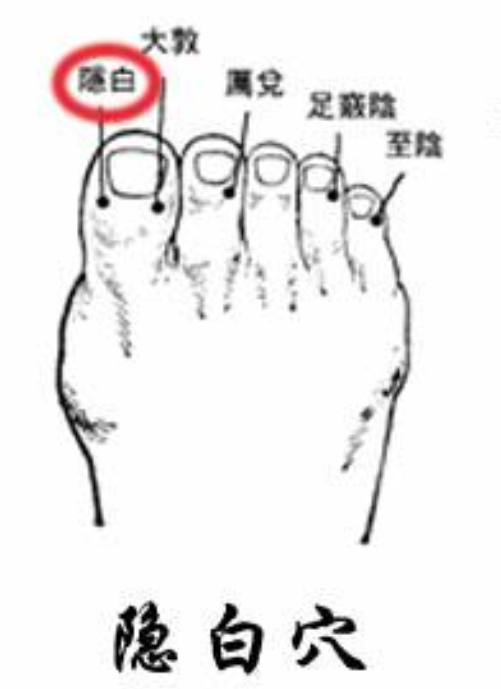
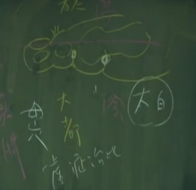
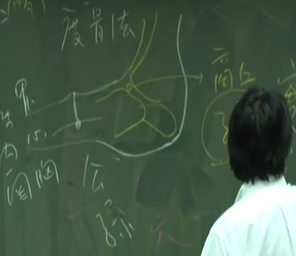
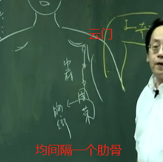

## 谏议之官：脾脏
脾脏，中医的脾脏，把它跟胰脏合并在一起。也就是中医把脾脏跟下面一块甜肉（就是胰脏）合在一起，讲到《黄帝内经》时我们会说得更多。脾脏跟胃相表里。胃是表，脾是里。所以看胃气，看不到脾脏，这是脏，内脏。
胃是腑，腑的定义是宣泄、消化。所以腑会有开口，有进有出；

中医认为**荣是血，卫就是气**。所以脾脏有非常多的血，胃有非常多的气在里面。气和血是平衡的状态。

小肠的津液和大肠的津液，都会往上入肺，肺的津液再从口出来时，就是我们的唾液、口水，脾脏和胃流出的涎。这两个有什么不一样？简单讲，中风病人的口水，这是涎。但这个流出来的不会酸，因为是脾脏来的，是甜味的。而胃里面的津液是很酸的。不相信我的话，你可以吃看看，这个是涎

## 脾脏主四肢 主肌肉
四肢的问题通通是脾脏在管。脾脏按《黄帝内经》来说是“谏议之官”，谏议之官就是要谏言。就像是魏征，当皇帝不对，要告诉皇帝不对，这就是脾脏。
有一天，病人告诉你：“我全身乏力”。问他：“你乏力是肌没有力是筋没有力，还是骨节没有力？”回说：“我从没想过呢！”回去想想后告诉你是肌肉没有力。这感觉得出来，关节没有力时，这关节整个感觉很酸软。筋没有力时懒的去握拳。会握不起来，所以肝主筋，你不能握拳是肝脏有问题。我们这里介绍的脾脏，管肌肉。走路怎么脚抽筋，那是肝的问题。

## 脾脏属土 味为甜
所以所有的甜味，通通是脾脏。但这是几千年前写下来的。那时没有人工精炼糖。你吃到人工糖是甜的，但吃下去是酸味，木是克土的，嘴巴是甜，下去是酸的，你看这东西可不可怕，表里就不一致。

胃是甘味，你吃到天然的甜，通通入脾胃。麦芽糖是甜味，蔗糖是甜味。我们小孩子胃口不开用麦芽糖。土很重要，因为土生万物，方向对，土生万物是有益的，方向错，生出来就是万弊。

## 脾脏色黄
黄色也是入通于脾。吃蔬果类，见到黄色的，橘子，黄瓜之类的，都是入脾脏的。

## 在音为宫
所以宫、商、角、征、羽，动作上面，实际上我们叫“呼”，呼吸的呼是宫的音，但你“呼”也没有用，因为动作要配合，动作要对。你手按在脾脏的地方，在左肋的地方。然后你呼气的时候，脾开窍在唇，口唇的唇是脾脏在管。所以你把嘴唇做“呼”的口形，然后吹气出来的声音，呼到没有气，这时才是正要开始的时候。没有气的时候，这时要把肛门提起来，谷道提起来，一提起来把身体的内劲，发出最后一个“呼”的音。那是最后一步，那个内劲吐出来是没有声音的，这时脾脏动的非常大。你呼完以后，再把吸气回来，你会感觉身体干干净净的，这时候你一吸的时候，马上就充满，所以练功一定要到空气比较好的地方。

若你只是平常在走路去“呼”，气是不会交换的。如果你是要练功，要把毒逼出来，你要到空气好的地方去交换。如果你的方向是对的，做得对的时候，当你在做最深入的呼，头会瞑眩。我们吃中药，一吃就头昏，下针就头昏，做这些功法的时候会头昏，都是正常的。做得非常好才会有头昏的现象。

## 在变动为哕
哕是打嗝。一直不断地打，当胃气、脾脏的气要消失的时候，可能三天、四天，每天不断的打嗝。到时候嗝不出气的时候，就是脾气绝了。
中医认为脾胃为后天之本，肾脏是先天之本，知道个大概就可以了。

## 思伤脾，脾主味。
胃口，味觉，是脾在管。思能伤脾，思虑很重，脾脏会受伤。脾脏受伤，味觉就没有了。这是一路相关的。

## 脾主少腹 脾统血
脾统血，食物营养吸收后是血。若有一天小肠温度不够了，腹寒了，静脉变冷的，就代表小肠温度下降。脚的温度下降。
由于脾主腹，所以脾直接到脚趾头上去了。三阴交是三条阴经的交会，这个冷会顺着三条阴经把冷传下去。而脾主少腹，所以腹是冷的，脚是冷的。
如果是小肠的火能下去，这个子宫卵巢得到小肠的热，小肠在后面子宫卵巢在前面。因小肠够热，心脏才能把奶水退下来，到子宫卵巢里面去，奶水本来是白的，但刚开始时是黄的，因为土生金嘛，到后来是白的。这白色的奶水排出来变红色的，因为奶水下来的时候，到了小肠，小肠很热，一加热以后就变红的。所以月经鲜红色是小肠温度是对的。若月经很淡，是因为小肠热度不够，没有完全气化掉，如果月经很黑、很深，就是烤焦了，用基本常识去想，这样就可以了。
小肠的寒热，当然可以在关元上灸，因为这是近取穴。而远取穴就在三阴交上面。

## 位置

隐白。
在脚掌里面有一个大脚趾骨。在这个骨边横纹，脚趾头跟脚掌交接横纹的这个地方，叫大都。

公孙 突骨下方和肌肉交接
商丘 

三阴交 脚踝上三寸
漏谷 三阴交上三寸

天地人三皇穴（阴陵 地机 三阴交）
阴陵泉就在你手去摸，按到脚内胫骨转弯的地方。但你下针不要贴到骨边下
阴陵泉下三寸 地机

血海 膝盖内测肌肉最高点的地方就是穴 跟合谷一样，血海是全身最大的穴道。
血海上五寸 箕门

冲门 曲骨外开四寸 
府舍 中级外开四寸
腹结 石门外开四寸
大横 神阙外开四寸
腹哀 建里外开四寸

天溪 乳中穴外开二寸 食窦这个穴道，在天溪下一寸六 一个肋骨

周荣 中府下一肋骨 胸乡 再下

大包 手臂内侧 胳肢窝底下，正下六寸，这是大包

---

#### 1.隐白 井穴 木 
隐白穴可治尸厥昏迷 。下针也可以，下针的话，井穴的地方刺激力度都很强，比如说肝经、肾经，从内侧股沟上来。
所以，病人疝气，肠子下坠，在肝经的井穴（大墩）上面，脾经的井穴（厉兑）上面，都可以下针。
隐白穴，除了治疗疝气 很好用，女人的妇科也可以，因为**脾主少腹**。脾脏主腹，所以肚脐以下，就是少腹。
所以很多妇人的白带，血滴漏不止，阴道的问题，通通可以在隐白下针，隐白是很好的穴道。

隐白上面的区域，叫三毛。不见得是三根，三根是形容多数嘛!所以叫三毛。**灸三毛可以治失眠。**你失眠而且不喜欢喝汤剂，我曾经在灸病人的三毛，灸到一半病人就睡着了，效果很好。你有失眠的问题，就灸三毛。这是个奇穴，没有别的治症。“灸三毛治失眠”就讲完了。灸三毛睡着之前记得要灭火! 
#### 2.大都 荣穴 火 母穴
既然是母穴的话，虚症治此。虚症在这里下针。我们用插提法、迎随法，会很痛。所以针下去以后，再提一点，就可以了。中医的观念里面，我们认为，脾脏有虚症的时候，除了四肢无力以外，唇口会比较白。因为是虚症，白色是金，土生金，所以整个颜色会出现，嘴唇会比较白，脾极虚的话，会容易产生蛔虫。

#### 3.太白 俞穴 土 本穴
俞穴第一个，按时间发的病，脾是早上九点到十一点，气血是在这两个小时走在脾。所以你的脾很实，脾气很旺的时候，四肢肌肉都很旺，所以九点到十一点是最有力的。很多员工一开始上班，大家都很累，那就是脾虚。想办法让他们多跑步，多“呼”啊，这样可以实脾、这样不会生虫了。用俞穴，按时间发的病都没了。
同时，因为属性相同，在俞穴上做补泻，虚实都可以。今天有个病人要扎大都，因为是虚症，但有人没有脚大拇趾。那怎么办，扎太白嘛!不要说：“我没有办法治他”，你还是可以选太白嘛! 
#### 4.公孙 胃心胸病 络穴
公孙用途非常多，所以你们务必找得到穴道。
公孙主冲脉。冲脉呢，按照人身上，在任脉旁开半寸的地方，是冲脉的所在。
有一句针灸的歌诀，叫**“公孙内关胃心胸”**公孙穴配上内关穴。内关在手心包经上面。任何的胃病 、心脏病 、胸部的问题：气喘 、咳嗽 、肺病 、心脏肥大 ，公孙通通可以治。
要先把喘定住，才能问他。不能一直问他，又让他一直喘。所以，公孙一定要找到。当胃痛时，内关还没用到，公孙下去也就好了。
甚至在发心脏病的时候，摸公孙都会摸到一个硬块。冲脉，在奇经八脉时会再介绍。整个冲脉都是公孙在管，整个任脉是列缺在管，介绍奇经时会再介绍到。
我第一天上课就拿个圆球给你看，病在中间，你可以从各种角度下针。临床上病人胃出血 一般不下足三里，因为是足三里胃的本穴，病人会吐更多血，所以我们下公孙。
同样的，公孙可以治妇女怀孕恶心、吐啊，当然我们有人参、半夏、生姜可以用，但用针灸的话，足三里、公孙也可以治妊娠呕吐。

公孙是脾经的络穴。刚刚介绍到足阳明胃经的原穴冲阳，如果病变经在足阳明胃经，我们要采原络治疗。我们会找**病变经的原穴，足阳明胃经的冲阳。再配合公孙。** 
为什么？就是在配合络穴，阴经和阳经中间有络，连在一起，所以能阴阳协调，阴阳是相辅相成的，而不能隔离开来。若那天看到病人阴走阴，阳走阳，这种人就快要死了。临床上，平时我都碰不到，但化疗后就碰到了！化疗好像一个东西把病遮着了，药也过不去了。
公孙穴主冲脉，冲脉力量很强，所以腹胀 、鼓胀通通可以用公孙。所以书上第二行开始讲“实则肠中切痛，泻之。虚则鼓胀，补之。”因为它是络穴，原穴、络穴虚实都可以在这下针。 
#### 5.商丘 子穴 金 经穴
子穴治实症。当我们发现脾经这里痛， 如有人发现膝盖内侧痛，痛了一个礼拜，下商丘。痛了好几个月，下大都。因为久痛为虚，新痛为实。
痛多酸少，先泻后补。病人越来越重，酸比较多，痛比较少，就先补后泻。过了这个时间后统统是麻了，麻是最重的，治疗比较慢。痛治疗比较快。所以发病时越快治疗越好。
那商丘穴呢，有帮助怀孕的效果。
#### 6.三阴交 主血 月经
三阴交跟足三里是人身上的一个大穴。为什么叫三阴交，就是三条阴经的交会处，足有三条阴经，足少阴肾经、足太阴脾经、足厥阴肝经。
三阴交在骨头旁边，不要扎到骨膜，所以不要贴在骨头旁边下针。
这穴道很大，女人月经痛 ，针三阴交，立竿见影。如果痛没有去掉，就是没有扎到三阴交。
穴道可以用在诊断，也可以用在治疗，以及事后的确认。妇人月经痛，月事好不好，按按三阴交就知道了，如果病人大叫一声，叫越大声的，痛经越厉害。
实有两种，一种是积块，一种是瘀血。腹诊上面可以查到，如果有瘀血时，从关元穴外开三寸、四寸的地方，在骨头旁，会找到压痛点，**人体的左侧主血，右边主气**。所以如果是子宫、腹腔有瘀血时，一般我们在腹部的左边有压痛点。
腹部的正中央有痛，大部分的都是 有积块，肿瘤。同样的，不管是瘀血 、肿瘤 ，在三阴交都会有压痛点。如果治疗好一点， 要看瘀血化了没，一样按三阴交，如果还有痛，就继续治疗，最简单最古老的方法就是最实在的方法。

我们在前面介绍合谷是大肠经的原穴，大肠跟肺表里，所以气表现在合谷上面。那三阴交主血，脾主少腹。那三阴交主血，脾主少腹。所以一个正常的孕妇有两种，血旺气衰跟气旺血衰。因为怀孕的时候。婴儿都是靠血在滋养，所以我们要让**孕妇血旺气衰，**小孩子会长的好。如果孕妇平时是血旺气衰，但在怀孕的时候生气啊，婆媳不和，变成气旺血衰，就会落胎， 这是情志上的反应。简单的观念有了以后，合谷是气穴，合谷是气，三阴交是血。我们如果是**补三阴交泻合谷**，气弱血旺，就可以安胎。
所以，合谷、三阴交，孕妇来说是禁针的。所以腹部的针不要扎以外，合谷三阴交也不要扎，因为怕你补泻搞错。

脾主少腹，腹部寒冷的时候，瘀血容易堆积在里面。你怎么知道他腹寒冷，看脚有没有冰冷，为什么知道他是冰的脚。
腹部是脾在管，小肠是受盛之官，它把东西吸收起来后。营养会转交给心脏。而脾脏主运化，主输送， 所以脾脏会把红色的营养交给心脏，青色的营养给肝脏，黄色的营养自己吸收，白的营养给肺脏，黑的营养给肾脏。

腹部的问题，男女都可以用。男人遗精 、梦遗，灸三阴交，针也可以。阴茎痛，少腹痛都可以。这个少腹痛除了月经痛以外，像肠子打结，都可以用三阴交。当然公孙也很好。公孙对冲脉很好，因为冲脉的路线经过少腹。几乎所有妇科的病都可以用三阴交。
但如果三阴交下去，腹不痛了，但滴漏仍不止，那就下隐白。中医认为血无止法，生病时没有止血的药，只有消导的药，让血自然停了，不要让本来要排出的血流在身体里面，这血要是留在里面，以后会做乱的。

那水肿 ，脚积水，也可以用三阴交，来消导。小便不利，也可以用三阴交。因为三条阴经经过，同时又主少腹。小便不出来，也可以用中极，因为中极是膀胱之募。都下的话，当然更好啊!
小便不出来，是因为膀胱太冷了，而膀胱太冷是因为小肠的温度不够。不够以后，这小便在膀胱里面是冷水而不是热水，冷水在里面会造成频尿，这时再灸关元。

我们有天、地、人三皇。三皇穴中，**三阴交叫人皇**，等一下会介绍地皇和天皇。病人只要有水病，压三阴交就有痛点。
#### 7.漏谷 络穴
诸位看到这边，穴名又出来一个山谷，漏谷这个穴道我们是禁灸的。
阳经都是表经，阴经都是里经，阴和阳一定有个表里。那脾的表经就是胃，足太阴脾经与足阳明胃经相连的地方，就是漏谷。
#### 8.地机 地皇 郗穴
肿腹坚、 肚子胀满，女子癥瘕，女生腹部有肿瘤、硬块，都可以用。
#### 9.阴陵泉 天皇 合穴 水
阴陵泉是个大穴。可用来治疗膝盖风湿 、水肿。像小便失禁 、小便频数都可以用。中风的病人也可以用，包括摄护腺肥大，晚上会夜尿。
#### 10.血海 妇科名穴
女人痛经，不管是滴漏不止或是月经不来，都可以在血海上治。
你扎进血海以后，把针左右捻一捻，无所谓补泻。因血海里面深的地方有个筋在里面，所以血海我们不深针，扎很浅，用一寸针扎进去就可以了，不会用到一寸半，扎太深病人会跳起来，跳起来，表示你扎错穴道了。
**痛经三穴 血海 三阴交 中极**
#### 11.百虫窝 血海下一寸
这是我们诊断身体里面有没有蛔虫 、寄生虫在身上
#### 12.箕门
近取穴的定义，它靠近阴部，所以对阴部的病都有帮助，很少用到，我这一辈子没有下过。
#### 13.冲门
冲门有一个对称治疗法，我们前面也介绍过对称治疗了。在治病时，要因时因地治宜。
冲门痛，当然我们可以扎脾经的子穴或母穴，但我们用的是云门，因为是对称治疗法，我们可以采对称治疗法。
生完小孩后，小孩子生出来了，很多人胎盘下不来 ，冲门穴也是很好的穴道。故名思义，门打开让胎盘下来。
#### 14.府舍
府舍是近取穴，近取穴因为靠近腹部。所以都可以治疗腹部的病。
#### 15.腹结
#### 16.大横
大部分都是治肠胃方面，常看到这个病人泻痢 、拉肚子，都可以在这附近取穴。
#### 17.腹哀
治症都一样，腹部、肠胃的问题、大便不顺 、胃不消化 ， 都可以用这个穴道。
#### 18.食窦
肚脐以上肋骨之下，可以直针，直针下去不要下太深。一般大概下一寸。肚子很大，可以下一寸半，小孩子的话，很浅的，三分就到了。要看他肚子大小来决定深浅。
而肋骨周围的穴道，下针的手法是这样子。 如同胃经斜刺
#### 19.天溪
如果妇人的乳房，有个硬块在这边，你一看，在乳中穴的旁边二寸，她这乳房硬块是长在足太阴脾经上面。所以，乳房硬块在那个位置，它代表的经络是不一样的，我们选择的角度就不一样，所以没有乳癌特效穴，而是看经络走向，选取它的穴道。

要了解经络的走向，同时要了解井荣俞经合，原穴、络穴、郄穴你怎么选择，诸如此类等。如虚实寒热搞不清楚，原穴都可以治疗。所以你要知道天溪，要知道食窦，不是要针直接扎下去，而是要靠它帮你辨证
#### 20.胸乡
#### 21.周荣
若有硬块在云门中府出现的话， 我们要在肺经上治疗。我们如果有硬块在脾经，我们要在脾经上治疗，这是你们要知道穴道的目的。
**初期硬块出来的时候，灸比针好，因为灸是“久火”。**为什么一开始要先学艾绒去烧，因为艾绒的性是往下，是找水。我们讲奶水奶水，奶里面一定有水。艾一点它就着火，表面看是烟往上，但气是往下的。热就能化，所以灸比针好。
所以找到乳房硬块，不要急，用灸，自己去按摩，一般都叫自己灸，自已按摩，或是由先生灸，先生按摩。
#### 22.大包 大包穴总统全身大络
大包穴总统全身大络，全身的络都是大包在管。
经与经之间都有络，所以才会有表里的现象出现，经和脏腑也有络，脏腑交接也有络，所以络是布满全身的，主干道是经，次要是络。
脏腑之间不能沟通时，要大包让他协调。所以大包是常用的穴道，阴经、阳经的络都是他在管。
为什么我们讲脾之大络。因为脾脏就好像水坝，水坝从供水到种田，都很重要，这个管道就是大包，都是大包在管。**所以脾脏能管五脏，是大包穴的关系。**

你看，中医把虚实再下个定义，学到越来越多虚实的辨证，凡是绷紧的都是实，松开来的称虚。实症的时候很紧，虚症的时候很松弛。病人手一拿起来就掉下去，松弛的时候是虚症。大包穴虚实都可以治

---

## 中风预兆
中风有个预兆，第一个是手前面三个指头麻。这个麻一旦的出现，大概六个月以内会中风。
那如果说这个麻是出现在足阳明胃经上面，在足三里、上巨虚、下巨虚、丰隆麻的时候，可能两个星期内会中风。这时候就马上灸足三里，灸的时候要灸到他不麻，起了疤都没关系，起了水泡就把水泡刺掉，灸个九壮、十一壮、十五壮，灸完第二天再灸，在灸的中间就让它通了。
心脏病也会有预兆，我们在介绍手少阴心经时再介绍。

## 咖啡与胰脏癌
我们为什么说喝咖啡会得胰脏癌 。很简单，所有的酸味，本身入肝，酸克土。味道、很厚、很重。味有两种，一个很重，一个很淡，重的入血分，味淡的入气分。胃主气，脾主荣主血。比如说咖啡，味道很厚重，是入血分的，咖啡又是酸性的，那所以入血分，直接打击到脾上面，对脾脏来说是一个负担。

## 对称治疗
这个对称治疗呢?我们不管穴性，不管阴阳五行，用基本常识去取。他脚痛正好在公孙的地方，你如果说你可以下对侧，左病右治，右病左治，新痛下对侧商丘，下商丘还痛，你可以下对侧的公孙，如果它痛过来一点，你也下过来一点。看他痛哪边，按照比例来分。
如果你把公孙放到手上面去，这刚好是我们手太阴肺经的鱼际穴。所以右脚的公孙痛，你可以扎左手的鱼际穴，左脚的公孙痛，你可以扎右手的鱼际穴。
有人一打架，撞到手肘这里会很痛，有时不小心一撞就很痛，那你想想看，把手翻过来对应到的正好是膝盖的顶端，我们就扎鹤顶，反过来鹤顶痛，扎三焦经的天井穴。
我们有很多治疗法则，但有时用这个方法比较好，有时用那个方法比较好，看哪个比较方便，就用哪个。

## 三皇穴
脾经这一条，我们又叫水道。水肿很厉害的时候，病人整个脚是绷紧的，因为里面都是水，皮肤会变得很亮，因为里面水很多，压力很大，很痛。一针下去起针后，这三个穴道会出水。而出血是因你扎到 了血管。扎下去，一拔针，就流水出来，见到流水没关系，不会发炎的，因为它是往外走，不会往内走，就让它流，这是三皇穴的第一个。
第二个，脾主四肢，腿没有力 ，也可以用三皇穴，这是强土的动作。
由于脾主四肢、主肌肉、脾主少腹、脾统血、脾主身上的湿热。我们怎么治疗水肿，除了消水以外，第一个就是强土。不强土的话，这水肿退了还会再回来。为什么你吃西药把水排掉，第二天水又回来了，因为利尿剂没有强土的功能，我们要把土建立起来。我们下针要双侧，左右两边都下，三阴交、地机、阴陵泉，专门治疗水肿。

## 下针的深浅
比如说，现在我们要制水，水在的地方很深，若针下的很浅，就一点用都没有。一定要下的很深，但也不要太过了，不是用一针就从阴陵泉透到阳陵泉，大概一寸半就够了。我在美国看到病人腿水肿的很大，我就用三寸针下，要有基本常识。小孩子腿很小，用一寸针下就够了。有时脚粗的，你扎一寸半对你来说很深，但对他来说还是在表，所以治水肿会没效。所以我们要看深浅，一下去要够深，才能达到水的位置。如果是皮肤表面的病，针就不要下很深，一定下在皮表上面。病在中间的地方，就下中间的地方。所以我们的深浅，是按病人的需要决定的，这是第一个观念。
第二个是治病的时候，病人是骨头的问题，我们下针也要下很深，下到骨头。这是一样的观念。如果是内脏的问题，治肝病，治气喘，也是要深针，因为脏是收藏嘛!是在看不到的地方。那腑是宣泄，所以肠胃系统，不用下很深，这是深浅的一般概念。

## **蛔虫症 判断**
把嘴唇拉开来，看下牙龈的下方，如果有很多白点连在一起，就是有虫。如果嘴唇一看没有白点了，还没结束哦。因为很多地方可以检查，因为虫有很多种嘛。眼睛拿起来看，把眼睛翻开来。如果在眼白的地方，出现很多蓝色的点代表有虫。还有晚上肛门痒，也代表有虫。
因为这些虫的位置不一样，有的在肝，有的在肠，有的在肛门口，所以要看好几个地方。最明显的表证是肚子大。大都穴因为虚症治此，所以我们可以实脾。脾脏实了就不会生虫，脾虚才会生虫。脾脏如果很强，三个人在吃菜，只有脾虚的会长虫，所以不是每个人都会得到。
百虫窝 按到百虫窝，病人有痛，就是有虫在里面，这是一种诊断的方式，表示里面有疣虫、蛔虫，也是告诉你给病人一针嘛!治疗到百虫窝没有痛了，就好了!速度就是那么快，这些穴道都可帮助我们诊断。
