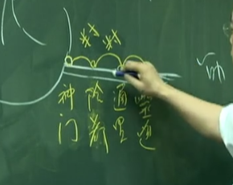
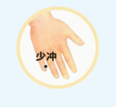

## 君主之官：心脏
脾开巳时，心开午时，午时是早上十一点到下午一点。心经是手少阴心经，心经属火，是阴经，属于阴火。
中医的观念，心脏本身是“君主之官”，它本身不受病。心脏会有病，在中医的观念，是心包膜有病，病都在心包上面，都是心包膜生病，心脏本身不会生病。
“心脏其脏坚固，不能容邪，容邪则死”。心脏得 到病就会死，所以一般的病都是在心包，包络着君主心脏，病都在心脏的周围，心脏本身根本就不受病，也不能受病。一旦受病就是死
## 心藏神
所以心神很重要，如果神不守，气就不会聚在一起，少气少气，命就会少。这是心藏神，中午十一点到下午一点，这是心经开穴的时间。

我们整个晚上不能睡，整个晚上不易入眠这都是心脏的问题。如果是专挑时间，十一点到一点不能睡，十二点准时起床，这就是胆有问题，一点到三点醒过来，这是肝有问题，三点到五点醒来，这是肺脏有问题。那这个病人没有黄疸，没有咳，没有气喘，但还是不好睡，就是心脏不好。
所以心脏要控制很好，睡眠就很好，情绪就会好。
## 心跟小肠是表里
心脏在这边，我们人的中央有大血管，这个大血管,把血导入到小肠。当你的火在小肠里面，这两个火是同样的温度、速度、压力。所以心脏在管人的体重，管人的腰围。我帮病人减肥，是强他的心脏。
## 在音为徵
在五音，宫、商、角、徵、羽里面，心脏的声音是“徵”.
其实在练功的时候，我们发的声音是“呵”，这个“呵”的声音，就是徵音。我会做示范个动作给诸位看，这个动作的目的，你要用观念去想。比如，今天用个吸管插到泥土里面去，拿起来后，这个吸管里面都是泥土，那你要怎样清掉？西医就是用吹啊，拿个管子往里面吹。
## 心主喜。
中医说恐能胜喜。恐是水，恐是肾脏在管。我们的木火土金水，心是火，水能治火，水就是肾，肾脏管的情志，就是恐。当一个人过喜的时候，就用恐来治他。
## 其华在面
两颊这边就是心脏管的部分。当它红色的时候，就是壮热，就是心实。实症壮热时，我们病人就感到热，这种是赤红色、鲜红色。当从脾送营养给心脏时，心脏有东西堵到，造成心脏本身不收来自脾脏的营养，而这个红色的营养就会反应到脸上，这种情形出现就是实症。

反过来是虚症。像这脸色很苍白。苍白没有血色就是虚症。心脏的虚症，我们可以取它的合穴，在少海穴下针。
## 位置
心经呢？我们全身上下穴道最少的就是心经。
心经只有九个穴道，是阴火。
小肠经是阳火，而心跟小肠相表里，小肠的问题可以在心 经上面治，同样心的问题可以在小肠经上治，这两个是相对的。

--- 

诸位看第一个穴道叫极泉。卷八28 页。这个腋下的地方，正上方是我们的肩髃穴，下面就是极泉。
是我们手弯起来，手肘弯起来外侧是曲池，这弯起来内侧叫少海。从少海上三寸，是青灵，一般很少用，但你要知道心经从这经过，从这条路线到极泉去。

手掌下面这个地方，有很粗的筋在这个地方，在这筋的内侧，跟手掌横纹交接的地方，这个穴道称为神门。神门再上半寸，就是阴郄。阴郄穴再上半寸，就是通里。通里穴再上半寸，就是灵道。

你叫病人握拳，手第四指和第五指指头到的地方，这个点就叫少府穴。旁边是劳宫穴。而这个点叫少府穴。

少冲

---

#### 1.极泉
平时极泉不会下针，也不会去灸，我们知道那个穴道叫极泉就好了。如果说有乳房 硬块，就知道是在心经。所以你要在心经上治疗，但不一定要用极泉治疗，它可帮助我们诊断用。
#### 2.青灵
你知道少海穴的话，就不会用到青灵，
#### 3.少海 合穴 母穴
所以刚好心经的井穴，正好是心经的 母穴。但我们补井当补合，如果母穴刚好是它的井穴时，我们就在合穴上治疗。泄井当泄荣
心脏的虚症，就取它的母穴，当心气太过而不能睡觉，心气不足也不能睡觉。虚和实，简单的定义，心脏是其华在面。其华在面，就是脸上的气色。我画的不好，但你知道这是人的脸。

补的数是三五七九单数。心 脏比较虚，可以做九补，九次做完以后，再提一点点。提一点点就是补。效果就看它回家睡觉睡得好不好睡。几天后，你看他脸色越来越苍白，就是补错了，所以可以马上查出来。
#### 4.灵道 经穴 金
#### 5.通里 络穴
#### 6.阴郄 郄穴
456 都是直针
#### 7.神门穴 荣穴 子穴
治疗失眠、惊悸、心脏动悸，用的很多。对心脏方面，情志方面，情绪不稳的，像动辄生气，还有心神不守的，常常见鬼发笑的。
对着手掌反向 沿着经络方向。
也可以从灵道、通里、阴郄到神门，这样子刺过去，因为是心经，所以对失眠帮助很大，一定会有效。

神门是子穴，所以心脏发生的实症，可以在神门上下针。面红实证发生 燥热 
#### 8.少府 本穴 火穴
心脏病急救大穴。
少府穴是心脏病的急救大穴。心脏停止跳动的时候，你就下关元，巨阙，少府。当少府针下去，心脏还没有动，那这个病人就差不多了。
涌泉、公孙，都可以治心脏病，而且是用在急救方面。少府又名手解穴。脚的解穴上次介绍过了，是在膝盖外侧直角骨上一寸的地方。

书里面说，少府可以治阴痛，因为心经跟小肠表里，所以下焦的病我们也可以用到。后面我们会介绍到本穴治疗，每条经都有它的本穴，我们利用本穴来调它的木火土金水。让它木生火、火生土、土生金等等，那就正常。若生病，有病态出现，就是木克土。
#### 9.少冲 木穴 井穴
少冲穴是手少阴心经井穴，属木。所以书上写“心虚补之”。因为木生火嘛。但我们会在少海穴上做补泻。若在少冲上做插提、捻转会很辛苦。
## 治肝先实脾
我们在治症上面，我们不管它是什么病，当一开始知道肝有问题时，就先去强土，不要再让它克到土了。再来想办法去强水嘛。进而治疗木。
错误治疗后，只剩火可用。这种病人活该，下针下井穴，好好给他教训一下。井穴效果又很好，速度又很快，因为痛啊。

所以得了肝病，千万不要等到胃口都没了，再来找我，因为已经克到土了嘛。我一看克到土，第一个马上壮水，让病到此为止，让病不会再前进。所以中医治症是，一开始先到此为止，再开始想办法把病去掉。