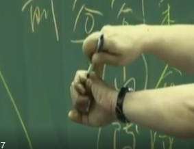
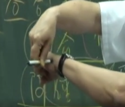
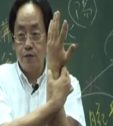
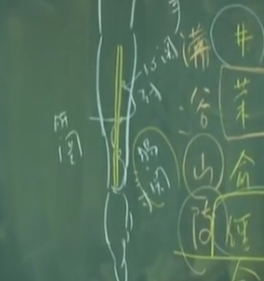
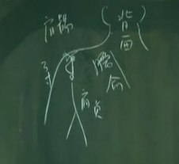
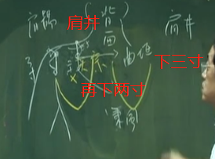
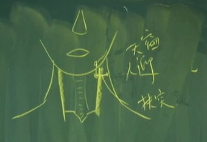
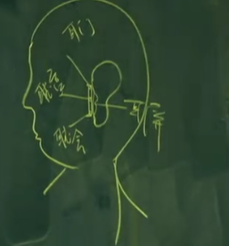

## 受盛之官，化物出焉
小肠是赤肠，胃之下口等。手太阳小肠经，它流注的时间为下午一点到三点。有的人来找我看病，他说他吃完中餐就很累，昏昏沉沉到三点多以后精神又来了，这就是小肠有问题。

这个小肠有问题，不见得是病，而是小肠比较虚弱一点。当你按照时辰发病的时候，依《针灸甲乙经》，就是取俞穴。用我师父传给我的荣穴也可以。

小肠一样属火，属阳火，阳火来自阴火，来自心脏。心脏在上面，心脏产生的热能传给小肠，心脏的下方就是动脉血管，血管里面除了血以外，还带着热。

心主汗，我们全身会流汗，心脏功能很正常就会流汗，所以当你运动时会流汗，这汗是来自心，因为心脏正常。一接触到外面的热，热胀冷缩嘛，毛孔就打开了，流汗就流很多了，流汗流很多，汗水蒸发多了，水份就变少，小便自然而然也会变少。小便的来源有两个：一个是西医知道的，是从肾脏经输尿管传到膀胱里面，这只是其中一个。**中医认为三焦是水道**，这个三焦是脏腑之间的油网，三焦跟膀胱是连在一起。当我们小肠跟膀胱贴在一起的时候，尿液累积在膀胱里面的时候，因为小肠很热，所以这个尿液是紧贴在火边，水就气化了，水一气化起来，膀胱就膨胀，膨胀起来后，就好像毛孔遇热打开一样，膀胱也是一样。小孔会排出来干净的水出来，这水会流到肝脏，帮肝脏来清肝脏，所以中医叫水生木。

如果没有变汗流掉，肺的津液，因金会生水，慢慢成入肾，进入肾后再排到膀胱出去，所以叫金生水。同样的，肾再排到膀胱以后，会经过第二次的气化，好的水会再回到肝脏，而浊水则会排到体外去。

## 位置
小肠经一共有十九个穴道，用到地方非常多
第一个少泽穴是井穴，以左手来说的话，左手的小指，指甲旁边后面这个地方，就是我们的少泽穴

前谷 直针这样下进去。下针时也是手握拳，但叫病人不要握太紧。

后溪 类似二间三间 握手取

腕骨 你手握拳，手这边有个骨头，有个特别的名称，叫小天星骨。

阳谷 手握拳，这个骨头跟掌骨的中间有个大筋，从这个筋的下方下针，从下方下针进去，就是我们的阳谷穴。阳谷穴要下很浅，一寸针

用这个姿势按到它，转过来后这个骨头会凹裂开，这个骨缝，就叫养老穴。养老穴要下浅，且要把手转过来下针，用一寸针，半寸就下到

支正 阳谷上五寸

肠关 肝关 心关.下针的时候，是在骨头的后方，所以在骨头的上方是小肠经，在骨头下方这边有三个穴道。

小海穴怎么找，将手肘弯起来握拳，这边有两个骨头，手这有个骨头，这边也有个骨头，将两个凸出来的骨头连成一条线，做成一个正三角形，这个三角形顶点的地方，叫做小海。
你如果压到小海，压一下，筋就麻了。小海压会很麻，以前小时候常常玩，小孩子很皮嘛，这就是小海穴。
手部的针，你们用一寸半的针，但小海不用一寸半，用一寸的针就够了，一下子就下到了，很浅。

从肩髃穴往上走，这有个骨头，走到内侧的骨头这边，有个骨缝，我们称为臑腧。从臑腧往下走三寸，就是我们现在讲的肩贞穴。
这个距离是三寸，所以大肠经跟小肠经非常的接近，在大肠跟小肠的中间，就是三焦经，我们三焦经还没有介绍到。

天宗 肩胛骨正中间。
在这扎针的时候，旁边的骨头很大，虽碰到骨头，但不会碰到肺的部位。天宗很少用，但你要知道只有肩胛骨旁边的痛，都属于小肠经。大肠经在前面，小肠经在后面，中间三焦经

曲垣 曲垣跟秉风怎么找?我们先找肩井，肩井本身是胆经的穴道，但我们先介绍，这样穴道会比较好找。肩膀这有个肌肉，这有个三角形，正上方最顶端，在这个缺盆骨头跟颈部正中间，这有个肩井穴，所以肩井穴摸都可以摸到。
肩井不能重击，但可以下针，但不能太深，因为它是肺的上端，下太深会伤到肺造成肺气肿，要特别注意。

从肩井穴往后，直下三寸，就是我们现在介绍的这个曲垣。从曲垣再旁开两寸，就是我们讲的秉风。

肩外俞是从陶道外开四寸的距离。肩中俞是从大椎开二寸。我们扎背针的时候，下针的方向是从身体内侧对身体外侧方向下针，呈八字形。 **类似胸针**
斜刺的时候，如这是四寸，你要从三寸的地方斜刺透到四寸，在四寸的地方就正好碰到穴道。要在前一寸或半寸，要看你针的长短，一般都是这样子。

天窗 人迎外开三寸

天容 耳朵下方

头部的穴道，我们可以下针，但差不多下五分，下得很浅。

再来是颧髎，颧髎在眼睛这边，眼睛的后方有个凹谷叫做瞳子髎。瞳子髎就是我们讲的太阳穴。那这瞳子髎下三寸，就是颧髎，知道位置就好了，很少下针。颧髎偶尔会用到治上牙痛 。

听宫.
前面有个骨缝，要张口才能找到。先闭口，再嘴张开，就有一个骨缝跑出来。以前面这个骨缝为主，分上中下，上面叫耳门，中间是听宫，下面是听会。我们有三条经，三焦经、小肠经、胆经经过我们耳朵里面。

针进去时，直接下一寸那么深。这穴道可以左右捻捻，平补平泻，插提都可以，都不会伤到，无所谓补泻，补泻都可以用。一般来说耳朵流脓，黄色的、腥臭味，这些都是实症，用泻的手法。

---

#### 1.少泽 金 井穴
平常井穴是下针放血，放血用的。
#### 2. 前谷 荣穴 水
用导引，诸位记得有沟谷山林的穴道名称，像我们的阴陵泉，会用沟谷山林来命名。所以遇到谷的时候要留意一下。
下针的时候呢，要压一下肉，尽量下在骨和肉的中间，不要贴在骨边下，你紧贴着肉或紧贴着骨边下都很痛，不但穴道没有下到，而且很痛。我们所谓的巧手是下针进去没有痛，刚好在骨和肉中间。

像妇人奶水不够，用前谷穴。现在讲针灸的导引术，奶水不足时，我们要找谷出来，水都在山谷里面，我们在奶水不够的时候可以用。

它是荣穴也可以用在时症，下午一点到三点可以用。扎前谷穴比较痛，所以我们常用在俞穴后溪穴上治。
#### 3. 后溪 俞穴 主督脉 木 母穴
因为是母穴，所以小肠经的虚症在这治疗。所以，当病人说，他整个脊椎骨痛。一看是督脉，就下后溪。那小肠经的虚症，肩膀痛，一看是小肠经的经络，同样是下后溪。
后溪管整个督脉，而小肠经有绕过后面的肩膀。所以肩、项有问题的时候，大部分都在后溪下针。我们针**督脉时候没有虚实，反正是一个穴道在管，但小肠经就有虚实**。
如果是小肠经的初痛，用小肠经的子穴。那久病就用它的母穴。通常到我手上都很少用子穴，病人几乎都拖到用后溪了。
#### 4. 腕骨 原穴 
阳经才有原穴
#### 5. 阳谷 本穴 火
本穴治疗法则，会用到阳谷穴。
#### 6.养老 郄穴
养老穴不是养老的病都可以扎。**可治老年人眼睛不好。**这也是我们第一个教到的治眼睛的穴道，在治眼科的穴道中，养老穴很有名。
我们有很有名的“养老透间使”。用透穴的方法，专治手肘扭伤 、**手不能扭毛巾**。

所以手不能扭毛巾的时候，用**养老透间使**。那间使穴在那呢，我先提一下，在心包经上面，由这个叫大陵的地方，再上三寸，它在两筋中间。所以我们下养老透间使的时候，手指头先按到间使，用三寸针把针提起来这个角度，从里面穿刺到间使穴，手先按到间使穴这边来，会感觉到针尖到这边来了，你不要透出来，感觉针到了就是到了。针穿过去以后，左右捻捻、平补平泻。左右捻捻叫平补平泻，平补平泻完了后，不留针，针马上抽出来，这样就好啦！当场就好
同侧
止痛下曲池 消炎

#### 7.支正 络穴
原穴是腕骨，络穴是支正。原穴和络穴都无所谓虚实，它们虚实都可以治。
记得在阳经取穴的时候，阳经是在手肘的上面，下面都是阴经。也要记得三个横手指是三寸，两个横手指是二寸。

支正是虚实都可以用，你看第二行，实则节弛肘废，手臂没有力气，泻之。虚则生疣，生了很多疣在皮肤表面上，都可用支正。
#### 奇穴 肠关 肝关 心关
肠关呢，顾名思义，就是把肠关掉，比如刚吃完承气汤要下利，而马路上又堵车，又找不到厕所，又很内急，这怎么办？男左女右，这左手是肠关，拿右手压肠关，压到时心里同时要想我不想上厕所，大概想三次，便意就没有了，就不会想上厕所了。你如果便意很强。

就一直不断的压着它，确定找到厕所，裤子都脱了，再把手放开。这是肠关，紧急时可以帮助自己。也可以下针，用来防止下痢 。少腹的痛，像肠绞痛 ，三阴交下去，因三阴交主腹啊。如果三阴交下去，公孙，关元，中极也下去，但腹部还痛。就下肠关，肠关下去，痛当场就去掉了，就是那么快。

再上三寸叫肝关。像肝癌到后来非常的疼痛，西医会开吗啡止痛，如果痛右边，就下左边的肝关，针下去平补平泻，痛就慢慢去掉了。因为是经外奇穴，所以无所谓补泻，平补平泻。

心关呢？就是治心脏病的，也无所谓虚实，不管是心脏的虚症或心脏的实症，都可在心关下针
#### 8.小海 子穴 合 土
小肠经的实症在上面治，像身上生疣 ，就可以用。
#### 9.臑腧
臑腧是手太阳、阳维脉、阳蹻脉的会穴
#### 10.肩贞
这些穴道你们知道就好了。有时病人说，我痛到后面去，指的地方正好就是臑腧、肩贞。
我们一看是小肠经，问他“痛多久”，痛三天，就下小海。三个月，就下后溪。
穴道就这样取的。看身体那边痛，我们再扎对侧。
#### 11.天宗
天宗很少用，但你要知道只有肩胛骨旁边的痛，都属于小肠经。
#### 12.曲垣
#### 13.秉风
秉风和曲垣都很少用，但你要知道。所以如果病人说肩井上痛，就是胆经，后面这边痛，痛到三寸的地方就是小肠经。在三寸跟肩井中间就是三焦经。
所以，确定是那一条经产生的痛，我们在该经的子穴或母穴做补泻，或者在原穴上做补泻就可以了。原穴是阳经才有，阴经没有原穴。
#### 14.肩外俞
#### 15.肩中俞
顾名思义，肩中俞和肩外俞，这些是肩膀酸痛 的近取穴。项强的时候，你可能是得到太阳中风或温病造成项强，或像西医讲的高血压，也会造成项强，瓣膜闭锁不全也会项强。但我们不管病是什么，中医是辨证论治，项强时通通可以治疗。这是项强 的近取穴。按照附近的穴道来取穴。不要直针，要斜刺。
#### 16.天窗
我们现在介绍天窗。足阳明胃经进入大迎后下来，进到大筋的内侧这穴道叫人迎，从人迎这里摸进去，有一个脉，人迎脉在这里。从人迎横开三寸，就是我们的天窗。三寸的地方是天窗，中间一寸半的地方，刚好是大筋的后方，就是扶突穴。三寸的地方，就是天窗穴，天窗穴在小肠经上面。
小肠经很多穴道，过去有人是认为痔疮是湿热下注小肠造成的，这到无所谓，反正成因很多。
#### 17.天容
下针的时候都要先用指甲切它，从指甲旁边下进去，这样就不会针到动脉血管。像脖子的甲状腺肿，脖子里面有肿瘤，硬块，天容通通可以治。
#### 18.颧髎
眼睛的后方有个凹谷叫做瞳子髎。瞳子髎就是我们讲的太阳穴。那这瞳子髎下三寸，就是颧髎，知道位置就好了，很少下针。颧髎偶尔会用到治上牙痛 。
#### 19.听宫
那顾名思义，耳门听宫听会，都是治疗耳朵化脓 、发炎 、耳鸣 、通通可以下听宫。下听宫的时候，病人嘴巴要张开来，针直接进去，闭嘴就没有穴道，你可以找个东西塞在嘴巴里面。
这三个穴道不要留针很久，留很久那不是整人吗。起针后，耳朵的耳鸣就好了，但是牙关会开始痛，因为牙开太久了。大概是五分，十分钟就可以了，你可以放个毛巾。在美国有一种牙科专用的器具，一放病人就咬上去，刚好可把骨头打开来。

一般来说耳朵流脓，黄色的、腥臭味，这些都是实症，用泻的手法。

我们治疗耳朵流脓、化脓的时候，我们常用喷剂。我们常用的麝香矾石散，麝香它无孔不入，通利。麝香加一点进去，然后再加矾石，可以保持耳朵干燥。我们还有很多配方可以保持耳朵干燥，只要保持里面干燥的话，里面没有水分了，那发炎就去掉了，炎就好像病毒喜欢待在水里面一样。

耳门听宫听会三针都可以下，你可以用交换的，今天听宫，下次可以耳门、听会、可以换来换去。没有什么大的差异。