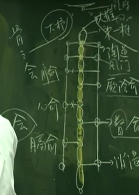
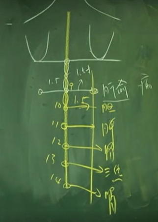
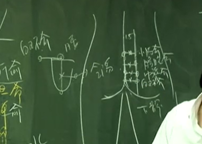
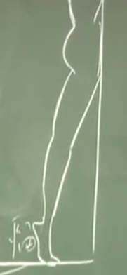
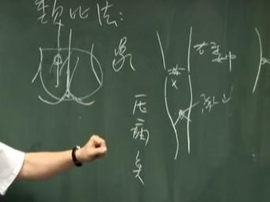

## 州都之官 气化则能出焉：膀胱
下午三点到五点，膀胱经是最大、穴道最多的经络，要花点时间介绍。
我们今天介绍足太阳膀胱经。在膀胱后面是小肠，小肠五行里面属火，膀胱是水。水有两种管道进入膀胱，第一种是从三焦，三焦是油网，泌也，是渗透的意思，水是渗透进去的。还有一个是西方医学知道的输尿管，从肾脏流进来。

肾脏呢？这是肾水，肾水是来自肺脏，肺的水下达到肾脏以后，因肾跟小肠靠在一起，水在上面，火在下面烧，肾的水就会气化，气化后会进入所谓命门的地方。这个水很热，因为小肠不断的加热，水进入命门以后，水跟肾的营养，就顺着督脉，一路跑到脑部，这是第一次的气化，像大陆的茅台酒一样是很纯的酒，这是给脑袋用的。

进入膀胱以后，还有好的营养在里面，会再气化第二次， 所以水到了膀胱以后，会经第二次气化。第二次气化以后，水就顺着三焦油网再进入肝脏。进入肝脏，因肝是木，这就是为什么说水生木的原因了。进入肝脏以后，会帮助肝脏的代谢。代谢出来有废物，就进入胆， 所以胆汁等于是肝脏排出去的大便浊物，排出去后再给身体里面消化再送给全身。

所以当在气化的时候，膀胱会膨胀。常人，就是正常人，应该有 400cc 的容量在膀胱里。当水在膀胱里面累积时，由于膀胱是紧贴着小肠，所以这水被气化以后，整个尿液是全部顶在膀胱的上面，所以膀胱就像是热气球往上升的状态。因为往上升，所以虽带着很多水，但却不重，正常人就不感觉到膀胱很重。

当有一天，你年纪大了，小肠的火不够了，膀胱的水就没有气化了，变成冷水在里面， 同样是尿，但是是冷的水。这个时候，水是停在底下的。所以，只要有一点点累积在下面， 就会很胀，很急，就会想上厕所。就变成频尿。

而我有个外号叫尿布终结者，我治频尿的时候，病人就不用带尿布了。八、九十岁也是一样。那我怎么治好的呢？把小肠的火救起来。你光在那边治膀胱没有用的，只要把这火一 加压，这尿液在进入膀胱的时候，就气化掉了，膀胱一往上升，那个括约肌一下就回来了。你怎么知道小肠火衰了，就看病人脚是不是冷的就知道了。

我们人身上一定要有水，所有的细菌、癌细胞、肿瘤都喜欢冷水，所以我们要想办法把他的水排掉。可是排水的同时，又不能伤到好的水，要把坏的水排掉。所以要想尽办法把水气化，水一气化以后，因为所有健康的组织细胞都喜欢热气，病毒都喜欢冷水。所以你看很多病，所有我们讲的寒症，到后来都是水或积水，摸他的脚都是冰冷的。

**气就是水蒸汽** 

这是膀胱，过去医书上很喜欢附会，因为水是黑色的，所以膀胱叫黑肠。

## 位置
足太阳膀胱经一共有六十七个穴道。 

睛明穴。 这睛明穴下针的时候，要把眼珠子拨开来，下针在骨和眼球中间。
这针进去不难，但有人之后会像熊猫一样。有人会有黑眼圈是为什么？是因为起针的时候没有做好，所以后一步重要。讲到起针才是开始，针灸的针头很利，所以起针时要直进直出。
你只要直进直出，它完全不会动到血管，完全不会出血。所以手法是在起针的那一刹那。

这个穴道刚好在眼内眶的地方，不可能在那灸

我们的眉头平常有几根毛翘起来的点就叫攒竹，如果你手摸下去，你可以压在一个骨缝，那个骨缝是横的，那个横的骨缝就是攒竹穴。

再来就是眉冲。从眉毛直上进入发际五分，你如果说从正中间走到素髎入发际五分，就是前面督脉介绍的神庭穴。那足太阳膀胱经，进到这边的时候，跟督脉差的距离就是一寸五分。所以说是一寸半。从这找一寸半，在曲差和神庭的正中间，这个穴道就是我们现在讲的眉冲。

神庭后五分就是上星，上星过来一寸半，就是五处。
五处后一寸半 承光 再一寸半 通天 再一寸半 络却

下通天时像扎百会，用一样的方向，这是通天。

络却后一寸五分 玉枕。头部的穴道都有骨缝，一摸就摸到了。现在诸位知道了，督脉在正中间，督脉外开一寸半，就知道是膀胱经。那再往外时，后面我们会介绍到是胆经。

再来讲天柱。玉枕、通天、络却用的不多。但天柱用的较多。

从天柱外开一寸的地方，在这个骨缝边有一个奇穴，贴在骨边属于经外奇穴，专治失眠， 穴名安眠。

大杼穴在陶道穴外开一寸半。 也是背针下法 骨会大杼

风门 二椎下 外开一寸半
肺俞 三椎下外开一寸半
厥阴 第四椎下外开1.5 又称心包
心俞 五椎外1.5
督俞 六椎外1.5
膈俞 在第七椎下外1.5 血会膈俞 1/8 腑会中脘，以后还会学到脏会章门，气会膻中，脉会太渊等等

消渴 八椎外1.5 奇穴
肝俞 九椎外1.5
胆俞 10椎外1.5
第九椎以下依序是肝胆脾胃三焦肾。这一椎一椎的，全部是外开一寸半。这是第十椎、第十一椎、十二椎、十三椎、十四椎，依次为肝胆脾胃三焦肾。

气海 十五椎外1.5
大肠俞 十六外1.5
关元俞 17外1.5
小肠俞 18外1.5
膀胱俞 19外1.5
中膂(举)俞 20外1.5
白环俞 21外1.5
接近我们的尾椎骨。我们的尾椎骨长三角形，尾椎骨上面突起来的是第二十一椎。从这第二十一椎，外开一寸半，就是白环俞。

八髎穴是全身上下最小的穴道。八髎穴有八个点。我们怎么找这八髎穴?上髎呢?从督脉外开一寸半是膀胱经，一寸半的中间，就是七八分的地方，外面是小肠俞，小肠俞和督脉中间的地方是所谓的上髎。

再骨缝中间有个洞

会阳 督脉腰俞和尾椎中间 

再外开一寸半 从督脉开三寸
以俞穴为主。穴道很接近，就是要加强效果。

附分 2椎下外3寸
魄户 3椎下外3
膏肓 4椎下外3
神堂 5椎下外3
譩嘻 6椎下外3
隔关 7椎下外3

魂门 9椎下外3
阳刚 10椎下外3
意舍 11椎下外3
胃仓 12椎下外3
肓门 13椎下外3  外开3.5 至 14椎位置 奇穴痞根
志室 14椎下外3

十九椎外开三寸的地方，是我们的胞肓
20椎下外三 秩边

你看这股沟这样弯起来，正好在大腿的正中间横纹的这个地方，这个穴道我们就称承扶。

膝盖 背后两筋中间 委中
委中 承扶中间 殷门 
膀胱经外侧为阳经 内测为阴经

委中外 肌肉和筋中间 委阳
委阳上一寸  浮郄
委中下三寸是合阳穴。一样是辅助委中的，以委中为主。
承筋穴在委中和承山的正中间。

因为阳经往外走，所以找到承山穴再往下一寸，再外开一寸，就是飞扬。

跗阳 昆仑往上三寸
昆仑 

从脚后跟往上三寸，从足后跟这里往上三寸的距离，脚后面这个大筋的正中央，就在筋上面，这个穴道是奇穴，我们叫消积。

从昆仑再下来到骨头旁边是仆参。

申脉穴在外踝裸下五分的地方。这个申脉穴，一摸有个骨缝，这骨缝就是申脉穴，我们下针的时候，手法斜的成四十五度，不是直针进去。

金门 在这个凸的骨头的前面就是金门，凸骨的后面是京骨。 金门穴和京骨穴，都是直针下。正好要扎在脚掌骨或脚趾骨跟肌肉的中间。

这脚趾头的后面有个凸的骨头，前方就是我们的通谷穴，后方就是束骨穴。

---

#### 1. 睛明
就是眼睛视力不好、视力模糊 、青光眼 、白内障 ，我们都可以在睛明上下针。可针不可灸
#### 2. 攒竹
那我们下针的时候，就是攒竹透鱼腰。什么叫鱼腰，就是眉毛像鱼嘛，从这边刺下去，沿皮刺，刺到鱼腰。 鱼腰是中间 下针要斜下

攒竹穴，除了下针以外，我们常用的是放血治疗
#### 3.眉冲
这些穴道，像神庭，上星，眉冲，这个都是在头顶的地方，这个位置正好就是鼻子冲到脑部的地方，很多鼻科病在这里可治。
#### 4.五处
眼科
#### 5. 承光
承光就是眼看不到光，或对光很敏感，所以叫承光。
#### 6.通天
鼻子要通天嘛。像有人鼻窦炎 ，鼻塞 ，下通天也可以。所以我们可以先下合谷，再来迎香，再下通天。
#### 6.络却
西医看说是**内耳不平衡**。中医一看是底座在晃动。这差很多哦！你底座在晃的时候，我们知道是水饮停在中焦，所以头昏眼花，常常恶心。所以你只要把底座给固定住，头晕就没有了。中膈的地方，这才是管人体的平衡处。你们晓得了，络却、中脘、公孙、内关。

#### 7.玉枕
我们后面有个骨头叫玉枕骨，这跟玉枕穴很接近。
从天柱外开一寸的地方，在这个骨缝边有一个奇穴，贴在骨边属于经外奇穴，专治失眠， 穴名安眠。
#### 8.天柱
如果晚上睡都睡不好，可以压压安眠穴，揉揉安眠穴。你不要揉到天柱，越揉精神越好。因为膀胱经气会旺。记得是天柱旁一寸，这样就睡着了。
我们下针不用下深， 用一寸针，下五分就够了。因为头发后有发根，所以不可以灸，否则会把头发给烧了。

你看发根越长越近脖子，这是忠肝义胆，发根长很高，这是破坏、背叛你的奸臣。
#### 9.大杼  专治骨病 骨会大杼
有一个病人脚突然扭到，你没有 X 光你怎么知道他里面有骨头裂掉，可以啊，过来背后大杼一按，病人大叫一声，表示裂了，没感觉，就是骨头没有裂，检查就结束了。

那这个会穴，有没有什么可以加强它的效果?当然有啦！我们有一种法则叫会郄治疗。

那平常灸身柱，又灸大杼，也可以长得高大，骨头也很硬，肋骨也很硬， 身体都会健康强壮。 

那从马上摔下来，就是五脏气乱了啊，就下天柱、大杼，让气平衡，这就是最传统、正统的方法。
#### 10.风门 
**风门穴是很好的治疗痈疽的穴道**。

我们叫风府。胆经还有风池。这些穴道下针是近取穴，脖子强硬，也可以灸，拔火罐也可以。
脑后的穴道很多用风来定名。伤风感冒大部分都有项强的症状。也就是说因为这个穴道常有风进来。我常讲这是我们的冷却系统嘛!肾脏的津液经过小肠的蒸化以后，进入命门，命门的火跟小肠是相通的，蒸气是很热的，一路往上冲、没有脖子当冷却器的话，脑部就烧坏掉了。所以经过这边要凉快一下，所以这有很多风进入的地方，一缩脖子风进不去，就不冷。

男女就不一样。女人呢，正面是阳，背面是阴，男人背面是阳，正面是阴。因为中医认 为淡侧、亮侧是阳，黑侧、暗侧是阴，所以女人奶水从前面出来是白色的，白色在前面，所以胸部为阳。男人反过来，胸部是阴。所以你看尸体在河中，因为天阳在上，地阴在下，尸体面朝上的统统是女的，背面朝上的都是男的。尸体泡烂了的时候是男女不分的。可是有经验的法医来看，男的背朝上，马上就知道，对不对，因为我们知道阴阳嘛。

脖子强硬，也可以灸，拔火罐也可以。
火罐可以通血，让毛孔张开来，就会流汗，痛就会去掉了。

背发的肿块、褥疮，中风的病人躺在床上，屁股后面都会长疮，都是痈，都可以烧。这个褥疮， 你不要在褥疮上面烧，要在风门上面烧

#### 11.肺俞
现在诸位学过手太阴肺经，肺主皮毛，变动在咳。很多人气喘，还有咳血等等，症有非常多，后面所有的俞穴，我们在治疗时，是不分虚实寒热的。我们会用到俞穴，也会用到募穴。

第四行讲小儿龟背，龟背就是肺里面有很多痰在里面，当然可以用肺俞下针或灸，然后正面取它的募穴，就是俞募治疗法。

如果是感冒伤风，咳出黄色的很脓稠的痰，这没有关系，即使咳血都没有关系，因支气管咳破了是很常见的。在刚开始的时候，连续两年都是这样子，每天晚上三点到五点会醒过来。二年以后，再去让西医检查就是肺癌了。所以，中医在二、三年以前，就已知道肺癌的初期，若等到西医查到是肺癌的时候，就太慢了。所以奶水如果逆流，就是肺癌的源头。
当我们压脊椎骨，压到第三椎身柱时，若一压，很痛，我们就知道有这个风险。我们现在就要赶快开始做，下肺俞、中府，再叫病人不要生气。

所以你如果知道病因，绝对可以治好的，我们可以不用死在癌症。外面说抽烟会得肺癌，实际上不会，但会影响到肝，因为金克木啊。抽烟伤金当然克木，但绝对不会影响造成肺癌。

#### 12.厥阴
厥阴俞又称为心包，心包经就落在心包上面。这个穴道我们平常也是一样下针、用灸通通可以。可治疗心脏病。前面说过，心脏本身正常应该不受病，有病都在心包上面。
#### 13.心俞
在诊断上面要知道第几椎，可以帮助我们诊断。当用手指头压的时候，如果有心脏病，压第五椎就会痛。

第五椎本身可以诊断心脏病。心俞加巨阙 俞募治疗。

心脏一有问题，第一个会影响到肺。如果心脏火能去生土，能相生的话，就代表没有病嘛。但如果克到金，那我们在下第五椎心俞时，是不是也要同时扎第三椎的肺俞，为什么要扎肺俞，因为要强金嘛。可以让病不再移转。我在治疗心脏病时，一下就是六针，心俞肺俞肝俞，治金完再去治木，心脏火就会生土，火会被生，所以我会同时下针肺俞跟肝俞。

当我们扎心俞再扎肺俞的时候，就是告诉病只能到此为止，心脏不准再坏下去。所以你一直在强它的肺的话，基本上心脏病就停止了，病也就不会再坏下去了。用灸用针，通通可以。

下针方法 一寸的位置向一寸半斜刺。 再两个肋骨中间。 扎到心脏比较难，除非很深。

第四行，最后面，最后一段，小儿心气不足、数岁不语。心气不足到好几岁，有时七、八岁都不讲话。所以，当你觉得奇怪，别的小孩都讲话，我的小孩不讲话，就是心气不足，用针、灸都可以。针心俞、灸心俞都可以。

健忘?是因为心藏神，神不守。有的病人很好玩，拿过药都出诊所大门了，刚好我出来休息，就有病人会说“倪医师，我忘了告诉你，我记忆不太好!”那怎么办呢?记忆不好，我们在心脏上治疗会有帮助的。

#### 14.督俞
督俞，顾名思义，专管督脉，督脉是诸阳之会。我在临床上，看血癌的时候，在第六椎可以找到压痛点。每一个进来，男女都是痛在第六椎，也就是说是督脉受到伤害，跟西医说的很接近，西医说白血球太高，高到十几万，这就是血癌。实际上，白血球增加那么高，是因为督脉得到不正常的营养所致。所以说，如果营养逆流从第六椎进入督脉，本来不应该发生这种情形，就叫做血癌。

你在治疗之前，第六椎有压痛点

在美国有个牙医32 岁得了血癌，来找我的时候，全身在发抖，因为他知道他要死啦!帮他治疗四个礼拜病就好了。怎么知道他好了?因第六椎没有压痛点了，就是那么简单。所以，你如果了解中医的话，可以把诊断通通简化。督俞可以下针，也可以灸。你看督脉多重要，它是诸阳之会。
#### 14.膈俞
血的会穴，也就是说血病治此。这儿讲的血病，不是西医讲的血癌，这里讲的血病，是讲贫血，瘀血，内伤打击造成内脏出血。血病，大便是血，小便是血，那小便出血可能是肾脏癌，大便出血可能是大肠癌或是痔疮，我们都不管。反正血病治此，出血的病、贫血、瘀血通通可以用。

你看膈俞在这里，在这里因为下面有肝，上面有心，它夹在中间。心生血，肝脏血，所以它统领全身的血。

用灸，用针通通可以。我们血症有很多很特定的现象。比如说，病人说“我口渴”，问他喝不喝水，回答“我不喝水”！你会觉得这个人是在捣蛋，又说口渴，又不喝水。其实不是捣蛋，而是身体里面有瘀血，很渴但是不想喝水。这是身体里面有瘀血的缘故。

所以唐容川写了一本书叫《血证论》，提出久病必瘀的道理。很久的病一定有瘀血在，所以要用活血化瘀来治疗。膈俞就是活血化瘀的穴道，比如说病人说他痛，可能是遭打击，或从马上掉下来，被踢到胸部，正好是乳中穴，这个经络正好是在足阳明胃经上，有瘀血，我们就下膈俞。胃经上痛也可下胃的郄穴梁丘。刚被踢到，就下内庭。
#### 消渴
消渴分上消、中消、下消。上消是渴饮百杯不能止渴，在胸隔以上，所以病人会渴，但饮百杯还是不能止渴。肚脐到胸膈是中消，中消是饥饮百碗不能解饥，吃了半天还是饿，这是中消。下消男人会阳不举，女人则完全没有性欲，变性冷感。
#### 15.肝俞
肝俞顾名思义，就是肝脏的部位，就是肝脏的后方。肝有痛，肝病治此，同样可用俞募治疗，下肝经的募穴，再下肝经的俞穴，任何的脏腑都有募穴与俞穴。俞穴可以用灸的，也可以用针，在左、右两侧外开一寸半。
下针的时候或灸的时候，都是两边一起灸，一起下，不管是肺、心、肝，都是两边一起做，不是左病右治，右病左治。在四肢上取穴的时候，才有左病右治，右病左治。治疗中风，我们下针的时候，一定是先扎好的地方，再扎患侧。所以医书上写先针健侧，再扎患侧。

同样的有肝病的时候，第九椎肝俞有压痛点，一压就会很痛。

全身只有一条经络，会经过男人的阴器睾丸，或经过女人的阴部，就是肝经。所以阴部有病，可以在肝病下针。睾丸疝气，可以在肝俞下针，而不单单只治内科病。我们小肠坠下去时，很痛啊！你下脾经的隐白，及肝的井穴，因井穴很痛，你一下针，马上会痛得缩回去了。在针井穴时，病人会抽一下因为是初病，疝气、坠肠的地方，脱肠都会缩回去，效果很好。

#### 16.胆俞
按时间的时症，晚上十一点到半夜一点，它有问题，我们可以在胆俞穴上下针。诊断时，我们怎么知道胆有问题，在第十椎会有压痛点，尤其是胆结石时，压的会很痛。

四花灸
#### 17.脾俞
脾俞顾名思义，脾主四肢，四肢上的问题，不管是肌肉，还是关节痛、风湿痛都可以在脾俞下针。这个土是治水的，脾主少腹，少腹讲的就是肚脐以下，腹部这边的水肿胀通通都可以用脾俞，用强土来治水，就可以解决水的问题。用灸、用针都可以，效果都会很好。

由于脾主肌肉，主四肢。所以脾脏有问题的时候，很明显的表症就是身重，身体会非常沉重。正常人，我们站立成这样子，人的气是往上升的，气就是全身的水液，气是往上升的。所以站在那边，不会感觉到体重。脚是身上最底层的地方。当你全身都在气化的时候，脚虽在最底下但却是温热的，这个热气一直往上来，全身都是在气化的状态。

当全身充满气的时候，是没有癌症的，像个热水瓶一样。所以我常常讲，脚是热的就没有癌症。你现在还没有癌症，就要想办法把脚热起来。

那脾主开胃，小孩子不吃东西，你都可以灸脾俞，再灸身柱，小孩会长得又高又大，肌肉又发达，骨头又大，人又高大，待会告诉你怎么让他聪明。
#### 18.胃俞
第十二椎开在胃上面，胃病治此。如果胃有病，不管是西医讲的胃溃疡、胃出血、胃下垂都没关系。扎胃俞，用俞募治疗，胃的募穴是中脘穴。扎正面的中脘，再扎胃俞就是俞募治疗。假设有胃痛，足三里、梁丘郄穴可以止痛。足三里也可以止呕。这样一票穴道就出来了。
俞募治疗、会郄治疗都可以。那腑会中脘，胃的会穴是中脘，用会郄法治病时，就再下胃经的梁丘穴，这是会郄治疗。会郄治疗加上俞募治疗，最后再加上足三里，怎么会治不好胃病呢？除非你是足三里扎到足二里，扎错穴道。
#### 19.三焦俞
三焦俞呢？三焦的募穴，就是肚脐下二寸的石门穴。三焦是水道，三焦这个地方有问题时，我们可以用俞募治疗。我们用三焦俞跟正面的石门穴。三焦俞也是讲水道。像水的问题，下利、大便带水、排水，水肿，吃东西不消化、都可以用三焦。治肚子胀满，三焦俞也用得很多。用了俞穴，就应会用募穴。
#### 20.肾俞
十四椎命门 肚脐对界面。
肾主骨，骨头要长的好，是肾脏在管。肾又藏志。所谓藏志，就是当肾气很旺时，人就有志气。如果有人什么都不想干，十二个月换十三个工作，就是肾气不旺，志不藏，没有大志。肾其华在发，华就是花。那头发很油鲜很光亮，肾气很好。你们要学老师，五十二岁头发没有白的，都是黑的，肾气很旺。
由于肾脏管耳朵。所以耳鸣、耳聋、听力不好，通通是肾脏在管。肾又管记忆，常常有病人说：“医生，我忘了告诉你，我记忆不好”。这是肾脏有问题。

肾管大小便，不单单是管小便，而且管大便。所以肾脏功能衰落的时候，病人常常有多便的现象，一天上两三次，上好几次厕所，拉出来是稀的。中医认为，肾阳不够的话，就阳不举了。

如果是两个脚平均的肿起来是肾脏。如果腿都没有肿，就只是脚踝裸关节肿是心脏有问题。
#### 21.气海
像腰痛、靠近肛门这边，治疗痔疮，都可以用。因为这是近取穴。在这个器官的周围，选择穴道就是近取穴。在四肢上找就是远取穴。

有的人内科没有病，内脏没有病。但背痛，就痛在十三椎，其它都很好，大便也都很好。你就帮他针十三椎旁边的俞穴，治疗那一椎的痛。这是第一个。若想加重治疗的时候，你可以在三焦经上的子穴上下针，就是**治当椎的痛。**比如说我们知道脾经的子穴是商丘，如果这个病人脾脏都很好，四肢也没有身重，什么也没有，关节也没有痛。就是第十一椎痛，你可以下脾俞以外，也可以下脾经的商丘，一针一下到子穴，第十一椎就开始热，这是我们的导引方法。导引就是一个目标，你一下到第十一椎，就等于是告诉身体，我要气血集中在这个点上，在帮他治疗。这时候，你一下子穴，气血又流回来，回到第十一椎，这个地方。这是本身没有其它病，就单椎痛的治法。
#### 22.关元俞
大部分都是治疗妇科、腰痛的病。男人腰痛，女人妇科都在这下针。像子宫肿瘤，我们的近取穴通通可以在这找。
第十四椎以下，通通可以直针下。直针下时，要有点基本常识，不可以下一寸的地方，要下一寸半的地方。那灸也可以，放片生姜做隔姜灸。
#### 23.小肠俞
那小肠俞顾名思义是跟小肠 有关系的。像靠近在这个近取穴，腰痛啊，痔疮啊，都一样，几乎很雷同。
#### 24.膀胱俞
除了治疗腰痛以外，小便失禁，妇科的病啊，都可以在这靠近的地方下针。
#### 25.中膂俞
像肾虚、消渴病，大小便的问题、腰痛，女人的赤带白带都可以。
#### 26.白环俞
因为是接近阴部的地方，像疝气、大小便，腰酸背痛，女人的白带，通通可以在这治疗。
#### 27.八髎穴 +4
上髎。上髎统治所有的腰痛，不管你的腰痛在 那个部位，都可以治。妇女无法怀孕，想要生小孩，可以灸灸上髎，同时针上髎也可以。阴部的治症，通通可以用上髎穴。

八髎穴治症雷同。我们下针会拿长一点的针，因为要下在骨头里面，但不要下很深，碰到骨洞下五分就够了

比如说大便下血，大便下血可能是痔疮漏血，或者是大肠岩（癌），所以大便跟血会混在一起，你可以在下髎这边做。妇人没有怀孕，我们可以在上髎中髎这边做，用灸的。
#### 32.会阳
治症跟这边差不多。你要知道这个穴位，有的病人说我这边痛，你就要知道它是膀胱经的穴道。
#### 33-34.附分穴与魄户穴
那这些穴道，以俞穴为主。你说我不要扎肺俞，我要扎魄户，当然也可以。穴道很接近，就是要加强效果。
#### 35.膏肓
膏肓呢?无所不疗。这膏肓穴非常好用，但穴位不好找。第五椎分三分 前1/3处外3寸。
我们让病人反着坐，前面放个枕头。轻松嘛，抱着枕头，一抱肩胛骨就打开来了，这膏肓就出来了，平常膏肓是躲在肩胛骨里面。
一般来说，膏肓痛代表这个人很卖力。在捉犯人的时候，很紧张嘛，捉人的时候，犯人很紧张，他也很紧张啊，在这时候出力，伤到的时候并没感觉，回家以后睡个觉起来，这个地方就很痛，痛点就在膏肓。

用针的效果到不了这儿，我们唯一治疗的方法是放血，针灸都不用。你让他肩胛骨打开来，用手去按。在原来肩胛骨这个地方，这个膏盲穴跑出来后，你拿三棱针或放血针去刺破皮肤，火罐放上去，把血吸出来，吸出来后，当场就好了。

那你灸膏肓后，整个胸腔都是热的，热气停在胸腔是没有用的，还没有达到治病的效果。就需要靠灸少腹的穴道及足三里，让气导到小肠里面去，才会达到治症的效果。当你在灸膏肓的时候，胸腔里面、肚子里面会一直咕噜咕噜在叫，这是水的声音在跑，这就表示灸对了。书上指出，膏肓穴是起死回生的妙穴。像重病，或当你不知道怎样出手治病时，就灸膏肓。但灸完膏肓后一定要灸足三里。不然嘴唇都会裂掉了，舌头都干了，讲话的声音就好像磨沙子的声音，因为干掉了。膏肓大部分是用灸和放血。
#### 36.神堂
神堂是心脏的大穴。
#### 37.譩嘻
病人叫譩嘻二个字，这个脉会跳上来
#### 38.膈关
治症跟膈俞差不多，像小便黄，大便不好，都可以用。
#### 39.魂门
增加肝俞效果
#### 40.阳刚
#### 41.意舍
因为脾藏意。人体的意志、意念是脾脏在管，你看第二行意舍第二行中间开始，主治腹满虚胀。因为脾主少腹，大便滑泻，因为脾脏湿的缘故，脾有问题的时候，湿不守就会进入大肠，就会洞泄。小便赤黄，因脾主黄色，这黄色本来应该在脾里面的!因脾脏比较虚了，所以营养会跟着小便排出来。

呕吐消渴，因脾是在中焦。身热目黄，因脾是黄色的。意舍是辅助脾俞的。
#### 42.胃仓
胃俞辅助
#### 43.肓门
我们所谓的乳房就是属于三焦系统。很多黄色的营养都在三焦。所以书上写的乳疾，在三焦俞、肓门、还有三焦募石门，通通可以用，石门有绝孕的功能。包括乳癌硬块，通通可以在这里针，或者是灸。
有时候有乳癌，不见得会在十三椎下有压痛点，但一有压痛点就在这选穴最好。
#### 44.志室

我平时下针的时候，肾俞，志室都是一起下的，都可帮助肾脏，帮助肾的功能

#### 奇穴 痞根
顾名思义就是痞块之根。中医认为肿瘤、硬块都有根,就好像树木有根嘛。你如果把树砍了，根不砍，树还是会长出来。所以这个穴道用在诊断上，查有没有肿瘤及治好了没有？同时也可以在这穴道下针，把根断掉。我们介绍到脚上的时候，还有一个奇穴叫消积穴，这个积，不管是痞块积在那，还是水积在那，还有腹胀，通通可以用消积穴。
#### 45.胞肓
胞肓是我们治大小便的近取穴，都是在下焦排泄系统。大便、小便，都可以在胞肓上治疗。
#### 46.秩边
秩边穴是很有名的治痔疮的近取穴，你可扎长强、秩边、孔最。孔最是肺经的郄穴，肺跟大肠相表里，还有温溜穴，都对痔疮有消炎镇痛，止血的效果。
#### 47.承扶
下针时是用三寸针，一针透进去，一针就到骨头上面。深针才有效果，因为这里肉很多，扎太浅就没效，一定要深针。像久年痔疮，臀肿、小便不利，近取穴都可以用。
#### 48.殷门
很少下针 委阳和承扶很好哦
#### 49.委中  合穴 第一个解毒大穴又称血郗 去血放毒、麻风病、背痛、皮肤癣
委中是非常有名的大穴。
我在美国临床的时候，有一种病叫卡波西肉瘤 。这种病呈现的症状，从肚脐分上下，这个人上半身才有，下半身好好的。上半身的肉瘤一个个长那么大，大的跟葡萄一样，长很多，衣服一拉开就吓一跳，肉瘤上有津液流出来，背后也是。很多医生一辈子都没看过这种病。这种病在美国联邦政府，不用验血，是 AIDS，这是法定的病。很奇怪，肚脐下没有。我就委中放血。委中放血是去毒，用在几个地方。

这是大腿，将脚后跟踮起来。踮起来后，你拿水或米酒，拍拍且打一打委中穴。委中在两筋中间，就会看到有青筋冒出来，你用放血针刺青筋，让它的脏血流出来。

美国西医很怕会感染到 AIDS。我们把血清出来后，要他隔两天再来看我，没想到隔两天就整个没了，我自己也吓一跳。临床上我看到很多的案例，你说 AIDS 这是表证，可是这卡波西肉瘤，在旧金山很流行的，很多同性恋才有。如果说 AIDS 是躲在细胞里面出不来，所以我们把毒液放掉就好啦。为什么呢？看他 AIDS 虽还是有啊，可是表证没啦。那你说我们按卡波西肉瘤判定他有AIDS，那治好后，他卡波西肉瘤没啦，但病人还是 AIDS，知道我的意思吗？

实际上，我在临床上看过非常多 AIDS 病人，根本就是白虎汤症，一剂下去病人就全身透天凉，很舒服，但西医却紧追不放，实际上是与吸毒或小儿麻痹疫苗有关。以后我们讲到 方剂的时候，我会再讲。这是中医的第一个解毒大穴，任何的毒都可以这边解。

第二个毒就是麻风病 。麻风病呢，你看到病人眉毛也掉鼻子也掉，头发也一块块的掉，这麻风病也会传染，身上长很多肿块。我们也是在委中放血，效果非常好。对于有传染性的病，诸位要带手套，如手上有伤口，碰到就很不好。

委中有另一个名称叫血郄，**血的郄穴。所以当血里面有毒，通通可以在委中放掉**。你脚踮着，这毒血通通会集中在这，可一次把毒血拿掉。这个委中放血非常有名。还有在临床上，

委中穴是膀胱经的合穴。补井当补合，补的手法是遇到母穴是井穴的时候，因补井当补合，所以就补合穴。
因膀胱经母穴正好在井穴上面，所以我们就把膀胱经的委中，变成膀胱经的母穴，在这个地方做补泻。

临床上，几乎所有的背痛，都可以在委中下针。委中是母穴，这是右腿，膀胱经的经气是这样下来，所以针委中的时候，手快转是顺经，再慢慢转回来，这是捻转法。

如果有病人找你，是背痛 ，且痛在督脉上面，我们知道要扎后溪。如果病人不是病在脊椎骨上面，而是痛在两侧这边，这时就下委中， “腰背委中求”，腰背有痛、有病的时候，都可以下委中穴。

#### 50。委阳 络穴 别络
委阳又称太阳经的别络。不是正络是别络，所谓别络是指还有分支在这里，不是大络。
原络治疗 里经的络穴 表经的原穴。 
像我们的淋巴肿大，可以用委阳。因为它是在转角的地方，这个三角的地方，腋下肿大都可以在委阳上下针。
#### 51.浮郄
浮郄穴常常用在治麻痹不仁，你看治症就看看书上就可以了，用的不多。殷门、浮郄都用的不多，用最多的是委中。
#### 52。合阳
委中下三寸是合阳穴。一样是辅助委中的，以委中为主。
#### 53.承筋
筋骨的筋，顾名思义，抽筋等可以在这下针，脚不能动，痉挛通通都可以在这下针。霍乱抽筋通通可以用。
#### 54.承山
比如说我这里是腰，屁股在这，你看这个“象”，老师这个“象”是人字纹嘛，肛门在这（指黑板上承山的位置），这是不是人字纹。委中从腿下来，脚踮起来时，你可以看到腿肚子有人字纹，人字纹下面就是承山。后面会介绍承山穴，这个**承山刚好跟肛门 是对到的**。所以承山是很有名的痔疮大穴。、

在手臂上呢？你握拳，肌肉出现人字纹是孔最穴。孔最穴对痔疮一样有很好的效果。
这膀胱经痛的地方是这个点，病在左边，我们在膀胱经右边的委中下针。下完针以后，这个点痛，在这肛门和腰，我们在这后方（指腿肚对应处）用手指头按，就找到一个压痛点。这压痛点没有定位，找到压痛点，针从这压痛点一下去，痛就没了，一击就中。所以说，如果是一条经痛的话，下委中就好了。可是还剩一点痛，就用这种手法。我在 临床上看的时候，越靠近腰椎，越靠近督脉的地方，就越接近这一点。越离开督脉这个地方， 就越外面，你把人的下体放到这个腿部上面，这是类比法，这是治疗腰痛，效果非常好。

这个承山用的地方非常多。包括脚抽筋，脚常常抽筋，如果游泳时抽筋怎么办，你就重压承山，就解掉了。在临床上，因痔疮大量出血时，针承山，灸孔最有止血的效果。你现在知道了，若有个人痔疮很严重，走过来腿都是弯的，因为痔疮很痛，我们就下长强，下承山，下孔最，痛就去了。若还有痛，比如说那个痔疮很大，我们就天应放血，把脓血放掉。

委中和承山常常并用，用在中风上面。腰背委中求，所以委中一下去，腰背力量就加 强了。

临床上，有很多妇女、小姐，因爱美穿高跟鞋，走路一摔倒，结果尾椎骨被撞到。因为这是督脉刚开始的地方，所以说很痛，那怎么处理呢？刚开始，新伤的时候，在承山穴你会看到青筋在那，有时在右腿，有时在左腿，有时两腿都有，这是针对尾椎骨受伤。这时候你拿放血针，承山穴血一放出来，当场就好了，效果就是那么快，这是伤科的大穴。

记得承山穴下针，一定要透到骨头上，透到胫骨上。尤其是抽筋，你同时用手去按它，筋就慢慢松开来了。
#### 55.飞扬 络穴
飞扬针下去，脚就像飞毛腿一样。当脚不能跑步，前面讲的足三里，后面讲的飞扬、承山，都是让脚有力的穴道。

这是一个基本常识，你如果手受伤，没关系，手受伤不能动，没关系，但脚受伤不能动，你要赶快让它好，一旦坐上轮椅就完了，所以脚受伤要让它赶快好。这是一个病理。
#### 56.跗阳 阳蹻脉的郄穴
治症跟飞扬、承山差不多。
#### 57.昆仑 经穴
是专门治疗项背痛很有名的穴道。 
昆仑穴是膀胱经的经穴，是火。孕妇不能下针，下针会落胎，小孩子会掉。所以平常用在生完小孩，胎盘没有下来，可以用昆仑，把胎盘掉出来，这是用在生完小孩以后的。
#### 58.奇穴：消积穴（判断肿瘤）
大筋的正中央，就在筋上面，这个穴道是奇穴，我们叫消积。里面有聚积、痞块，都可以用消积穴。这个穴道我们可以用来诊断。

。这个穴道刚好在两个大筋中间，所以下针的时候，手指把大筋捉住，针直接从这个筋的正中间扎下去，扎到骨头上。一针从这边进去到骨头上，病人躺倒的时候，针是这样下进去，从大筋的中间穿到骨头上面去，正扎在筋上面。平常筋上没有穴道，但在这是个例外。这是我们的消积穴。 
#### 59.仆参穴
治疗足后跟痛。有人脚后跟不能踩在地上，这种病人很多。
一般中医的观念里面认为，脚后跟的问题是肾脏在管，所以在介绍《金匮》的时候，会看到六味地黄丸专治脚后跟痛，这是肾脏在管。而脚踝裸这边会水肿大部分是心脏的问题。
#### 60.申脉 申脉穴主管阳蹻脉
这个申脉穴，一摸有个骨缝，这骨缝就是申脉穴，我们下针的时候，手法斜的成四十五度，不是直针进去。
这个申脉穴主管阳蹻脉。阳蹻脉是申脉在管。所谓蹻，顾名思义就是“足”字边再加一个“乔”，所以脚可以往 右边，右转，往外转就是阳蹻。可以往内转是阴蹻。所以往右侧走的时候，右脚往外，左脚往内，所以阴阳是平衡的才可以控制自如。像有的人不能转弯，有的人停不下来，要往前冲。还有人更可怜，走两步退三步。这都是阴阳的不平衡。

我们灸阳蹻，灸阳蹻就是申脉穴。用隔姜灸，放生姜在这灸，这是癫痫用的。痫病昼发，就是白天发痫病，我们灸阳蹻，就是灸申脉。夜发就灸阴蹻，照海。

灸到什么程度，一天灸八、九壮以上都可以。脚上的 火气是不会上来的，有空就灸，灸到眼上的鸡爪慢慢退下去，跟黑眼珠没有碰到就不会发了。若鸡爪还在那，你虽知道不会发，但还要继续灸，不要停，让它整个都退掉。这是我们用针灸来治癫痫的方法
#### 61.金门 **郄穴**
金门是膀胱经的郄穴。主治的症状：身站，不能久立等
#### 62.京骨 原穴
正好要扎在脚掌骨或脚趾骨跟肌肉的中间。
#### 63. 束骨 俞穴 子 木
束骨穴是膀胱经的子穴。专治膀胱经的实症。比如，有个病人来了，说他背痛，问：“痛几天了？”“五天、三天”，又是左边痛，我们扎右边的束骨穴。若是左边痛就扎右边。

所以俞募治疗大部分是用在内科病，子母补泻都是治疗经络上的痛。书上所说的治症，像背痛、生疮、生脓疮、化脓，因为都是长在膀胱经上面。

---

以前很多江洋大盗嘛，我在看很多医书都是活体的解剖。有人很恶劣，把人活杀了，国家判刑也把他活杀了。现在不会发生这种事，认为不人道。以前很乱，强盗都是活杀，一方面可以研究，一方面是警告

## 四穴放穴增强视力
四个穴道，第一个就是攒竹。第二个在眉毛尾巴，眉尾，鱼尾的地方。第三个，眼外的瞳子髎，就是俗称太阳穴的地方。第四个在耳尖，耳尖就是，你把耳朵一折，尖的那一点就叫耳尖。

那我们放血的手法呢？放血针拿右手，攒竹穴一刺，挤两滴血出来就好，其它也是一样。

若放血的方法不对，比如说人这样子，你这样扎，好像射飞镖一样，这就很痛，而且会放太多血。若我们手法对，这放血的地方，翻一下就点到，这样是不是很好用，又准，又可以控制深浅，又可以控制方向。

## 会郄治疗骨病
郄穴就是消炎，清热，止痛。郄穴是麻醉穴。现在病人骨头裂开了， 伤到这个地方，这个地方刚刚好是在手阳明大肠经跟手太阴肺经上。如大杼有压痛点，郄穴 下针，手阳明大肠经郄穴温溜，手太阴肺经郄穴孔最。下针后都可以止痛，同时骨头也会恢复，这样会选穴了吧。

这是外来的，内发的呢，也有。什么都有，你看中医学哦。精不精密。我们全身的骨是肾脏在管，在《内经》我会讲的更多。今天先讲骨，中医的观念是这样子，全身的骨骼都有个起点，也有终点。从我们的环跳骨，髋关节的地方，这是骨头的起点，到四肢的末梢，是骨头的终点。所以人在生骨的时候，新骨细胞在这，从这个地方到脚趾头及手指头间，一共要两年。
所以我们每一个人，每两年就有一套全新的骨骼。

有病人髋关节痛，问他有没有出过车祸， 回答说“我从来没有过”。刚开始在骨有病的时候，骨病之初。

骨病都可在这里治疗，反之，若在这找到压痛点，就代表骨有问题。压痛点去了，代表骨头没事了。刚开始有骨病的时候，病人都会有膝盖痛，为什么，因为骨头很大，它有痛时，会从膝盖开始痛，因为你这两个髋骨在这，膝盖在这，所以你骨有问题时，膝盖还不会开始痛，而是支撑这里的开始痛，绝大多在左膝。

我们在做会穴治疗，无所谓补泻，引到气就好了。

## 背后治痈
有个病，医书上叫痈。背上常常长很多脓块。有三种，第一种，是脓块， 白头，化脓了，这个脓块，是红色的，头是白的，有脓块在里面嘛。第二种，白色的，没有头。第三种是凹陷的。
如果我们遇到痈，长在身上四肢的都可以在风门上治，因为中医认为是风引起的。
这三种不太一样，前二种如果用灸的，用三棱针把皮挑破，把脓吸出来，在上面灸。

在灸的时候，痛要灸到不痛。

那白色无脓头呢?一般来说也是用灸，我们有烧针，之后我会介绍燔针哦。燔针就是烧针，就是燔针术。

第二个也可以用灸，也可以用燔针术。因为他不痛，不痛的话，我们用灸，就灸到他痛为止。不痛的话灸到痛。

第三个是凹陷，不用针，凹陷是非常不好的症状。非常凶恶的，直接用灸。

背发的肿块、褥疮，中风的病人躺在床上，屁股后面都会长疮，都是痈，都可以烧。这个褥疮， 你不要在褥疮上面烧，要在风门上面烧。

## **俞募治疗法**
我们现在知道了肺的募穴是从中府下针到云门。再下针在背面的肺俞，约二十分钟。

俞募治疗法，大部分都用在内科的，可能你面对的是咳，或是慢性支气管炎，肺结核、气喘、肺癌等等。我们都可以用俞募治疗。俞募治疗大部分是用在治内脏病。

子母穴大部分是用在经络痛或四肢痛。

除了这个俞募治疗法外，若用后，病人还会痛，还有郄穴及会穴合用的会郄治疗法。

因忧会伤肺。中国老祖宗很早就知道，过于忧虑到后来会寻短。这个时候我们不用抗忧郁的药。针灸用的时候，在肺的俞穴及募穴下针就可以了。这是针灸治忧郁症的方法。

我们治病，按照五行木火土金水治疗，有很多治疗法。有一种我们叫正治法，就是通用的治疗方法。当我们发现木有问题的时侯，我们先去强土,再去强肾。就可以把病堵住了。同样的，当我们肺有问题时，第一个会影响到木，所以要先去强木。所以在治疗肺的时候，要先去治疗肝再去治疗脾脏，让金必须要去生水，让金没办法克木，这种我们称之为正治。
当金去生水，相生的现象出现了，这就是正常。

## 红斑性狼疮
有一种病叫SLE，西医叫红斑性狼疮。我们在临症时，每次都是第五椎有压痛点。第五椎是心脏，对不对?就问他大便、月经好不好?都回答“便秘，月经不好！”。月经有时不规则，有时会来好几天，有时很痛，出来的颜色也不好，睡觉也不好，也失眠。

那心火是土的妈妈，心脏有问题时，当然会影响到土，因此伴随而来的是关节肌肉痛。同时，心其华在面，心脏有问题的时候，两个脸颊很红润。
当这个赤红色蝴蝶斑出现时，我们就知道是心脏的问题，红色是心脏，脸上本来不应该跑出来红色，是因为营养要进入心脏，而没办法进入心脏，反而逆流出来，就跑到脸上了。心脏在脸上是红色的。所以红斑性狼疮，给西医治疗是没有药的，就只能吃类固醇。女人会得到红斑性狼疮，男人也会，但很少。因为男人的奶水在下面，白色的，女人在上面，所以最接近心脏。

## 痨瘵四花灸（膈俞、胆俞）
这种病实际上是西医的肺结核，病人会发黄，全身是黄的，小便也黄，眼睛也黄。我们叫肺痨，肺痨不容易好，我们在胆经上可以治疗。
因为金克木，会在胆上面走，很多TD 的人不见得常会咳，他会被药压住而不咳嗽。

治痨病你要吃杏的核就会好的。他就买了很多新鲜的杏，把核打裂，把仁生吃了。结果咳嗽没了，身上的黄也退了，也不咳血了，精神也变得很好。

所谓四花灸就是两个胆俞，还有第七椎外开一寸半的膈俞，这四个穴道同时在灸。我们称为四花灸，是用在治疗肺结核非常好用的穴道。

## 针灸的担法与截法
什么叫担呢？扁担嘛!扁担扛在肩膀上，叫做担。有个人来找你，说我这背痛的很难过，很奇怪，病人说“我就是痛这一点和这一点”，当然你可以扎对侧。用左病右治、右病左治。用担法呢，不用那么麻烦。在两个穴道中间承扶合委中中间的殷门，一针下去就解掉了。这就叫担法。
你现在学会了，病人肩膀痛和手腕痛，扎两个痛点中间的曲池。所以我们技巧很多。那担法也不能乱用，例如有个太太跑来，我两个乳房痛，不要用担法。或肚子痛跟小腹痛，那你也不会用担法，不能担到神阙，神阙是禁针的。

截法呢？笫一个用在有出血的时候，如这人手被砍断了出血。如何用截法止血，在出血的位置上一寸下针。比如说这个人被刀子砍到。我们所谓的一寸，是靠近身体的一寸，不是往四肢末梢。没有穴道的，上一寸下一针，下完还在流，再下一寸，再下一针，两针下去一定止血。

有一种带状疱疹。我以腰蛇为例， 红红的一条，我们在灸的时候，灸这边，灸那边（灸两头），这就是截法。五行上面来说，心脏有问题的时候，我们先去治金，病不会再进了，再去强木，硬把火推到土上，循环就回来了，这是一种截法的观念。