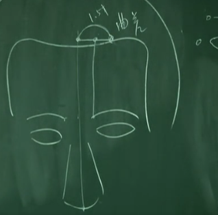
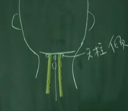
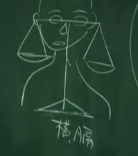

## 州都之官 气化则能出焉：膀胱
下午三点到五点，膀胱经是最大、穴道最多的经络，要花点时间介绍。
我们今天介绍足太阳膀胱经。在膀胱后面是小肠，小肠五行里面属火，膀胱是水。水有两种管道进入膀胱，第一种是从三焦，三焦是油网，泌也，是渗透的意思，水是渗透进去的。还有一个是西方医学知道的输尿管，从肾脏流进来。

肾脏呢？这是肾水，肾水是来自肺脏，肺的水下达到肾脏以后，因肾跟小肠靠在一起，水在上面，火在下面烧，肾的水就会气化，气化后会进入所谓命门的地方。这个水很热，因为小肠不断的加热，水进入命门以后，水跟肾的营养，就顺着督脉，一路跑到脑部，这是第一次的气化，像大陆的茅台酒一样是很纯的酒，这是给脑袋用的。

进入膀胱以后，还有好的营养在里面，会再气化第二次， 所以水到了膀胱以后，会经第二次气化。第二次气化以后，水就顺着三焦油网再进入肝脏。进入肝脏，因肝是木，这就是为什么说水生木的原因了。进入肝脏以后，会帮助肝脏的代谢。代谢出来有废物，就进入胆， 所以胆汁等于是肝脏排出去的大便浊物，排出去后再给身体里面消化再送给全身。

所以当在气化的时候，膀胱会膨胀。常人，就是正常人，应该有 400cc 的容量在膀胱里。当水在膀胱里面累积时，由于膀胱是紧贴着小肠，所以这水被气化以后，整个尿液是全部顶在膀胱的上面，所以膀胱就像是热气球往上升的状态。因为往上升，所以虽带着很多水，但却不重，正常人就不感觉到膀胱很重。

当有一天，你年纪大了，小肠的火不够了，膀胱的水就没有气化了，变成冷水在里面， 同样是尿，但是是冷的水。这个时候，水是停在底下的。所以，只要有一点点累积在下面， 就会很胀，很急，就会想上厕所。就变成频尿。

而我有个外号叫尿布终结者，我治频尿的时候，病人就不用带尿布了。八、九十岁也是一样。那我怎么治好的呢？把小肠的火救起来。你光在那边治膀胱没有用的，只要把这火一 加压，这尿液在进入膀胱的时候，就气化掉了，膀胱一往上升，那个括约肌一下就回来了。你怎么知道小肠火衰了，就看病人脚是不是冷的就知道了。

我们人身上一定要有水，所有的细菌、癌细胞、肿瘤都喜欢冷水，所以我们要想办法把他的水排掉。可是排水的同时，又不能伤到好的水，要把坏的水排掉。所以要想尽办法把水气化，水一气化以后，因为所有健康的组织细胞都喜欢热气，病毒都喜欢冷水。所以你看很多病，所有我们讲的寒症，到后来都是水或积水，摸他的脚都是冰冷的。

**气就是水** 

这是膀胱，过去医书上很喜欢附会，因为水是黑色的，所以膀胱叫黑肠。

## 位置
足太阳膀胱经一共有六十七个穴道。 

睛明穴。 这睛明穴下针的时候，要把眼珠子拨开来，下针在骨和眼球中间。
这针进去不难，但有人之后会像熊猫一样。有人会有黑眼圈是为什么？是因为起针的时候没有做好，所以后一步重要。讲到起针才是开始，针灸的针头很利，所以起针时要直进直出。
你只要直进直出，它完全不会动到血管，完全不会出血。所以手法是在起针的那一刹那。

这个穴道刚好在眼内眶的地方，不可能在那灸

我们的眉头平常有几根毛翘起来的点就叫攒竹，如果你手摸下去，你可以压在一个骨缝，那个骨缝是横的，那个横的骨缝就是攒竹穴。

再来就是眉冲。从眉毛直上进入发际五分，你如果说从正中间走到素髎入发际五分，就是前面督脉介绍的神庭穴。那足太阳膀胱经，进到这边的时候，跟督脉差的距离就是一寸五分。所以说是一寸半。从这找一寸半，在曲差和神庭的正中间，这个穴道就是我们现在讲的眉冲。

神庭后五分就是上星，上星过来一寸半，就是五处。
五处后一寸半 承光 再一寸半 通天 再一寸半 络却

下通天时像扎百会，用一样的方向，这是通天。

络却后一寸五分 玉枕。头部的穴道都有骨缝，一摸就摸到了。现在诸位知道了，督脉在正中间，督脉外开一寸半，就知道是膀胱经。那再往外时，后面我们会介绍到是胆经。

再来讲天柱。玉枕、通天、络却用的不多。但天柱用的较多。

从天柱外开一寸的地方，在这个骨缝边有一个奇穴，贴在骨边属于经外奇穴，专治失眠， 穴名安眠。

大杼穴在陶道穴外开一寸半。

---

#### 1. 睛明
就是眼睛视力不好、视力模糊 、青光眼 、白内障 ，我们都可以在睛明上下针。可针不可灸
#### 2. 攒竹
那我们下针的时候，就是攒竹透鱼腰。什么叫鱼腰，就是眉毛像鱼嘛，从这边刺下去，沿皮刺，刺到鱼腰。 鱼腰是中间 下针要斜下

攒竹穴，除了下针以外，我们常用的是放血治疗
#### 3.眉冲
这些穴道，像神庭，上星，眉冲，这个都是在头顶的地方，这个位置正好就是鼻子冲到脑部的地方，很多鼻科病在这里可治。
#### 4.五处
眼科
#### 5. 承光
承光就是眼看不到光，或对光很敏感，所以叫承光。
#### 6.通天
鼻子要通天嘛。像有人鼻窦炎 ，鼻塞 ，下通天也可以。所以我们可以先下合谷，再来迎香，再下通天。
#### 6.络却
西医看说是**内耳不平衡**。中医一看是底座在晃动。这差很多哦！你底座在晃的时候，我们知道是水饮停在中焦，所以头昏眼花，常常恶心。所以你只要把底座给固定住，头晕就没有了。中膈的地方，这才是管人体的平衡处。你们晓得了，络却、中脘、公孙、内关。

#### 7.玉枕
我们后面有个骨头叫玉枕骨，这跟玉枕穴很接近。
从天柱外开一寸的地方，在这个骨缝边有一个奇穴，贴在骨边属于经外奇穴，专治失眠， 穴名安眠。
#### 8.天柱
如果晚上睡都睡不好，可以压压安眠穴，揉揉安眠穴。你不要揉到天柱，越揉精神越好。因为膀胱经气会旺。记得是天柱旁一寸，这样就睡着了。
我们下针不用下深， 用一寸针，下五分就够了。因为头发后有发根，所以不可以灸，否则会把头发给烧了。

你看发根越长越近脖子，这是忠肝义胆，发根长很高，这是破坏、背叛你的奸臣。
#### 9.大杼  专治骨病 骨会大杼
有一个病人脚突然扭到，你没有 X 光你怎么知道他里面有骨头裂掉，可以啊，过来背后大杼一按，病人大叫一声，表示裂了，没感觉，就是骨头没有裂，检查就结束了。

那这个会穴，有没有什么可以加强它的效果?当然有啦！我们有一种法则叫会郄治疗。

---

## 四穴放穴增强视力
四个穴道，第一个就是攒竹。第二个在眉毛尾巴，眉尾，鱼尾的地方。第三个，眼外的瞳子髎，就是俗称太阳穴的地方。第四个在耳尖，耳尖就是，你把耳朵一折，尖的那一点就叫耳尖。

那我们放血的手法呢？放血针拿右手，攒竹穴一刺，挤两滴血出来就好，其它也是一样。

若放血的方法不对，比如说人这样子，你这样扎，好像射飞镖一样，这就很痛，而且会放太多血。若我们手法对，这放血的地方，翻一下就点到，这样是不是很好用，又准，又可以控制深浅，又可以控制方向。
