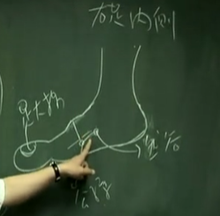
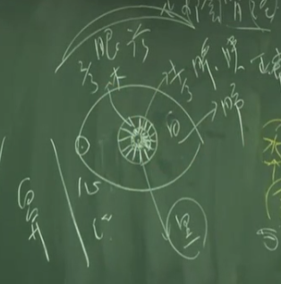

膀胱经是申时，申时是下午三点到五点。五点钟以后，气血会进入肾经，首先是涌泉穴。

肾经本身是水，属水。开穴、气血流注的时间是下午五点到七点。当你的病人每天下午到黄昏就开始累，就是肾经，七点钟以后眼睛亮了，这是肾。
## 肾主骨 其华在发
肾主骨，骨病就要想到肾。肾 其华在发，所谓其华在发，就是头发的光泽，是肾在管。发很光亮、很鲜就是肾。人在死前两天或三天，肾气要绝了，你就会看到头发整个蓬起来，比如说，看到白色， 这个白色是枯干的白，它就不会反光，整个头发蓬起来，干干的没有油，不会反光，就表示该走掉了。
## 开窍在耳
耳鸣、耳聋、耳朵有问题都是在肾脏治疗。
## 肾主记忆 作强之官，伎巧出焉
我们人的年龄是从一岁开始，到五十岁到达巅峰，也就是说五十岁是肾气旺的时侯，五十以后肾气开始往下走。这是一个人的生老病死，我们每一个人都会面临到这问题。所以才说要吸收前人的经验。

中医认为，肾脏要好，就要节欲，这个欲不单单是指房事，还有情志、欲望。欲望很强，野心很大，都会影响到肾脏，这是人的一生。

作强之官，伎巧出焉。所以我们动脑筋，去研发东西，去思考。我们去创新东西出来就是靠肾脏。
## 肾主大、小便
所以肾脏有问题的人，大便不正常，小便也会频尿。

中医的观念里面，气喘有两种，一种是吸，一种是呼。吸入困难就是肾脏在管，呼出困难就是肺脏在管，这两个不太一样。所以我们治气喘病人的时候，我们会去问他，你呼吸很短促，你认为你是吸气比较困难，还是吐气比较困难。病人说“我吸气比较困难”。问“会 不会耳呜”，回答“我会耳鸣，黄昏很累”。这样就问完了，脉也不用摸了，我们就已经看诊完了。

## “病之在骨也，其音羽，其数六，其臭腐，其液唾”
我们发肾脏音的时候是“吹”，吹的声。所以我们 五脏在逼毒的时候，我们用“吹”。什么叫吹。你站好后，手去压肾，压背后，吸一口气，一脚前、一脚后，身体往前倾去按摩它，身体要弓起来，压到肾脏，然后“吹”。这个气吐完以后，吐气没有了才是开始，还没结束。没有气了，就把肛门提起来，后一口气，无声的吹，那是无形的气，让力量逼出去，全身都是汗，这是吹声。

小肠-火-大肠--水--肺-唾液--肾水 金生水

我们在强火的时候，火就是小肠跟心，我们会把小肠跟心的热恢复，一热时，肾脏的热气就跟着回复。一回来时，整个水气都蒸发起来，这热气一蒸发起来，水气往上升，病就去掉了。这是我们为什么说病人原来积很多水，但嘴巴是干燥的。当你把他水一排掉，津液回来了，这人就不断的在小便。

## 北方生寒，寒生水，水生咸，咸生肾，肾生骨髓。

## 位置

涌泉。
然谷。那公孙往后一寸，沿着骨边和肌肉中间，这个穴道，就是然谷穴。
太溪在内踝高骨与脚后大筋的中间。

在我们脚后跟骨头跟大筋交接的地方。这是筋，这是骨头，正在交接点的地方就是大钟穴。
水泉正好在太溪穴下来到骨边。
这区域好热闹，又有溪又有泉，这里的名称都是这样子，就是告诉你水肿在这下针。

照海 内踝下五分 不是直针 避开骨头是斜刺45 度从内踝裸刺到照海穴。

大钟正上两寸  复溜。复溜穴往里一寸，到骨头旁边，就是交信穴。下针也是直下，跟复溜差一个大筋而已

筑宾 太溪上五寸 内开一寸

阴谷 膝盖弯曲 内测两条筋中间

进入腹部 
横骨穴是冲脉、少阴交会的地方。所以，从这开始冲脉和足少阴肾经两者是重迭在一起的。

横谷 曲骨外开一寸。
大赫 中极外开一寸。
气穴 关元外开一寸。
四满 石门外开一寸。
中注就是阴交穴外开一寸。越靠近肚脐或天枢的地方，都可治疗大肠的问题。
神阙外开一寸就是肓俞。

商曲在下脘穴外开一寸
石关穴在建里外开一寸

步廊--俞府 外开两寸
，每隔一个肋骨，就有一个穴道。隔一个肋骨，就是《针灸大成》上的隔一寸六的单位。

注意胸针下法。针下在一寸半的地方，从一寸半下针。针下去的时候，肋骨在这边，要下在肋骨交缝的地方，不要从两个肋骨中间扎，这样就不会伤到肺。你如果扎得很深就会扎到肺。扎在两个胳骨中间，就不会扎到肺了，从一寸半往二寸扎，要用这种刺法进去，扎在两个胳骨中间。

---

#### 1.涌泉 井穴 木 子
肾经的实症，就在涌泉上治疗。如果是你的仇人，这个人来了就下涌泉。当井穴是子穴时，我们叫做泻井当泻荣。

我们不会拿涌泉当子穴来下针，这是急救的大穴。

涌泉穴可治疗头顶痛。有时可扎荣穴，就是膀胱经的束骨穴。若头上的百会针下去。扎了半天头还痛，就扎涌泉。所以涌泉对头顶痛，效果非常好。有的人头一抬起来，撞到上面的东西，可以在涌泉下针，头痛就去掉了。
#### 2.然谷 荣穴 脑震荡 郗穴
那肾经的井穴是涌泉，它本身属木，但泻井当泻荣，所以肾经的实症在然谷可以下针。然谷穴有一个特殊的治症，治疗脑震荡。

脑部受到撞击，脑震荡以后，然谷穴会崩起来一块青筋。病人会头晕、恶心，你拿放血针一刺然谷，血喷出来后。所以凡从高处坠下来，头撞到受伤都可以用，然谷放血是很有名的急救大穴。

然谷穴放完血后，头昏就没有了，但恶心还有的话，再扎冲脉公孙，恶心就去掉了。然谷穴除了是荣穴以外，还是郄穴，非常好用。这是近取穴，像脚不能踩地都可以用。
#### 3.太溪 俞穴
我们有太溪脉，手摸上去有个动脉在里面，脉会跳，这就是太溪穴。太溪脉可以用来诊断，如果病人昏过去了，但太溪脉还有，就可以救回来。
太溪脉有摸到就是肾气还在。若太溪脉没有了，就完了。瞳孔放大，太溪脉又没了，这个人就没有救了。

你的大拇指一压太溪脉上面，在上面这一寸、二寸的地方去压。当你找到压痛点，就表示有肾结石。当肾结石的时候，你在这里压，压到病人痛的地方，这才是阿是穴。肾结石在排的时候会很痛，痛到大汗淋漓男人都会哭的啊。找到阿是穴以后，针一下，那个痛马上就去掉了，病人会告诉你“我感觉有东西在里面动，痛都没有了”。
#### 4.大钟 络穴
络穴跟原穴一样，虚实都可以治疗。所谓肾经的实症，如小便排不出来，我们可扎大钟穴，虚症，如腰酸痛 ，你也可以扎大钟穴。它是络穴，当你做补泻的时候，你可以按照它的虚实来做补泻
#### 5.水泉
那我常常用水泉治疗脚后跟痛。所以左脚后跟痛扎右脚，右脚后跟痛扎左脚的水泉，刚好是反的。那为什么扎水泉会好，因为脚后跟是肾在管，那脚后跟不能抬起，诸位不要小看这个后跟，不要觉得很少人后跟痛，50岁以上的人出现很多，几乎每天都有老外找我说后跟痛。

水泉在临床上面，像月经停经不来都可以用，都可以在水泉上下针。
#### 6.照海 管阴蹻
癫痫的病，痫病夜发，晚上发癫痫就灸照海，灸阴蹻脉的照海穴。白天晚上都发，就申脉、照海一起灸。
#### 7.复溜 母穴 经穴 金
肾家的虚症，可以在复溜上治疗。既然复溜是母穴，下针的时候，应该要顺经对不对。你不会直接在复溜上下针，你一定要在下五分的地方，对复溜下针去随着它。你针下去这个地方就已经是补了，可是是小补，你在去转针的时候，就是大补。再拔一点出来，就是大大补。

在临床上，遇到水肿、小便不出、肚子肿胀腹鼓。都可以用复溜穴。它是常用的穴道。灸复溜是非常好的，因为肾是水经，那艾绒是找水的，所以一灸下去的时候，脚就会热起来。
#### 8.交信 阴蹻脉的郄穴
交信用在女子月事不止或滴漏不止的时候，还有阴挺，就是子宫颈下垂到外面来，我们都可以用交信。
#### 9.筑宾 阴维脉的郄穴
筑宾穴跟曲池这两个穴道是呼应的。筑宾穴是肚脐以下的消炎、解毒穴，也可镇痛。肚脐以上是曲池。
巨阙是我们前面讲过的上纪，关元是下纪。这个纪呢，在上焦、上半身，由巨阙穴管它的纪律，就是管周边的循环。肚脐以下的纪律是由关元在管。肚脐以上的炎症下曲池。肚脐以下就下筑宾。
#### 10.阴谷 合穴 本穴
五行的理论是非常灵活的。肾经的阴谷穴，肾主水，阴谷穴又是水穴，水会生木，所以当遇到肝、胆的虚症时，阴谷穴可补肝胆，也可以泻金家大肠经的实症跟肺经的实症。

你想，若有人跑来找我，他痛在委中。一种选择呢？就是扎对侧，但偏偏这人没有左脚。你不能说，每个人都有左脚啊。委中刚好是在弯曲的地方，所以找委中对侧的尺泽或曲泽都可以下针。如果是内侧痛，你就可以扎少海。外侧痛就下曲池。

阴谷穴也是妇科大穴，像治白带都可以用。
#### 11.横谷
近取穴若能配合远取穴，效果会更好。像男人失精啊，晚上睡觉梦遗，都可以用。
#### 12。大赫
#### 13。气穴
这是近取穴，像阴缩 ，睾丸缩到腹部里面去，妇人的赤带、白带都可以在大赫穴这下针。
#### 14.四满
到了四满的位置，几乎就到了我们的大肠，所以肠子泻痢、腹泻 、肠鸣 通通可以在四满下针。
#### 15.中注
#### 16.肓俞
大肠附近的。
靠近大肠的地方，一般来说都可治大肠的问题。靠近腹部这边，就是小肠、膀胱、女人的子宫胞户、卵巢等，治疗妇科的近取穴，或男人小便问题等等
#### 17.商曲
#### 18.石关
胃方面的问题
#### 19.阴都
中脘穴外开一寸。
#### 20.通谷
治症一样是胃的停饮，胃不消化及一般的胃病。
#### 21.幽门
幽门是从巨阙穴外开一寸。在主力穴外开的穴道都可以辅助主力穴， 辅助它的治症。比如说，我们下了巨阙，心脏若还有闷痛，你就在巨阙旁一寸下针，来加强力量，所以它是加强力量用的。
#### 22.步廊
书上讲胸肋痛等都可以在这治。 
#### 23.神封
膻中外开两寸。所以很多人乳房的硬块是累积在神封这边，我们要在肾经上治疗。治硬块初期时，效果非常好。所以女人初期乳房硬瑰，中药处理得当，就不会得乳癌，一开始就该处理。
#### 24.灵墟
神封穴再隔一个肋骨。治症都是一样，治咳嗽、胸满。
#### 25.神藏
神藏是紫宫外开二寸，彼此治症差不多。
#### 26.俞府
俞府是璇玑外开二寸。
气喘、咳嗽，几乎都可以治。它没有所谓的木火土金水，它没有穴性的问题，它是天应，取近取穴的时候，发气喘时，你不用管它是实的气喘还是虚的气喘，也不用管是热的气喘，冷的气喘，就因为是近取穴的缘故所以用它。但是你唯一要知道的事。他的气喘若是吸入困难，要在肾治疗。如果是吐气困难，要在肺治疗，以治肺为主。所以，气喘在处方跟下针上通通不一样。 
#### 27。彧中
华盖穴外开二寸

## 眼诊法 望诊
你看这是眼睛，眼袋下方就是肾的位置。望诊时我会慢慢跟你们介绍。你一看过去，怎么搞的，病人眼袋位置暗暗黑黑的，就表示肾脏已经受伤了。如果眼袋的地方凸起来很大，好像一条卧蚕一样，就是有水肿，病人有积水。

如果没有卧蚕但有暗红 色，这红是暗的，有点粉红色，因为水克火，火是红的。一看就是肾脏病，这些是我们望诊可以看到的情形。

瞳孔都是黑色的，所以查肾脏查瞳孔。那瞳孔旁边会有一圈，这一圈是土，  就是有土，土在控制水，水就不会乱跑，就好象有堤防，水在河流水道里，对不对，所以土把水围住了。这一圈是中医在诊断脾脏、胰脏的地方。你们要知道什么叫正常，这就是人纪了。正常眼睛的组织结构是这样子的。第二圏是很密的，一条一条接着很密也很整齐，这是正常。再外面这一器是木就是肝脏，肝脏像木头一样片一片排成这样。所以我们在看瞳孔时，正中间是黑的，旁边是木。木的外面，因为把树整个包住是天地，肺就是天嘛，它把整个包住。

正常人是，因为肾是阴脏，当你的灯光照到它的时候，瞳孔马上就缩起来，这是正常。阳来了，阴就会退。少了这部分若你灯光照上去，他的瞳孔都不动，就是肾阳不够了，肾脏已经虚掉了。如果一照已经没有瞳孔或瞳孔已经放大了，这个人就死掉了，肾气没有了，肾气没有了，心脏就没有了。所以西方医学也是对了，指出瞳孔放大就死了。

当有一天你看到了，有的人肺白的地方，好多白块在里面，一块一块好像面包屑一样，白白的一片一片。肺怎么里面会有白白一片一片，就是肺癌嘛！这就不需要去照X 光了。再问：“晚上睡的好不好”，回答：“我晚上三点准时起来”，就非常清楚了!

那瞳孔越小的人越聪明，反之，就是比较笨啊。

## 扁桃腺诊治
由于肾经一路从照海，到喉部这边，照海管阴蹻，阴蹻跟着肾经上来的时候是重叠在一起的，一直到喉咙这边。所以我们在治症的时候，有个很好的治疗，我们叫。**列缺照海**
治疗一切喉咙病。

举例，现在有个女孩子八岁，扁桃腺发炎，里面肿得好大，像荔枝一样，把三寸针后面折起来，把两边刺破，用单刺的，刺破以后，列缺下针，下完再下照海，马上就不痛了，治疗速度就有那么快。我们把她治好了，若不跟她讲收尾，下次扁桃腺发炎又来找你，你就等着赚钱。

如果你很讨厌看到她，就告诉她，你如果扁桃腺好了，去买夏枯草五钱，加个生鸡蛋，带壳的，两碗水煮成一碗水，蛋吃了，汤也喝了，做一次，扁桃腺终生不再发。夏枯草五钱约五块钱台币，鸡蛋一个也不用多少钱，而且不会再发。

你可能临床上会碰到甲状腺肿大、扁桃腺肿大或慢性喉炎的病人，甚至是一般的喉咙发炎都可以用列缺照海。还有妇人的月经，因为照海管阴蹻，阴蹻脉的气血是往上走的，任脉是管经血，所以正常女人，月经来的时候，任脉的气血是往上，心脏会逆向把乳水导下来，可是你阴蹻脉有问题时，会把月经推回来，没有排出来，再从子宫进入蹻脉，蹻脉跑到嘴巴里面，月经从鼻子跑出来，叫逆经，变成每月固定流鼻血，就用照海穴。目前西医仍没有办法治逆经。

## 针灸皮肤病
上半身曲池。下半身是筑宾，三阴交是三条阴经的交会，血海有清血的作用。所以，如果我们正面下针的时候，在合谷、曲池、筑宾、血海、三阴交，这五个穴道下针，针下去痒就同时去掉了。如果起了很多皮肤癣 、干癣，在委中放血，这是针灸上治疗皮肤病很好用的穴道。

针灸是很活的，你只要观念有了以后，穴道是由你选择的，不是被穴道摆布的。若看书上，那个治症就用那个穴道，那就完蛋了。穴道是给你的工具，你要使用这个穴道，而不是被这个穴道役使。我会让你们到这个阶段。

## 水肿
若今天有个病人来是肾脏病，水肿 ，下半身整个是肿的，小便也滴滴答答的，那怎么处理呢？用任脉的水分穴，关元旁开二寸，足阳明胃经 的水道，脚的三皇穴，阴陵泉、地机、三阴交。三皇穴下进去，水就开始消。针完后第二天， 就消了一大半，这是下半身水肿。若是脸肿，正面的脸是足阳明胃经，承泣四白巨髎等都在 阳明经上面，诸如此类。穴道要灵活运用，灵活运用就不用记，大家能够很直觉的反应到，不能紧急的时候再去查书。只有反应一下就想到了，一定要学到这样子。 

## 肾经乳房
如果，今天有位太太来找你，她有个乳房硬块，一看在肾经上面，所以，你如果在其它 经上治疗，效果就不好。你有几种处理的方式，你可以问她是不是在喂奶，她说我正在喂母乳。喂母乳的时候，我们知道胸部的乳房里面是三焦的气脉集中处，到了再从这走，往这走，这时候我们加强她心脏的力量，加强足阳明胃经的经气，比如说解溪、梁丘（止痛）、心脏的募穴巨阙，让那个奶水集中到乳头出来，因为是在喂母乳嘛!因为肾经跟胃经之间，里面有三焦在联络它。下堂课我会介绍到三焦经，三焦行阳，所以奶水都是阳，阳就是白色的。

你如果看到黑色的就是阴，黑色的就是乳癌了。小孩子不会吃黑色的。

但如果不是喂母乳，她有个硬块在肾经上面，初期硬块用灸的当然很好啊，灸本来就是找水，如果这化了， 初期硬块一定是钙等等的东西累积在那，实际上就是营养留在那里。我们就灸它。如果是肾经，当然在肾经上下针啊。如果硬块才一个星期，又很痛，这是实症。

如果是实症的话，在肾经上下针，如果你很讨厌这个女的就下涌泉，忘了然谷了嘛!如果这太太每天行善，就用 然谷。如果说是虚症，就在复溜。病很久了，按了很舒服，复溜上下针。