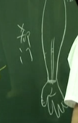

心包经气血流注在戌时。就是晚上七点到九点，肾经是从下午五点到七点。心包经的俞穴等于心包之募，就是膻中穴。

心包经跟心经一样，只有九个穴道。

中医的观念，心脏是君主之官，心脏本身不受病。那你在怀孕的早、初的时候，中医认为是一滴真水，所以中医认为第一个肾脏，但你看不到肾，只看到水，这个水就是肾脏，再一个礼拜后进入肝脏，再过一个星期后到心脏。

所以在怀孕的早期，若受到药物影响，或是妈妈情绪不好，在这段时间会伤到心脏，得到先天性心脏病最初期的时间。

为什么心脏象火，因为它本身不是火，是心脏跳动产生热，我们不晓得怎么定义这个热，就用火来代表。心包是相火。

今年的**夏至到今年的冬至，心包经属火。今年的冬至到来年的夏至，心包经属水。**第四个指掌骨和笫三指掌骨的中间，在手掌的正中间。夏天的时候，因为身体很热，外面也很热，所以这个时候会过热。这个时候心脏的火会把热发散掉，所以夏天我们会流汗。冬天的时候很冷，我们要把热内敛在身体中间，所以属性会相水。

所以，在针心包经跟三焦经时要注意，要看夏至到冬至，属性是相火，心包经的木穴跟三焦经的木穴是它的母穴。过了冬天以后，属性是相水，金穴是它母穴，木穴是它的子穴，半年会换一次，这概念像日光节约时间一样要调一下。

心主汗。心脏差的人非常容易受到惊吓。不管是中风、中脏，我们都知道心脏有问题，舌强不能语，发一点点汗，效果就出来了。还没有出汗，就还没回复，就要再治，这是基本常识。 

**心包络会在膻中胸腔**，男的找比较快，两个乳中穴的中间就是膻中，下面络到石门穴，石门穴是三焦之募，三焦的募穴，这两个是表里。石门穴是任脉上的穴道。 

## 位置

天池  乳中穴旁开一寸
天泉 腋下两寸 手臂内侧

将手臂稍为弯一点，你会看到大筋在这个地方，大筋外侧是肺经。大筋的内侧是心包经。
大筋的上面外侧那边，就是尺泽，大筋跨过来这边内侧，就是曲泽。

郄门 手腕横纹头上五寸 两筋中间

横纹头上三寸 间使.二寸的地方，这个穴道我们叫内关，手纹头这边叫大陵。
大陵下针，像神门一样，对手掌方向下针，神门对着少府，大陵对劳宫穴的方向。

你手轻握拳时，中指无名指尖所到的地方就是劳宫穴。第四个指掌骨和笫三指掌骨的中间，在手掌的正中间。

中指的指尖是中冲穴。

---

#### 1.天池
四肢不举、腋下肿。
。如果有个妇人，它的乳房硬块，正好在乳中穴外开一寸，那你是不是在心包经下针。灸还是在天应。你在选择穴道时就要选心包经。只有在喂母乳那段时间，是在阳明经上治，这样是确保奶水往下走，就不会有多余的奶水累积在乳房里面。

#### 2.天泉

#### 3.曲泽 合穴 阴为水 本穴 阳为土
主客、本穴治疗。
同样的，有个病人跑来说，我委中痛，我委阳痛。都是在膝盖的后面，就可在曲泽、曲池这边下针。当然是下对侧。心脏的人非常容易受到惊吓。心主汗，所以心脏功能回复的话，病人会发汗。

#### 4.郄门 郄穴
郄穴镇痛、止痛的效果很好的。
#### 5.间使 经 阳为金 阴为火
间使穴是专治手麻，如果有人很手麻，间使针一下马上就去掉了。
#### 6.内关 络穴
大穴。公孙+内关 冲脉合阴维，通用。

内关穴本身可以止吐，也可以催吐。晕车呕吐 ，或者是怀孕呕吐、吃饭呕吐，你就用手压内关。当你手压内关时，要告诉你自己“我不想吐!我不想吐！”要专心哦!这样就不想吐了，若你手压内关，想“我想吐！”那就吐掉了。吃坏肚子，又吐不出来时，手伸进去抠也出不来。就压内关并心里想，我想吐!我想吐!好恶心就全部吐掉了。
心包经在管心脏，心藏神。所以你的心神很重要。

有人上吐、下泻，按着内关想，我不要下利!就不会下利啦！看你自己怎样做，人体很奇妙，临床上很有效，你们可以试看看。

下针的时候，内关的效果很有名。我们下内关的时候，一般是配合公孙在做。公孙主冲脉，内关穴管奇经八脉的阴维脉。肋骨里面叫阴维，围一圈。肋骨外面叫阳维，围一圈，简单的观念是这样子。
大家现在知道公孙主冲脉，跟着肾经上来直接冲到胃，所以下公孙以后，再下内关可治胃心胸。我们所有胃方面、心口方面、气胸方面如长年气喘 ，公孙、内关都可以用。

内关穴是大穴。几乎任何的胃病、心脏病、气喘，通通可以用。当有个人喘得很厉害，是急症怎么治？病人一来，公孙、内关先下去，喘就去大半了；同样的，当一个人心脏痛，痛得很厉害，来的时候，公孙、内关下去就减轻了；胃痛得很厉害，针下去胃痛就去了。

若你知道他是胃痛，公孙、内关扎下去后，再扎足三里、中脘，一路下去。

那心脏痛、心口痛，我治疗动脉血管堵塞、心肌梗塞的时候，公孙内关下针以后，再下关元、巨阙、 天突。

若是气喘还是下公孙、内关，再下肺经的中府、云门、肺俞。诸如此类，要懂得调整。公孙、内关都一样，以后会介绍八脉八法。 
#### 7.大陵 俞穴 阳属土 阴属木
临床上有个人左后脚跟痛，这时是不是下右手大陵？因为手掌弯起来就是后跟，这是膝盖。你如果要下得更精准。可以用硬的筷子、找找看压痛点。当有压痛点时，你就从大陵对压痛点穿刺过去，这样会很精准。一针下去，痛就当场就去了，后跟就可以踩到地上去了。

例如，有个女孩子来了，有乳房硬块，一看在乳中穴旁开一寸天池。在心包经上，是初症，会有剧痛。也有时候她已痛了三、四个月，可是她拒按。拒按就是中医讲的实症，实症的话不喜欢按，虚症的时候喜按，虚不单单是指人体虚，虚就是没有，它就喜欢你按，这是虚症。虚症出现时候下母穴。有可能好几个月都是实症。当有痛及红肿通通下子穴。
#### 8.劳宫 荣穴 阳属火 阴属水
我们有在儿科治症，手的推拿， 让小孩子退烧，都是以劳宫为基准。因为它在心包上面，跟他属性相同的，就是心包的本穴：手掌心因汗比较多，所以不会在这灸，用下针或推拿。
#### 9.中冲 井  退烧 阳属木 阴属金
心包络直接络到喉咙的舌后。心开窍在舌，肾开窍在耳，肝开窍在眼，脾开窍在唇，肺开窍在鼻。

心包时，气血的流向是从上往下走的。心包经，因为是跟心脏在一起，所以它是偏向走阴的。而三焦完全是行阳的，行阳气。因为三焦是行阳气，所以全身上下的内脏之间，布满了三焦。

三焦行阳，心包是阴，这两个是表里经，一个阴一个阳。中医的脏腑的观念是，所有的腑，腑就是消化系统，包括我们的胆，小肠，胃，大肠， 膀胱，还有三焦。腑就是阳，脏呢？就是阴。肝、心、脾、肺、肾，再把心包放在这个地方。
因补井当补合，当井穴是母穴时，你要到合穴上面做补，不要在井穴上做。三焦跟心包都要配合节气交换。 

## 手六筋

手掌靠近太渊，经渠，列缺，是肺经的地方，这条经筋就是我们的心和小肠。在手的这条大筋，中间有两条，中间这一条和第一条的中间，还有一条，这一条就是肝胆。那正中央是脾土，黄的嘛。第一条是赤筋、第二条是青筋、第三条叫黄筋。再过来这一条是三焦，三焦在管这一条筋。后面的神门这边是属于肾筋，肾筋和膀胱都在这，在肾和三焦的中间， 还有一条叫肺和大肠。所以，这个手有六筋，六条筋。

## 导引法
比如，手麻在心包经上面，我们下大陵， 大陵下去很快就好。我们一般采对侧。如用同侧，我们叫导引。比如说手麻，我下针在本侧间使，引病。我要子母补泻，就在对侧下针，手麻就去掉了，这叫导引法。就是把目标放好，然后射箭。所以，导引的精神在这，你也可以这样做。