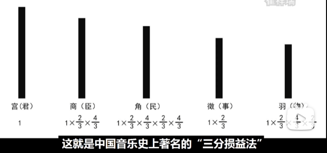
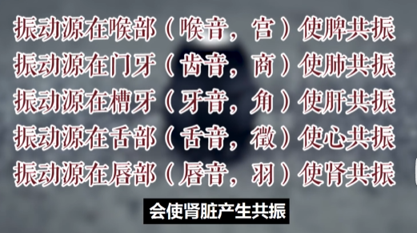

## 气血流注方向
我们介绍穴道的时候，第一个穴道开始讲，是三点到五点。三点到五点是肺经气血起来，所以从中府云门天府一路往下，然后到五点。五点钟以后呢，开始商阳二间三间合谷等一路往下。我讲穴道的方向，就是气血的方向。然后走到迎香，再来七点到九点，头维下关颊车一直往下走，一直走到厉兑。九点钟以后呢，进入脾经，从隐白，大都，太白，公孙，看气血流行。所以我们在讲穴道的时候，为什么不倒着过来讲，是因为配合气血的流向来讲的。

## 五脏-情志-五音
心-喜-徽
肝-怒-角
脾-忧-宫
肺-悲-商
肾-恐-羽

以徵音（5-So）为主的徵调式乐曲，躁急热烈如火，节奏欢快，宜用笛奏，舒心。
以羽音（6-La）为主的羽调式乐曲，苍凉淡荡如水，风格清纯，与琴音调，补肾。
以宫音（1-Do）为主的宫调式乐曲，浑和厚重如土，旋律悠扬，应当吹笙，健脾。
以商音（2-Re）为主的商调式乐曲，悲壮铿锵如金，曲风高亢，适弹古筝，润肺。
以角音（3-Mi）为主的角调式乐曲，圆长清脆如木，曲调亲切，可伴箫声，养肝。
在五行学说指导下，根据五脏的生理节律，以五音调为基础，可配合选择不同乐器

春嘘明目夏呵心，秋呬冬吹肺肾宁。
四季常呼脾化食，三焦嘻出热难停。
发宜常梳气宜敛，齿宜数叩津宜咽。
子欲不死修昆仑，双手摩擦常在面

## 奇经八脉
每个都有一个穴道管
任脉 列缺
督脉 后溪
冲脉 公孙
阳蹻 申脉
阴蹻 照海